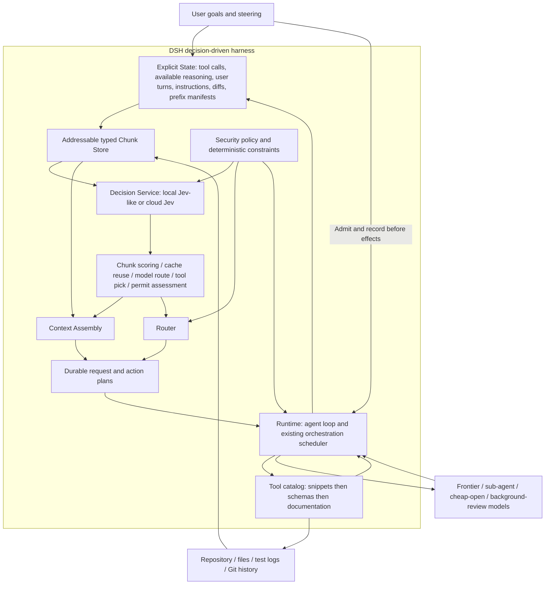

# Agent Note: Configurable decision-driven harness for Jev Engineering

Status: proposed

English | [中文](2026-09-24-configurable-decision-driven-harness.zh.md)

## Problem

DSH needs to decide what evidence to load, which model and tool to use, and whether work is ready to continue without paying for a generative model to deliberate at every such point. A callable classifier alone leaves the generative model in charge of initiating all these decisions. The requested target is the complete first-page architecture of [Jev Engineering for Coding Agents](https://drive.google.com/file/d/17h982xvsL3E7b80iGmOCfKp9qTOW9ohv/view), not an MCP-only integration.

The reference is an independently compiled synthesis, not an endorsed TypeSafe specification. Its architecture is the design requirement; its illustrative pricing and token shares are not DSH measurements. This proposal specifies native DSH behavior, configurable between a local Jev-like implementation and a cloud decision service. It does not implement or deploy that behavior.

## Proposal

Introduce a provider-neutral Decision service and native consumers at context assembly, model routing, tool disclosure, command assessment, and phase supervision. Jev supplies bounded semantic judgments; deterministic DSH policy owns authorization, dependencies, budgets, scheduling, and acceptance. Frontier, sub-agent, inexpensive/open, and background-review models generate content only when the selected work requires generation.

Completion means every box and arrow below has an executable implementation and acceptance evidence. Staged delivery may activate subsets, but no subset is called full Jev Engineering. DSH remains an independent product; the Codex-side jev-use installation and Workbench are neither runtime dependencies nor proof of DSH integration.

## Architecture fidelity



| Reference element | DSH design obligation | Observable evidence |
|---|---|---|
| Tool calls, user turns, diffs and files | Index immutable events and content-addressed artifacts with source positions | A chunk resolves to its exact originating content |
| Reasoning | Index only provider-exposed content or permitted summaries; keep opaque replay data opaque | No invented or extracted hidden reasoning |
| AGENTS.md | Version and scope applicable instructions; pin mandatory rules | Compaction and selection cannot remove applicable obligations |
| Cached prefix | Record exact ordered prefix identities and provider cache capabilities | Cache reuse is distinguished from a decision-result cache hit |
| Chunk scoring | Select hide/short/long/full per query with pinned and paired content constraints | Critical-evidence recall and reversible selection |
| Cache reuse decision | Compare legal reuse and rebuild candidates using measured costs | Selected plan and actual provider cache usage are recorded |
| Model routing | Choose an eligible model and context together | Exact provider/model/effort/capacity and routing evidence |
| Tool selection and disclosure | Select from snippets, expand selected schemas, load docs on demand | Only selected legal schemas enter a logged request |
| Permit command | Assess a concrete action after deterministic policy filtering | A favorable score never supplies missing permission |
| Context Assembly and Router | Produce one consistent, durable request/action plan | Independent byte-exact reconstruction and stale-plan rejection |
| Runtime feedback | Execute, append results, invalidate affected decisions | The next observation includes actual outcomes, not claimed success |
| Four model classes | Route foreground, child, inexpensive and read-only reviewer work | Budgeted runs with lineage, resource ownership and receipts |
| Shared data and background work | Reuse the same immutable retrieval snapshot | Multiple consumers read one snapshot without sharing write authority |

## Source-grounded integration

Source inspection on 2026-09-24 uses published-branch snapshot `fbc6e844b4c01e91a872b2c4cf7b7c95daaa7b3e` (commit date 2026-08-19), not an assertion that this is the latest development commit. The inspected core, orchestration, LLM, settings, credentials and jobs trees match development commit `25c82ce4693`; unrelated unpushed work is excluded from this document branch. These are source observations, not installed-runtime acceptance. Source links identify existing owners; new types and configuration later in this note are proposed.

| Existing owner | Reuse | Required extension |
|---|---|---|
| [Agent loop](../../../../packages/core/agent-loop/README.md) and [architecture](../../../../docs/architecture.md) | Step lifecycle, inbox admission and request dispatch | A pre-generation decision phase and logged plan application |
| [Session](../../../../packages/core/session/README.md) | Append-only events and model-history projection | Decision, context and action plan event projection |
| [System prompt](../../../../packages/core/system-prompt/README.md) and [tools](../../../../packages/core/tools/README.md) | Scoped registration, schema assembly, guarded execution | Versioned snippet catalog and logged selected-schema assembly |
| [Context compiler](../../../../packages/orchestration/context-compiler/README.md) | Context handoff construction | Selection plans shared by foreground and child requests |
| [Orchestration](../../../../packages/orchestration/orchestration/README.md) | Durable TaskGraph, sealed plans, approval and recovery | Decision-derived proposals validated by the existing scheduler |
| [LLM](../../../../packages/llm/llm/README.md) and [pi-ai adapter](../../../../packages/llm/llm-pi-ai/README.md) | Generative adapters, exact-route metadata and usage | Explicit cache capabilities; optional local structured-output decision adapter |
| [Settings](../../../../packages/settings/settings/README.md) and [credentials](../../../../packages/credentials/credentials/README.md) | Revisioned configuration and per-operation credential resolution | Separate decision settings and credential references |
| [Jobs](../../../../packages/jobs/jobs/README.md) and [compaction](../../../../packages/compaction/compaction-basic/README.md) | Existing lifecycle and fallback mechanisms | Read-only shared observations and coordinated context-generation ownership |

The [reconstructable-request decision](../../implemented/architecture/2026-07-05-reconstructable-requests.md), [routed-model context policy](../../implemented/architecture/2026-07-20-routed-model-context-and-compaction-policy.md), and [dynamic workflows](../../implemented/feature/2026-07-05-dynamic-workflows.md) remain active constraints. This proposal extends them and does not supersede their shipped guarantees; no existing note is archived.

## Orchestration prerequisites exposed by inspection

The existing [daemon](../../../../packages/orchestration/orchestration-local/src/daemon.ts) has a single scheduling path and sealed execution plans, but its current acceptance and approval mechanisms are not sufficient for the target assurance. Its start path treats the presence of an `approvalRef` as approval; the active design must instead validate an authoritative approval ticket bound to plan, scope and revision, or require the daemon-owned decision transition. A caller-supplied string cannot authorize a Jev-selected action.

The inspected attempt settlement treats an operator `completed` stop reason as passing evidence; it does not evaluate every declared acceptance requirement or verification plan. Before autonomous completion decisions are enabled, extend the existing scheduler with explicit deterministic acceptance evaluators and immutable verification receipts. Jev may flag missing evidence, but it cannot fix this by supplying a completion score.

Current graph conflict checks and in-process serialization do not establish durable cross-run scope leases or scheduler epochs. Resident command receipts and session leases provide an existing [implementation pattern](../../../../packages/physical-operator/resident-operator-local/src/store.ts), not graph-wide guarantees. Add the needed global scope admission, execution-id/request-hash deduplication and stale-owner fencing within the existing orchestration authority before cross-run parallel activation. Record these prerequisites in D0 and require their acceptance before D4, without blocking read-only shadow evaluation.

## Components and ownership

The proposed `dsh-decision` service is a Cordis Service Definition with a scoped provider registry. Its operations are capability discovery, request resolution and bounded judgment. Cloud and local providers implement it; context assembly, routing, disclosure and supervision consume it. Registration and listeners use reversible effects. The service has no authority to execute a tool or schedule a graph node.

Keep one runtime-policy owner for resolving requests and applying results, one context-plan owner for projections, and provider plugins that only translate protocols. Package names are provisional until implementation confirms independently evolving responsibilities. Reuse DSH settings, credentials, artifacts, telemetry and jobs; do not create parallel versions inside a Jev subsystem.

There remains one durable TaskGraph scheduler. Decision clients may bound their transport concurrency, but this is not another work scheduler. Resource admission for local GPU inference, child execution and background work remains under existing execution ownership.

## Explicit state and durable plans

A `StateSnapshot` identifies session/graph, run, goal revision, log cursor, source revision, instruction revision, tool-catalog revision and policy revision, plus model-capability and decision-configuration revisions. A `ChunkRef` identifies immutable content by digest, source event/artifact and range, kind, sensitivity, access scope and dependency edges. Mutable files produce new snapshots; the index is a rebuildable projection, never a second authority over the session log. Externally sensitive equality information must not leak through globally shared digest indexes.

Chunk kinds cover user input, tool call/result pairs, allowed reasoning, applicable instructions, files/diffs, tests, prior decisions and prefix manifests. A provider's opaque reasoning or replay state is not ordinary text to send to another provider. The design neither requests inaccessible hidden reasoning nor assumes access to it. Short and long representations are separately versioned derived artifacts with source links; Jev selects a representation but does not generate its summary.

Mandatory constraints, unresolved user requests, active failures and required evidence are pinned by deterministic rules. Tool-call/result dependencies remain closed; orphaned results or pending calls cannot be hidden independently. A missing required chunk fails request construction. An optional missing chunk triggers re-retrieval or conservative context reconstruction, never a silently different request.

Persist proposed `decision/requested`, `decision/resolved`, `context/plan` and `runtime/action-plan` facts before their outputs affect execution. A resolved record includes typed answers, confidence provenance, actual provider/model revision, calibration identity, policy revision, provenance and usage. A context plan includes ordered chunk/representation hashes, selected instruction sections, tool schemas, model route and prefix identity. References must resolve to immutable bytes available to replay; hashes alone are insufficient.

Decision observations may use Session events for agent work and graph-owned artifacts/events for scheduler work, with explicit correlation ids rather than duplicate mutable truth. Durable decision requests are themselves model-visible inputs and need reconstruction, although they do not pretend to be generative assistant messages. Credentials and request authorization headers are never logged. Retention pins referenced artifacts for the required replay period; explicit user deletion yields a recorded unavailable/tombstoned replay state rather than invented content.

## Native request lifecycle

The inspected loop claims inbox input and assembles a prompt snapshot before `agent/pre-step`; it appends admitted messages only after opening a step. Its `agent/request` waterfall changes call configuration, not arbitrary history. See [the loop implementation](../../../../packages/core/agent-loop/src/agent.ts) and [the request invariant](../../../../packages/core/agent-loop/src/invariant.ts). A router attached only at the latter hook is insufficient for the complete design.

The proposed preparation phase runs inside an open turn before a generative step. It durably references the claimed input and freezes the observation revision; cancellation must return an unconsumed claim to the inbox or record its explicit disposition, never lose user input while waiting for a classifier. This requires a new durable claim lifecycle with reserved/committed/requeued/withdrawn states and a stable claim id; the inspected destructive `claim()` API is not a recovery mechanism. Resume reconciles an uncommitted reservation once, preserves input order, and distinguishes explicit user cancellation from retryable interruption. The diagram’s direct User-to-Runtime edge is command/inbox admission, not a bypass of state recording. It resolves mandatory instructions and legal candidates, obtains bounded decisions, then freezes the joint route/context/tool plan before final prompt assembly. Existing [model-selection coordination](../../../../packages/core/agent/src/model-selection.ts) is the precedent for keeping prompt variables and the chosen route coherent.

For a generation action, open the step, append admitted user/context messages and the applicable context plan, finalize the existing request header/context records, and append a proposed `request/manifest` before every dispatch attempt, including same-step retries. The manifest records an attempt ordinal and header/plan/source sequence references; one manifest per step is insufficient. A new sequence-bounded pure projector reconstructs the selected history from that manifest and immutable references; the existing independent invariant must be extended rather than disabled. Include provider and reasoning effort as well as messages/system/tools in the comparison. The inspected companion does not compare every recorded call-config field, so this extension includes that coverage gap.

For an already-resolved deterministic action, retain the meaning of a Step as a model request plus its tool work. Record a distinct runtime action span inside the turn, with its own intent, start and receipt events, then enter the existing guarded tool execution path. Do not create a fake model step or assistant response. No-generation transitions, inbox cancellation and termination require new lifecycle tests. The context compiler currently serves graph handoffs, not native Session request history; reuse its concepts and artifact ownership without claiming that it already implements this path.

## Decision provider protocol

A resolved request carries branded decision/snapshot ids, purpose and rubric versions, the immutable authorized state view, typed questions, eligible alternatives, deadline/cancellation, result budget, locality policy and configuration revision. Questions use `noul`, `choice` and `score`; dependent questions are separate rounds, not incorrectly batched as independent questions. Question meaning must be explicit in instructions and criteria, not encoded only in its id.

Every answer identifies its question, typed value or abstention, optional distribution, confidence kind, actual model revision and capability/calibration profile. Noul means a probability only when that provider is admitted to probabilistic semantics. Score is the expected ordinal position only when a compatible distribution is supplied. Label-only classifiers remain valid for admitted categorical purposes; they cannot fabricate distributions, assign confidence 1, or substitute an uncalibrated self-rating for probability.

Providers declare supported primitives, state modalities, maximum request and batch sizes, cancellation, version identity, score semantics, distribution availability and cache mechanisms. DSH validates these claims with conformance and task-domain evaluations. A successful health ping is not qualification. Incompatible type, unknown option, missing or duplicate answer, non-finite number, invalid distribution or inconsistent ordinal expectation produces a typed invalid-response result, not a default answer.

Outcomes distinguish answered, abstained, unavailable, timed-out, cancelled, policy-denied and invalid-response. Preserve per-question failure where the transport supports it. Confidence from a native head, distribution-derived margin and an empirical calibrator carry distinct tags; thresholds are purpose/provider/model/rubric specific. Provider-reported probability is not a universal accuracy guarantee. [TypeSafe primitives](https://docs.typesafe.ai/introduction) and [Noul semantics](https://docs.typesafe.ai/primitives/noul) define the cloud vocabulary, not a claim that every local model implements its statistical behavior.

## Local and cloud implementations

| Provider kind | Integration | Admission and limitations |
|---|---|---|
| Cloud Jev through OpenRouter | Dedicated Decisions transport, credential reference, recorded resolved model | Never send Jev requests to Chat Completions; use the documented [Decisions API](https://openrouter.ai/blog/tutorials/how-to-use-jev/) |
| Direct cloud Jev | Native TypeSafe adapter under the same DSH service | Independently test protocol, timeout and usage translation |
| Local native decision model | Proposed versioned decision-HTTP adapter or in-process provider | Can provide genuine logits/distributions when its implementation supports them; locality is verified, not inferred from a friendly name |
| Local classifier/ranker | Adapter maps a trained model's output to admitted purposes | Fixed label sets or scoring tasks only; rubric changes may require a different model |
| Local structured-output LLM | Reuse an explicitly local generative adapter behind the Decision service | Approximate Jev-like behavior; schema-valid JSON alone provides neither calibration nor native Jev latency |
| Deterministic rules | Execute locally before semantic judgment | Exact counts, hashes, permissions, dependency readiness and test exit codes do not need a model |

For the proposed local HTTP protocol, `GET /v1/decision-capabilities` reports a pinned descriptor and `POST /v1/decisions` accepts the neutral request. These are new DSH protocol endpoints, not claimed existing endpoints of Ollama, MLX, or TypeSafe. An OpenAI-compatible local server instead uses the structured-output adapter; unsupported response formats fail qualification rather than being assumed from endpoint compatibility.

Local-only means the complete inference path and telemetry obey the configured locality policy. Redirects, gateways and provider fallback cannot silently turn local into cloud. Benchmark local cold load, warm inference, memory pressure and contention with the coding model separately. A slower local decision can be preferable for privacy, but not described as a latency improvement. This proposal does not require training a new model; it requires an interchangeable implementation and qualification data.

## Context assembly, cache and instructions

The decision phase captures one state revision before constructing a generative request. It retrieves bounded candidate chunks, reuses valid representations, judges visibility, closes dependencies, applies pinned instructions, and materializes a `ContextPlan`. Ordered sections use stable identities; the assembler does not reorder an unchanged prefix merely because equivalent scores fluctuate. A frontier call is unnecessary when the resulting action is already fully specified and permitted.

A visibility result never destroys the source log. Short/long summaries must already exist or be produced by a separately attributed summarization operation. A context-owned representation producer reuses the existing LLM adapter and summarization machinery with a dedicated purpose, not a new scheduler. It records a proposed `context/representation` fact containing source digests/ranges, producer and prompt versions, actual model, output artifact, usage and validation outcome. Replay resolves the recorded output rather than regenerating a stochastic summary. Summary generation cost and errors belong in the decision economics. If summarization is not worthwhile, use verbatim bounded spans. The existing compactor and context-plan consumer must share one surface-generation owner, with an explicit generation transition preventing independent simultaneous rewrites.

KV Cache reuse has three capability cases: implicit provider prefix reuse, an explicit provider-owned cache handle, and no exposed reuse mechanism. DSH may preserve matching bytes or pass a supported handle; it cannot move KV tensors between unrelated models, force a provider hit, or treat unknown cache support as available. Local exact-prefix reuse is enabled only when the serving implementation exposes and validates it. Record predicted reuse separately from measured cache-read/write usage.

Routing evaluates joint candidates `(model, context plan, prefix strategy)`: uncached input, cache reads/writes, output, context transfer, return-summary cost, Jev calls, queueing, failed attempts and expected rework. Use provider-owned capacity and empirical latency; unknown pricing or cache behavior cannot establish a cheaper route. A configured quality floor and data policy filter candidates before cost optimization. Local compute and subscription quota are separate reported quantities, not invented dollar equivalents.

Conditional instruction sections have explicit selectors and versions. Applicable mandatory rules are included deterministically and re-resolved after compaction, fork, resume or a changed scope; Jev may select optional guidance only. Precedence is fixed by DSH policy, not a relevance score. A context manifest records the chosen sections and hashes so an auditor can reconstruct exactly which rules applied.

## Tools, permissions and runtime actions

Build snippets from scoped registered tools and version them with their complete schemas. First apply capability, sensitivity, authorization and availability constraints; then let Jev select or rank eligible snippets. Expand selected schemas before argument construction and include them in the request header. Documentation loads only when needed. Tool-registry changes invalidate affected selections. Selection uses the same scoped visibility that ToolRuntime uses for lookup and dispatch, while monotonic guards and consumer-specific sandbox escalation remain authoritative. For Resident graph nodes, the inspected capsule provider does not yet enforce tool/MCP/guard injection; such bindings are rejected. Active tool selection there requires an enforcing operator adapter, not a prompt-only allowlist. Multi-tool plans still respect exclusive/parallel execution declarations and required dependencies.

Jev selects existing action candidates; it does not invent shell arguments. If arguments require generation, the selected generative model receives the full schema. If a deterministic operation has fully resolved arguments, a logged runtime-action plan can invoke the existing guarded tool pipeline without a generative request. This new action origin needs explicit event and lifecycle support; do not fabricate an assistant tool call to fit the old projection.

A semantic permit result is advisory to the existing approval and sandbox mechanisms. Deterministic deny remains deny, and a required human approval remains required even when Jev returns allow. Approval is bound to exact arguments, working directory, affected artifact digests and policy revision; a changed script or target invalidates it. Failure preserves existing checks and escalates when semantic assessment is required. There is no probabilistic auto-approval of destructive commands.

Before application, revalidate the complete observation dependency fingerprint: goal/input, source, instruction, catalog, policy, graph, decision configuration, provider/model capabilities and calibration revisions. Own audit events may advance the raw log cursor without changing those dependencies; new steering or changed read-set inputs must invalidate the plan. Never compare only a convenient subset of revisions. An obsolete decision is logged as stale and never applied. For graph mutations, the existing scheduler validates sealed-plan identity, scope ownership and applicable concurrency controls. Results flow back through normal tool/session/graph events; a model's completion claim is not an acceptance receipt.

## Delegation and shared background observations

Foreground decisions may propose a bounded child task with acceptance criteria, allowed model classes, scoped files and a small immutable context manifest. Exact task ids and ownership are checked deterministically. Semantic similarity can propose duplicates for review, but cannot cancel an active task or discard a distinct requested outcome. No second task ledger is introduced. Ordinary native DSH agents route through `ctx.llm`; graph nodes using Resident choose a physical-operator product/profile in their sealed plan. These are different execution paths. An external application receives only capabilities its adapter actually exposes: DSH cannot promise to reconstruct that application’s private context or control its KV Cache. Full-figure acceptance requires the native path; external operators explicitly advertise and qualify their supported subset.

Read-only background reviewers, documentation assessors and evaluation builders consume the same retrieval snapshot. They have explicit budgets, cancellation and a parent correlation id; they cannot write the foreground worktree or merge changes. Generic jobs are process-local; restart-safe background work must be represented by the existing durable graph with interruption/reconciliation, not assumed to survive because it has a job id. A result whose source revision changed becomes a new observation requiring reconciliation. Useful concurrency is limited by resource and scope admission, including a local decision model competing with the generative model for memory.

Checkpoint questions assess requirement coverage, missing evidence, drift and repeated failures separately. Code reads actual test exits, artifact identities and required verification records. Stop, retry, continue and escalate remain deterministic lifecycle transitions informed by these observations, never direct interpretations of a free-form model assertion.

## Configuration and user experience

Separate decision-provider settings from generative model selection. Register the proposed `decision-engine` namespace through existing settings; bind plugin composition to existing Cordis bundles, never hardcode a deployment endpoint in a consumer. Providers and rubric ids must resolve before active use. Unknown required capabilities, invalid combinations and absent permitted fallbacks fail configuration validation; optional disabled features do not block unrelated operation.

```yaml
# Proposed decision-engine Settings namespace, not runnable configuration today.
mode: shadow
providers:
  local:
    adapter: decision-http-v1
    endpoint: http://127.0.0.1:8088
    model: deployment-pinned-revision
    residency: local-only
  cloud:
    adapter: openrouter-decisions
    endpoint: https://openrouter.ai/api/alpha/decisions
    model: typesafe/jev-1.13
    apiKeyEnv: DSH_DECISION_OPENROUTER_API_KEY
    residency: external
routes:
  context.visibility:
    primary: local
    fallback: []
    calibrationRef: context-retention-v1
  model.route:
    primary: local
    fallback: [cloud]
    allowedData: [public]
    calibrationRef: worker-routing-v1
  command.assess:
    primary: local
    fallback: []
    onUnavailable: require-existing-approval
limits:
  requestTimeoutMs: 1500
  maxQuestionsPerBatch: 24
  maxInFlight: 2
  decisionBudgetFraction: 0.05
  minMaterialBytes: 8192
```

Values above are illustrative starting limits, not calibrated defaults or promised Jev latency. Calibration references name deployment-owned, versioned qualification artifacts. The local endpoint must implement the proposed protocol. An additional local structured-output profile instead names an existing local LLM route and pinned prompt/template; it must not recursively route its own generation through Decision consumers.

Support off, shadow and active modes per purpose. Off makes no decision calls; shadow records judgments without changing execution; active applies qualified judgments under deterministic policy. Shadow still consumes budget and may transfer data, so it follows the same egress authorization. Cloud fallback is opt-in per purpose and data class; local-only never falls back externally. If no eligible provider remains, keep sufficient context and use the configured generative route or request intervention as the consumer requires.

The DSH settings UI exposes provider type, locality, endpoint/model, credential configured-state, supported primitives, qualification status, modes, budgets and fallback policy. A connection test uses a synthetic payload. A local-vs-cloud comparison uses authorized fixtures and shows cold/warm latency, quality and resource use. Credentials are references resolved per operation and never appear in UI exports or decision logs. No secrets are placed in union-schema defaults.

Each decision captures a configuration revision. Changes apply to subsequent operations; a restrictive policy update also prevents an in-flight older decision from being applied. A per-session inspector shows selected and retained chunks, why required context stayed, route alternatives, confidence provenance, fallback, cache prediction versus observation, and generation avoided or still required. Users can pin evidence, disable a purpose, and inspect its complete source without altering the audit record.

## Failure, caching and recovery

Batch only independent questions sharing the same authorized observation. Resolve file contents outside the generative context, but do not send unapproved private content merely because the transfer happens in a plugin. Cheap deterministic filters and exact lookup run first; small or already-read material can bypass semantic selection. Size limits count encoded state and question bytes; oversized batches split without silently truncating required evidence.

Decision-result reuse keys include content/representation hashes, ordered questions and rubrics, actual model/capability/calibration identity, instruction/tool/policy/config revisions and scope. An unresolved model alias, unbounded staleness, changed file or a missing result invalidates reuse. Cache reuse never grants broader access. Keep this cache separate from provider KV Cache and shared retrieval artifacts.

On timeout or invalid output, visibility keeps evidence, routing keeps a legal configured route, disclosure uses a bounded legal fallback, and permission assessment never weakens approval. Every fallback is observable. A failed cloud request is not silently replayed to another destination. Reconcile an uncertain transport receipt when available; any bounded retry records attempt and possible duplicate billing, never repeats a tool side effect.

Before applying an action plan, append its identity and expected source revision. Recovery replays durable choices; it does not rescore history to guess what ran. Uncertain tool effects require reconciliation through existing receipts and scheduler recovery. Forks retain shared immutable content but use new run ownership and revalidate policy and provider access. A bounded number of semantic rounds ends in abstention or generative escalation, preventing a Jev-only loop.

## Delivery stages

| Stage | Deliverable | Exit evidence |
|---|---|---|
| D0: contracts and baseline | Decision service, local/cloud qualification harness, purpose rubrics, legal state views | Same fixtures distinguish native probabilities, label-only and structured-LLM adapters; measure no-decision baseline |
| D1: state and shadow | Chunk projections, immutable references, recorded observations and shadow judgments | Replay survives restart; no execution changes; no unauthorized external data |
| D2: native context | Durable context plans, visibility representations, conditional instructions and tool disclosure | Reconstruct filtered requests independently; preserve dependencies and mandatory content |
| D3: routing and cache | Joint model/context/prefix selection, measured cache capabilities and no-generation action plans | Demonstrate an eligible action without a frontier call; show actual cache behavior and compare complete-task cost |
| D4: supervision | Existing-scheduler delegation, deduplication checks, shared read-only background observations and permit assessment | Failure/restart/scope-conflict tests; no second scheduler or weakened approval |
| D5: product rollout | Settings, inspector, purpose-level rollback, calibrated active profiles | Headless/Web/SDK entry paths, assembled snapshots, real local/cloud scenarios and full figure traceability |

Each stage is independently disableable but not independently declared a faithful reproduction. Durable event/schema changes follow DSH version rules: unknown required model-visible events cannot be marked ignorable just to make old readers accept them. Update event projection, replay, UI, adapters and runtime invariants together. Disabling the feature affects future decisions; it does not erase prior plans or make old readers compatible with them. Desktop packaging changes, if later implemented, separately follow the Desktop delivery protocol; no application deployment is part of this document.

## Alternatives considered

**MCP-only helper.** Useful for a pilot, but requires the generative model to initiate each judgment and cannot satisfy native context assembly, prefix decisions or generation-free dispatch.

**A single Jev model as the entire agent.** Rejected because bounded decisions do not generate arbitrary plans, arguments, code or explanations. Deterministic rules plus generative models remain necessary.

**A new Jev scheduler or external supervisor as authority.** Rejected because it duplicates TaskGraph ownership and recovery. Borrow narrow observation patterns from [Foreman](https://github.com/thruwire/foreman), not a second scheduler.

**Treat every OpenAI-compatible local model as Jev.** Rejected because JSON compatibility does not establish probability, independence, calibration or latency semantics. Use explicit reduced capabilities and purpose-specific qualification.

**Rewrite frozen LLM requests or destructively prune history.** Rejected because it breaks audit/replay and can lose instructions and tool dependencies. Persist selection plans and preserve source content.

**Adopt all community plugins directly.** The [jev-use](https://github.com/shitianfang/jev-use) transports and batch semantics are useful implementation references. [Yoshi](https://github.com/compozy/yoshi) and compaction plugins demonstrate boundary interception, but their external proxy/hook ownership does not replace DSH-native log, policy and scheduler integration. Reuse maintained libraries where their protocol and lifecycle fit; do not import another product's permission assumptions.

## Acceptance criteria

A conformance matrix maps every reference element to a consumer, durable artifact, runnable scenario and test. A missing implementation remains a named gap. The implementation test matrix covers cloud Jev and at least one genuinely local provider. Each deployment qualifies only providers it enables; local-only and off deployments require no cloud credential or cloud test call. Missing credentials make the corresponding cloud integration test explicitly unavailable, not a fabricated pass. A label-only or structured-LLM provider is reported as a compatible subset until its additional semantics are proven.

Required correctness scenarios cover pinned instructions and failures, hidden relevant evidence without error keywords, tool-call/result pairing, stale decisions after steering or edits, provider/model changes, malformed partial responses, timeout/cancellation, local-only egress, budget exhaustion, unavailable cache handles, concurrent scope conflicts, restart after intent logging and uncertain tool receipts. A fresh independent reconstructor reproduces each applied generative and decision request from recorded facts and artifacts. An action requiring approval remains blocked even if all semantic answers are favorable.

Evaluate complete tasks in three families: failure diagnosis, large-search navigation, and bounded implementation. Compare the unchanged DSH baseline, local decisions, cloud decisions and policy-constrained hybrid routing on the same input revisions and acceptance tests. Counterbalance run order, separate cold/warm cache and local load, repeat enough trials to report uncertainty, and include Jev calls, queueing, context reload, summaries, retries, foreground tokens and review effort. Report recall of labeled critical evidence, false completion, unsafe recommendations, useful generation avoided, total latency and billed/compute usage separately.

Activation requires no mandatory-rule or authorization loss, no fixture-critical evidence loss, a declared task-domain quality floor, and measured net benefit for the enabled purpose. Before an experiment, version the dataset, rubric, minimum quality, tolerated error cost and latency/cost target; do not tune them after seeing a favorable sample. The Codex pilot's 8 KiB cutoff and isolated timings are hypotheses, not DSH defaults. Shadow and active runs expose receipts showing which decisions changed behavior; unit tests alone do not establish architectural fidelity.

## Risks

False-negative selection can hide decisive evidence; retained originals, pinned obligations, domain recall tests and conservative abstention reduce but do not eliminate that risk. Stable wrong judgments can be confidently cached, so cache correctness is not semantic correctness. Summary drift and provider revision drift need independent detection.

Local inference can compete with the coding model for memory and slow the task; cloud inference can violate locality or dominate short-task latency. Extra judgments can cost more than the work they replace. Purpose-level bypass and budgets are product behavior, not failures to maximize Jev usage.

The largest engineering change is the replayable pre-generation plan path, not the HTTP adapter. Tool disclosure and selective context may reduce prefix reuse; routing must measure the combined effect. Provider cache facilities and local probability quality remain deployment-dependent. Until every figure element passes its tests, the release is an incremental implementation of this proposal, not a full reproduction.
