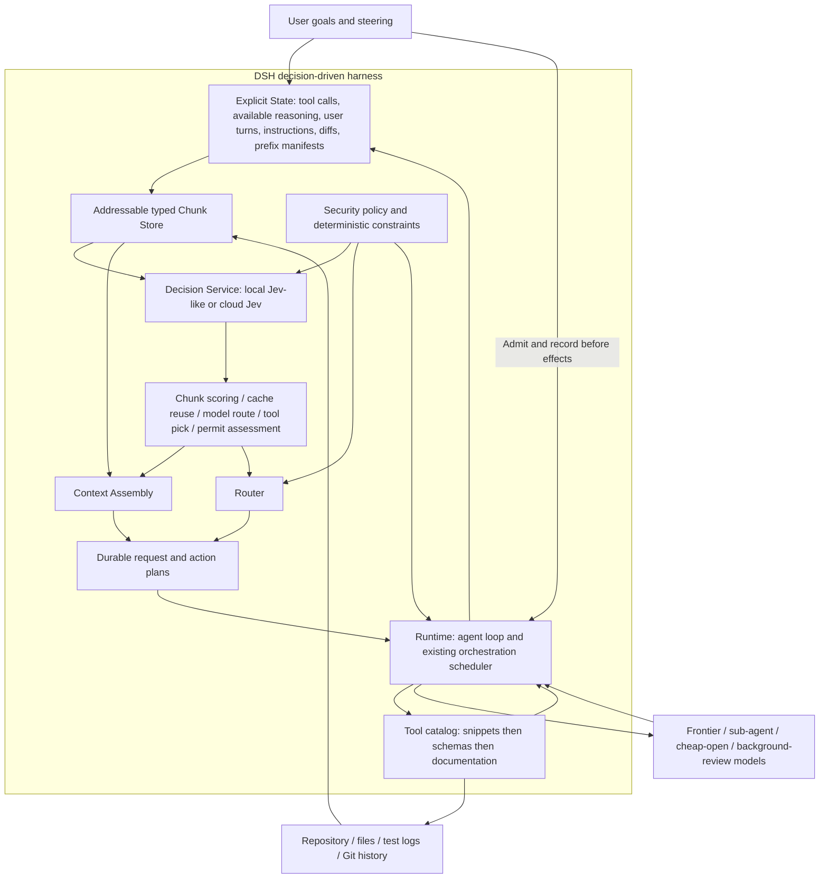

# Agent Note: 面向 Jev Engineering 的可配置决策驱动 Harness

Status: proposed

[English](2026-09-24-configurable-decision-driven-harness.md) | 中文

## 问题

DSH 需要判断加载哪些证据、选择哪个模型和工具、工作是否可以继续，而不必让生成模型在每个这样的节点都进行推理。仅增加可调用的分类器，仍由生成模型负责触发全部判断。本设计的目标是完整满足 [Jev Engineering for Coding Agents](https://drive.google.com/file/d/17h982xvsL3E7b80iGmOCfKp9qTOW9ohv/view) 首页架构图，而不是仅接入 MCP。

参考文档是独立编写的综合材料，并非 TypeSafe 认可的正式规格。其架构作为设计要求，其中示例价格与 token 占比不是 DSH 实测。本提案定义 DSH 原生行为，支持在本地 Jev-like 实现与云端决策服务之间配置切换；本次不实施或部署这些行为。

## 提案

增加与提供方无关的 Decision 服务，并在上下文组装、模型路由、工具分层披露、命令评估和阶段监督处接入原生消费者。Jev 提供范围明确的语义判断；确定性的 DSH 策略负责授权、依赖、预算、调度和验收。只有所选工作需要生成内容时，才调用前沿模型、子 agent 模型、低成本或开放模型，以及后台审查模型。

完成标准是下图每个模块与每条数据流都有可执行实现和验收证据。分阶段交付可以启用部分能力，但任何子集都不能称为完整 Jev Engineering。DSH 保持为独立产品；Codex 侧已安装的 jev-use 和 Workbench 均不是运行依赖，也不能作为 DSH 集成证据。

## 架构图逐项对齐



| 参考图元素 | DSH 设计义务 | 可观察证据 |
|---|---|---|
| 工具调用、用户轮次、差异和文件 | 将不可变事件和内容寻址产物按源位置建立索引 | 每个块都能解析到精确的原始内容 |
| Reasoning | 仅索引提供方已暴露的内容或允许的摘要；不透明回放数据保持不透明 | 不伪造或提取隐藏推理 |
| AGENTS.md | 对适用指令按版本和作用域管理，固定必需规则 | 压缩与筛选不能移除适用义务 |
| Cached prefix | 记录有序前缀的精确标识及提供方缓存能力 | 明确区分缓存前缀复用与决策结果缓存命中 |
| Chunk scoring | 按查询选择 hide/short/long/full，遵守固定内容与成对内容约束 | 关键证据召回率及可逆选择 |
| Cache reuse decision | 使用实测成本比较合法的复用与重建候选 | 记录所选计划与实际提供方缓存用量 |
| 模型路由 | 联合选择合格模型与对应上下文 | 精确提供方、模型、推理强度、容量及路由证据 |
| 工具选择与披露 | 从简介选择工具，展开选中 schema，按需加载文档 | 只有选中且合法的 schema 进入已记录请求 |
| Permit command | 在确定性策略过滤之后评估具体动作 | 有利评分不能补足缺失权限 |
| Context Assembly 和 Router | 生成一致且持久化的请求或动作计划 | 独立逐字节重建，拒绝过期计划 |
| Runtime 反馈 | 执行、追加结果、失效相关决策 | 下一份观察包含实际结果而非成功声明 |
| 四类模型 | 路由前台、子 agent、低成本和只读审查工作 | 具有预算、血缘、资源所有权及回执的运行 |
| 共享数据与后台工作 | 复用同一份不可变检索快照 | 多消费者读取一个快照，但不共享写入授权 |

## 与现有源码的接入关系

2026-09-24 的源码审阅使用已发布分支快照 `fbc6e844b4c01e91a872b2c4cf7b7c95daaa7b3e`（提交日期 2026-08-19），不声称它是最新开发提交。已审阅的 core、orchestration、LLM、settings、credentials 和 jobs 目录与开发提交 `25c82ce4693` 一致；无关的未推送工作不进入本文档分支。以下是源码观察，不是已安装运行时的验收结果。源码链接指向现有职责所有者；后文的新类型与配置均为提案。

| 现有职责所有者 | 复用内容 | 所需扩展 |
|---|---|---|
| [Agent loop](../../../../packages/core/agent-loop/README.md) 与[架构](../../../../docs/architecture.md) | 步骤生命周期、收件箱准入和请求派发 | 生成调用之前的决策阶段与已记录计划的应用 |
| [Session](../../../../packages/core/session/README.md) | 只追加事件与模型历史投影 | 决策、上下文和动作计划的事件投影 |
| [System prompt](../../../../packages/core/system-prompt/README.md) 与[工具](../../../../packages/core/tools/README.md) | 有作用域的注册、schema 组装和受控执行 | 带版本的简介目录与已记录的所选 schema 组装 |
| [Context compiler](../../../../packages/orchestration/context-compiler/README.md) | 上下文交接构造 | 前台与子请求共用的选择计划 |
| [Orchestration](../../../../packages/orchestration/orchestration/README.md) | 持久化 TaskGraph、封存计划、审批与恢复 | 由现有调度器验证的决策派生提案 |
| [LLM](../../../../packages/llm/llm/README.md) 与 [pi-ai 适配器](../../../../packages/llm/llm-pi-ai/README.md) | 生成模型适配器、精确路由元数据和用量 | 显式缓存能力；可选的本地结构化输出决策适配器 |
| [Settings](../../../../packages/settings/settings/README.md) 与[凭证](../../../../packages/credentials/credentials/README.md) | 带修订版本的配置与逐操作凭证解析 | 独立的决策设置和凭证引用 |
| [Jobs](../../../../packages/jobs/jobs/README.md) 与[压缩](../../../../packages/compaction/compaction-basic/README.md) | 现有生命周期与回退机制 | 只读共享观察，以及协调后的上下文代际所有权 |

[请求可重建决策](../../implemented/architecture/2026-07-05-reconstructable-requests.md)、[路由模型上下文策略](../../implemented/architecture/2026-07-20-routed-model-context-and-compaction-policy.md)和[动态工作流](../../implemented/feature/2026-07-05-dynamic-workflows.md)仍是有效约束。本提案扩展这些机制，不替代其已交付保证；不归档已有记录。

## 源码审阅确认的编排前置条件

现有[守护进程](../../../../packages/orchestration/orchestration-local/src/daemon.ts)具有单一调度路径和封存执行计划，但当前验收与审批机制不足以满足目标保证。启动路径把存在 `approvalRef` 视为已审批；主动模式必须改为验证绑定计划、作用域和修订的权威审批凭据，或要求通过守护进程所有的决策转换。调用者提供一个字符串，不能为 Jev 所选动作授权。

已审阅的尝试结算将操作器的 `completed` 停止原因视为通过证据，没有逐项评估声明的验收要求或验证计划。启用自主完成决策之前，应在现有调度器中增加显式确定性验收器和不可变验证回执。Jev 可以标记证据缺失，但不能用完成评分修补这个缺口。

当前图内冲突检查和进程内串行化，不等于持久化的跨运行作用域租约或调度器 epoch。Resident 命令回执及会话租约提供了现成[实现参考](../../../../packages/physical-operator/resident-operator-local/src/store.ts)，但不构成图级保证。在启用跨运行并发之前，于现有编排权威内补齐全局作用域准入、执行标识与请求摘要去重，以及过期所有者隔离。D0 记录这些前置条件，D4 前必须验收通过，但它们不阻止只读影子评测。

## 组件与所有权

拟议的 `dsh-decision` 服务是 Cordis Service Definition，拥有带作用域的提供方注册表，提供能力发现、请求解析和有界判断。云端及本地提供方实现该服务；上下文组装、路由、披露和监督是其消费者。注册与监听通过可撤销的 effect 完成。该服务没有执行工具或调度图节点的权限。

由一个运行时策略所有者负责解析请求和应用结果，由一个上下文计划所有者负责投影，提供方插件只做协议翻译。包名在实施确认各职责需要独立演化之前保持暂定。复用 DSH 的设置、凭证、产物、遥测和 jobs，不在 Jev 子系统中重建平行机制。

持久化 TaskGraph 仍然只有一个调度器。决策客户端可以限制传输并发，但这不是另一个任务调度器。本地 GPU 推理、子任务执行和后台工作的资源准入仍归现有执行所有者管理。

## 显式状态与持久化计划

`StateSnapshot` 标识会话或图、运行、目标修订、日志游标、源码修订、指令修订、工具目录修订与策略修订，以及模型能力和决策配置修订。`ChunkRef` 用摘要、源事件或产物及范围、类型、敏感级别、访问作用域和依赖边标识不可变内容。可变文件生成新快照；索引是可重建投影，不成为会话日志之外的第二事实源。不能通过全局共享摘要索引泄露敏感内容的相等关系。

块类型涵盖用户输入、工具调用与结果对、允许使用的推理、适用指令、文件与差异、测试、历史决策和前缀记录。提供方不透明的推理或回放状态，不是可以发给另一提供方的普通文本。本设计不请求不可访问的隐藏推理，也不假定能读取它。short 与 long 表示分别是带版本、带源引用的派生产物；Jev 选择表示，不负责生成摘要。

由确定性规则固定必需约束、未解决的用户请求、当前失败与必需证据。工具调用与结果的依赖必须闭合，不能独立隐藏导致孤立结果或未完成调用。缺失必需块时，请求构造失败；缺失可选块时，重新检索或保守重建上下文，不能静默发送不同请求。

在结果影响执行之前，持久化拟议的 `decision/requested`、`decision/resolved`、`context/plan` 和 `runtime/action-plan` 事实。已解析记录包含类型化答案、置信度来源、实际提供方与模型修订、校准标识、策略修订、来源和用量。上下文计划包含有序块与表示摘要、所选指令片段、工具 schema、模型路由及前缀标识。引用必须能解析为回放时可用的不可变字节，只有 hash 不够。

agent 工作的决策观察可使用 Session 事件，调度器工作使用图所有的产物与事件；通过显式关联标识连接，避免复制可变事实。持久化的决策请求本身也是模型可见输入，必须可重建，但不伪装为生成模型的 assistant 消息。凭证与请求授权头绝不进入日志。在必需回放期限内固定被引用产物；用户显式删除数据时，记录不可用或墓碑状态，而非伪造可回放内容。

## 原生请求生命周期

已审阅的循环在 `agent/pre-step` 之前认领收件箱输入并组装提示快照，在打开步骤后才追加已准入消息。其 `agent/request` waterfall 修改调用配置，而非任意历史。参见[循环实现](../../../../packages/core/agent-loop/src/agent.ts)及[请求 invariant](../../../../packages/core/agent-loop/src/invariant.ts)。只在后一个 hook 附加路由器，不足以满足完整设计。

拟议的准备阶段位于已打开的轮次内、生成步骤之前。它对已认领输入建立持久化引用并固定观察修订；取消时必须把尚未消费的输入退回收件箱，或记录明确处置，不能在等待分类器期间丢失用户输入。这需要新增持久化认领生命周期，具有 reserved、committed、requeued、withdrawn 状态及稳定认领标识；已审阅的破坏性 `claim()` API 不是恢复机制。恢复时对未提交预留只核对一次，保留输入顺序，区分用户显式取消和可重试中断。图中 User 直达 Runtime 的箭头表示命令或收件箱准入，不代表绕过状态记录。随后解析必需指令与合法候选，获得有界决策，在最终提示组装前冻结联合路由、上下文和工具计划。现有[模型选择协调机制](../../../../packages/core/agent/src/model-selection.ts)是保持提示变量与所选路由一致的参考。

对于生成动作，打开步骤，追加准入后的用户或上下文消息及适用上下文计划，完成现有请求头与上下文记录，并在每次派发尝试之前追加拟议的 `request/manifest`，包括同一步骤内的重试。该记录包含尝试序号及请求头、计划和来源的日志序号引用；每步只写一份不足以覆盖重试。新增受日志序号约束的纯投影器，根据该记录及不可变引用重建所选历史；扩展现有独立 invariant，而不是关闭它。比较范围除消息、系统提示和工具外，还包含提供方与推理强度。已审阅的 companion 尚未比较全部已记录调用配置字段，因此该扩展也补齐这项覆盖缺口。

对于参数已经解析的确定性动作，保留 Step 表示一次模型请求及其工具工作的含义。在轮次内记录独立的运行时动作区间，具有自己的意图、开始和回执事件，然后进入现有受控工具执行路径；不能伪造模型步骤或 assistant 响应。无生成转换、收件箱取消和终止需要新增生命周期测试。上下文编译器目前服务于图节点交接，而非原生 Session 请求历史；应复用其概念和产物所有权，但不能声称它已经实现这条路径。

## 决策提供方协议

已解析请求携带 branded 决策与快照标识、用途与评分准则版本、不可变且已获准的状态视图、类型化问题、合格候选、截止时间与取消信号、结果预算、数据驻留策略和配置修订。问题使用 `noul`、`choice`、`score`；存在依赖的问题分轮执行，不能错误地作为独立问题合批。问题含义必须明确写入 instructions 和 criteria，不能只编码在 id 中。

每个答案标识问题、类型化值或弃权、可选分布、置信度种类、实际模型修订及能力或校准档案。只有提供方获准使用概率语义时，Noul 才表示概率；只有提供兼容分布时，Score 才表示有序等级的期望位置。仅返回标签的分类器仍可用于已获准的类别判断，但不能伪造分布、填写置信度 1，或用未经校准的自评分冒充概率。

提供方声明支持的原语、状态模态、请求与批次上限、取消、版本标识、评分语义、分布可用性和缓存机制。DSH 通过协议一致性测试与任务领域评测验证这些声明；健康探测成功不等于通过准入。类型不匹配、未知选项、缺失或重复答案、非有限数、非法分布及不一致的等级期望，产生类型化的非法响应结果，而不是默认答案。

结果区分已回答、弃权、不可用、超时、已取消、策略拒绝及非法响应；传输支持时保留逐问题失败。原生置信度头、从分布导出的差值及经验校准器必须使用不同标记；阈值按用途、提供方、模型和准则设置。提供方报告概率不代表通用准确率保证。[TypeSafe 原语](https://docs.typesafe.ai/introduction)和 [Noul 语义](https://docs.typesafe.ai/primitives/noul)定义云端术语，并不意味着所有本地模型都实现相同统计行为。

## 本地与云端实现

| 提供方类型 | 接入方式 | 准入条件与限制 |
|---|---|---|
| 经 OpenRouter 的云端 Jev | 独立 Decisions 传输、凭证引用、记录实际解析模型 | Jev 请求不得发送到 Chat Completions；使用已文档化的 [Decisions API](https://openrouter.ai/blog/tutorials/how-to-use-jev/) |
| 直连云端 Jev | 同一 DSH 服务下的原生 TypeSafe 适配器 | 独立验证协议、超时和用量翻译 |
| 本地原生决策模型 | 拟议的版本化 decision-HTTP 适配器或进程内提供方 | 实现支持时可提供真实 logits 或分布；本地性需要验证，不能依据名称推断 |
| 本地分类器或排序器 | 适配器将训练模型输出映射到已准入用途 | 仅用于固定标签集或评分任务；准则变化可能需要不同模型 |
| 本地结构化输出 LLM | 在 Decision 服务后复用明确限定为本地的生成适配器 | 属于近似 Jev-like 行为；JSON 符合 schema 不代表已校准或具有原生 Jev 延迟 |
| 确定性规则 | 在语义判断前本地执行 | 精确计数、hash、权限、依赖就绪和测试退出码不需要模型 |

拟议本地 HTTP 协议通过 `GET /v1/decision-capabilities` 报告固定版本描述，通过 `POST /v1/decisions` 接收中立请求。这些是新设计的 DSH 协议端点，不声称是 Ollama、MLX 或 TypeSafe 的现有端点。兼容 OpenAI 的本地服务改用结构化输出适配器；响应格式不受支持时应准入失败，不能由端点兼容性推断其支持。

仅本地意味着完整推理路径及遥测遵守配置的数据驻留策略。重定向、网关和提供方回退不能静默把本地变成云端。分别测量本地冷加载、热推理、内存压力及与编码模型的资源竞争。本地决策即使更慢，也可能因隐私要求而更合适，但不能宣称延迟改善。本提案不要求训练新模型，要求的是可替换实现及准入数据。

## 上下文组装、缓存与指令

决策阶段在构造生成请求之前固定一个状态修订，检索有界候选块、复用有效表示、判断可见性、闭合依赖、应用必需指令，并物化 `ContextPlan`。有序片段使用稳定标识；组装器不能仅因等价评分波动而重排未变化的前缀。如果所得动作已经完整指定且获准执行，就不需要前沿模型调用。

可见性结果不删除源日志。short 与 long 摘要必须已存在，或由独立归因的摘要操作生成。由上下文所有的表示生产器以独立用途复用现有 LLM 适配器与摘要机制，而不是另建调度器。它记录拟议的 `context/representation` 事实，包含来源摘要与范围、生产器及提示版本、实际模型、输出产物、用量和验证结果。回放解析已记录输出，而非重新生成随机摘要。摘要成本和错误必须进入决策收益核算；不值得生成摘要时，使用有界原文片段。现有压缩器与上下文计划消费者必须共享一个 surface generation 所有者，通过显式代际转换防止双方独立同时重写。

KV Cache 复用分为三种能力：提供方隐式前缀复用、显式的提供方缓存句柄，以及没有暴露复用机制。DSH 可以保留匹配字节或传递受支持句柄，但不能在无关模型间搬运 KV 张量、强迫提供方命中，或把未知缓存能力当作可用。本地服务只有明确暴露且验证了精确前缀复用时才能启用。分别记录预计复用与实测缓存读写用量。

路由联合评估候选 `(model, context plan, prefix strategy)`：非缓存输入、缓存读写、输出、上下文传输、回传摘要成本、Jev 调用、排队、失败尝试和预期返工。使用提供方所有的容量信息与经验延迟；未知价格或缓存行为不能成为更便宜的证据。配置的质量下限和数据策略在成本优化前过滤候选。本地计算与订阅配额分别报告，不伪造美元等价成本。

条件指令片段具有显式选择器和版本。确定性地纳入适用的必需规则，在压缩、fork、恢复或作用域变化后重新解析；Jev 只能选择可选指导。优先级由 DSH 策略固定，不取决于相关性评分。上下文记录保存所选片段和摘要，以便审计者精确重建当时适用的规则。

## 工具、权限与运行时动作

从带作用域的已注册工具生成简介，并与完整 schema 一起版本化。先应用能力、敏感性、授权和可用性约束，再让 Jev 选择或排序合格简介。在构造参数前展开选中 schema，并将其纳入请求头；仅在需要时加载文档。工具注册表变化使相关选择失效。选择使用 ToolRuntime 查找和派发所使用的同一套作用域可见性，单调限制 guard 与消费者自己的沙箱升级审批仍具权威。对于 Resident 图节点，已审阅的 capsule 提供方尚未执行工具、MCP 或 guard 注入，而是拒绝此类绑定；该路径启用主动工具选择前，必须有实际执行限制的操作器适配器，不能只在提示中写允许列表。多工具计划仍遵守独占或并行执行声明及必需依赖。

Jev 选择已有动作候选，不凭空生成 shell 参数。参数需要生成时，所选生成模型接收完整 schema；若确定性操作的参数已全部解析，则已记录的运行时动作计划可直接调用现有受控工具流水线，不发生生成请求。这种新动作来源需要显式事件和生命周期支持，不能伪造 assistant 工具调用来迁就旧投影。

语义许可结果仅为现有审批与沙箱机制提供建议。确定性拒绝仍是拒绝；即使 Jev 返回 allow，必需人工审批仍然必需。审批绑定精确参数、工作目录、受影响产物摘要及策略修订；脚本或目标变化使其失效。失败时保留现有检查，必须进行语义评估的操作应升级处理。不能用概率自动批准破坏性命令。

应用前重新验证完整观察依赖指纹：目标与输入、源码、指令、目录、策略、图、决策配置、提供方与模型能力及校准修订。自身审计事件可以推进原始日志游标而不改变这些依赖；新的中途引导或读取集合输入变化必须使计划失效。不能只比较容易取得的部分修订。过期决策记录为 stale，绝不应用。图变更由现有调度器验证封存计划标识、作用域所有权及适用并发控制。结果通过正常的工具、会话和图事件反馈；模型的完成声明不是验收回执。

## 委派与共享后台观察

前台决策可以提出有界子任务，明确验收标准、允许模型类别、文件作用域和小型不可变上下文记录。精确任务标识与所有权由确定性逻辑检查。语义相似性可以提出重复候选供复核，但不能取消活跃任务或丢弃用户要求的不同结果。不引入第二套任务账本。普通原生 DSH agent 经 `ctx.llm` 路由；使用 Resident 的图节点在封存计划中选择 physical-operator 产品或 profile。这是两条不同执行路径。外部应用只能获得其适配器实际暴露的能力；DSH 不能承诺重建该应用的私有上下文或控制其 KV Cache。完整图示验收必须覆盖原生路径，外部操作器显式声明并验证其支持子集。

只读后台审查、文档评估和评测构造任务消费同一份检索快照。它们具有显式预算、取消和父关联标识，不能写前台工作树或合并改动。通用 jobs 属于进程本地；需要跨重启的后台工作必须进入现有持久图并处理被中断与核对状态，不能因为有 job id 就假定能够恢复。源码修订已经变化的结果成为需要核对的新观察。有效并发受资源与作用域准入限制，包括本地决策模型与生成模型竞争内存的情况。

检查点分别评估需求覆盖、缺失证据、偏离和重复失败。程序读取真实测试退出码、产物标识和必需验证记录。停止、重试、继续及升级仍是受这些观察影响的确定性生命周期转换，不能直接解释自由文本中的成功断言来改变状态。

## 配置与用户体验

将决策提供方设置与生成模型选择分开。通过现有 settings 注册拟议的 `decision-engine` 命名空间，通过现有 Cordis bundle 挂载插件，消费者不能硬编码部署端点。提供方与准则标识必须在主动使用前解析。未知的必需能力、非法组合及缺失的允许回退在配置验证时失败；已禁用的可选功能不阻断无关操作。

```yaml
# Proposed decision-engine Settings namespace, not runnable configuration today.
mode: shadow
providers:
  local:
    adapter: decision-http-v1
    endpoint: http://127.0.0.1:8088
    model: deployment-pinned-revision
    residency: local-only
  cloud:
    adapter: openrouter-decisions
    endpoint: https://openrouter.ai/api/alpha/decisions
    model: typesafe/jev-1.13
    apiKeyEnv: DSH_DECISION_OPENROUTER_API_KEY
    residency: external
routes:
  context.visibility:
    primary: local
    fallback: []
    calibrationRef: context-retention-v1
  model.route:
    primary: local
    fallback: [cloud]
    allowedData: [public]
    calibrationRef: worker-routing-v1
  command.assess:
    primary: local
    fallback: []
    onUnavailable: require-existing-approval
limits:
  requestTimeoutMs: 1500
  maxQuestionsPerBatch: 24
  maxInFlight: 2
  decisionBudgetFraction: 0.05
  minMaterialBytes: 8192
```

以上数值是示例起始限制，不是已校准默认值或 Jev 延迟承诺。校准引用指向部署所有、带版本的准入产物。本地端点必须实现拟议协议；额外的本地结构化输出配置则引用已有本地 LLM 路由及固定的提示模板，不能让其自身生成再次递归经过 Decision 消费者。

每个用途支持 off、shadow、active 模式。off 不发生决策调用；shadow 记录判断但不改变执行；active 在确定性策略下应用通过准入的判断。shadow 仍消耗预算且可能传输数据，因此遵守相同的外发授权。云端回退按用途和数据类别显式启用；仅本地模式绝不回退到外部。没有合格提供方时，保留足够上下文，并根据消费者要求使用配置的生成模型路由或请求干预。

DSH 设置界面展示提供方类型、本地性、端点与模型、凭证是否已配置、支持原语、准入状态、模式、预算和回退策略。连接测试使用合成输入。本地与云端对比使用获准的样例，展示冷加载与热调用延迟、质量和资源消耗。凭证通过引用逐操作解析，绝不出现在界面导出或决策日志中；不能在联合 schema 的默认值内放秘密。

每次决策固定配置修订。变更用于后续操作；更严格的策略更新还必须阻止正在执行的旧决策被应用。会话检查器展示选中与保留的块、必需内容保留原因、路由候选、置信度来源、回退、预计与实测缓存情况，以及是否避免或仍需生成。用户可以固定证据、禁用某个用途、检查完整来源，而不修改审计记录。

## 失败、缓存与恢复

只对共享同一份已获准观察的独立问题合批。在生成上下文之外读取文件，但不能因为传输发生在插件内就发送未经许可的私有内容。先执行低成本确定性过滤和精确查找；小材料或已经读过的材料可以跳过语义筛选。大小限制计算编码后的状态和问题字节；超限批次拆分，不能静默截断必需证据。

决策结果复用键包含内容与表示摘要、有序问题及准则、实际模型、能力和校准标识、指令、工具、策略与配置修订，以及作用域。未解析模型别名、无界过期、文件变化或结果缺失使复用失效。缓存复用不能授予更宽访问权。该缓存与提供方 KV Cache、共享检索产物分别管理。

超时或非法输出时，可见性选择保留证据，模型路由保留合法的配置路由，工具披露采用有界且合法的回退，权限评估绝不削弱审批。每次回退必须可观察。失败的云端请求不能静默改投另一目的地；有传输回执时先核对不确定结果，任何有界重试记录尝试及可能重复计费，绝不重复工具副作用。

应用动作计划前，追加计划标识及预期源码修订。恢复时重放持久化选择，不重新给历史打分来猜测执行内容。不确定的工具效果通过现有回执及调度器恢复机制核对。fork 保留共享不可变内容，但使用新的运行所有权并重新验证策略与提供方访问。语义决策轮数有界，耗尽后弃权或升级到生成模型，防止仅由 Jev 构成的无限循环。

## 交付阶段

| 阶段 | 交付内容 | 退出证据 |
|---|---|---|
| D0：协议与基线 | Decision 服务、本地和云端准入工具、用途准则、合法状态视图 | 同一组样例区分原生概率、仅标签与结构化 LLM 适配器；测量无决策层基线 |
| D1：状态与影子运行 | 块投影、不可变引用、已记录观察及影子判断 | 重启后可回放；执行不变化；无未授权数据外发 |
| D2：原生上下文 | 持久化上下文计划、可见性表示、条件指令与工具披露 | 独立重建筛选后的请求；保留依赖及必需内容 |
| D3：路由与缓存 | 联合模型、上下文与前缀选择，实测缓存能力，无生成动作计划 | 展示一个无需前沿调用的合格动作；验证真实缓存行为并比较整项任务成本 |
| D4：监督 | 现有调度器下的委派、去重检查、共享只读后台观察及许可评估 | 失败、重启、作用域冲突测试；无第二调度器或审批削弱 |
| D5：产品启用 | 设置、检查器、按用途回退、已校准主动配置 | Headless、Web、SDK 入口、组装快照、本地与云端真实场景及完整图示追踪 |

每阶段都可以独立禁用，但不能独立宣称忠实复现完整架构。持久化事件与 schema 变更遵守 DSH 版本规则：不能仅为让旧读取器接受，就把未知的必需模型可见事件标为可忽略。同步更新事件投影、回放、UI、适配器和运行时 invariant。禁用功能只影响未来决策，不删除历史计划，也不使旧读取器自动兼容。若后续实施涉及 Desktop 打包，另行遵守 Desktop 交付协议；本文档不包含应用部署。

## 已考虑的替代方案

**仅提供 MCP 辅助工具。** 适合试验，但仍要求生成模型触发每次判断，不能满足原生上下文组装、前缀决策或无生成派发。

**让单一 Jev 模型承担整个 agent。** 不采用，因为有界决策不能生成任意计划、参数、代码或解释，仍需确定性规则与生成模型。

**另建 Jev 调度器或让外部监督器成为权威。** 不采用，因为会重复 TaskGraph 所有权与恢复机制。借鉴 [Foreman](https://github.com/thruwire/foreman) 的窄观察模式，而不是引入第二调度器。

**把所有兼容 OpenAI 的本地模型视为 Jev。** 不采用，因为 JSON 兼容不能证明概率、独立性、校准或延迟语义。应显式声明较小能力集，并按用途准入。

**重写冻结的 LLM 请求或破坏性裁剪历史。** 不采用，因为会破坏审计和回放，并可能丢失指令与工具依赖。应持久化选择计划，保留源内容。

**直接采用全部社区插件。** [jev-use](https://github.com/shitianfang/jev-use) 的传输与批量语义可作为实现参考。[Yoshi](https://github.com/compozy/yoshi) 及压缩插件展示了边界拦截，但其外部代理或 hook 所有权不能替代 DSH 原生日志、策略和调度器集成。在协议与生命周期匹配处复用维护中的库，不导入另一产品的权限假设。

## 验收标准

用一致性矩阵将参考图每个元素映射到消费者、持久化产物、可运行场景和测试。缺少实现的部分明确保留为差距。实现测试矩阵覆盖云端 Jev 与至少一个真正本地的提供方。每个部署只验证它所启用的提供方；仅本地和 off 部署不要求云端凭证或云端测试调用。缺失凭证时，将对应云端集成测试明确记录为不可用，不能伪造通过。仅标签或结构化 LLM 提供方在额外语义被证明前，报告为兼容子集。

必需正确性场景覆盖：固定指令与失败、没有错误关键词的相关证据、工具调用与结果成对关系、中途引导或文件编辑后的过期决策、提供方或模型变化、非法部分响应、超时与取消、仅本地外发限制、预算耗尽、缓存句柄不可用、并发作用域冲突、记录意图后的重启，以及不确定工具回执。全新且独立的重建器从已记录事实和产物复现每个已应用的生成请求与决策请求。即使所有语义答案有利，要求审批的动作也必须继续阻止执行。

按失败诊断、大规模搜索导航、有界实现三类完整任务评测。在相同输入修订与验收测试上比较未改变的 DSH 基线、本地决策、云端决策和受策略约束的混合路由。交错实验顺序，区分冷缓存、热缓存及本地负载，重复足够次数以报告不确定性；计入 Jev 调用、排队、上下文重读、摘要、重试、前台 token 和审查成本。分别报告预标注关键证据召回、错误完成、危险建议、实际避免的生成、总体延迟，以及计费或计算用量。

启用条件包括：必需规则和授权不丢失，样例关键证据不丢失，声明任务领域质量下限，并对启用用途测得净收益。实验前固定数据集、准则、最低质量、可接受错误成本及延迟或成本目标，不能看到有利样本后再调标准。Codex 试验中的 8 KiB 阈值和孤立时延只是待验证假设，不是 DSH 默认值。影子与主动运行通过回执说明哪些决策改变了行为；仅有单元测试不能证明符合目标架构。

## 风险

筛选假阴性可能隐藏决定性证据；保留原文、固定必需义务、领域召回测试和保守弃权可以降低但不能消除风险。稳定的错误判断也可能被高置信缓存，因此缓存正确不等于语义正确。摘要偏移与提供方修订漂移需要独立检测。

本地推理可能与编码模型竞争内存并拖慢任务；云端推理可能违反数据驻留要求，或主导短任务延迟。新增判断的成本可能超过被替代工作。按用途跳过及预算限制属于产品行为，不代表未尽量发挥 Jev 价值。

最大的工程变化是可回放的生成前计划路径，而不是 HTTP 适配器。工具披露和选择性上下文可能降低前缀复用率，路由必须衡量合并后的效果。提供方缓存设施与本地概率质量仍依赖具体部署。在参考图所有元素通过测试之前，版本应称为本提案的增量实现，而非完整复现。
