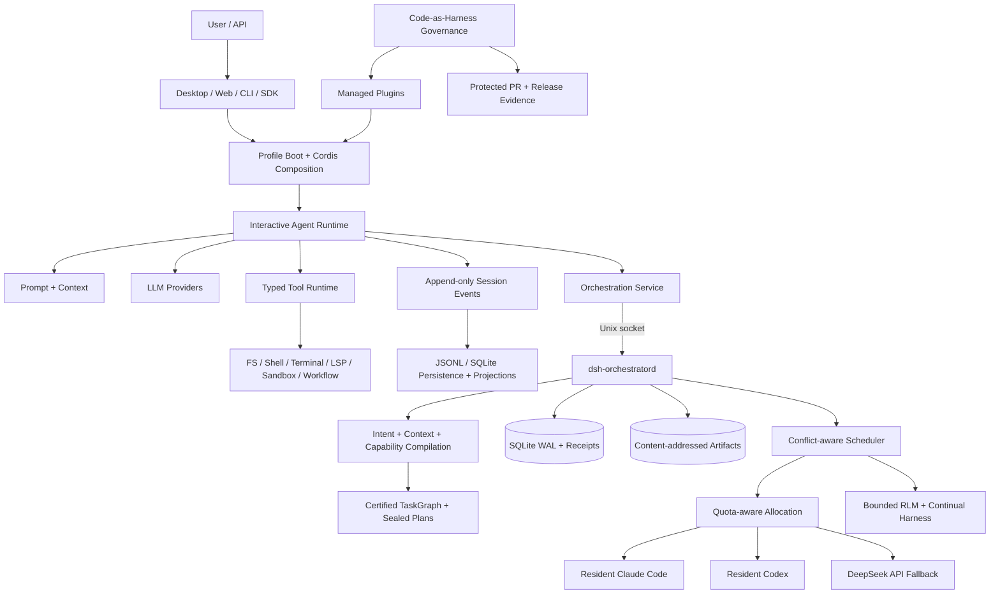

# DSH — DeepSeek Solar Harness

English | [简体中文](README.zh.md)

**A governed, plugin-composed agent runtime and macOS workbench with durable TaskGraph orchestration.**

**Snapshot:** DeepSeek-Solar-Harness (`DSH`) is a community downstream distribution of [DeepSeek Harness](https://github.com/deepseek-ai/deepseek-harness), not an official DeepSeek AI release. This analysis is pinned to `solar@a3cd4397efc5294704e9d7384515ab285f81bd06` on 2026-08-27 and DSH Desktop `3.6.6`. The accepted product contract currently covers macOS; machine-readable manifests remain authoritative after this snapshot.

## Positioning

DSH is not only a terminal coding agent and not only an agent-workflow library. It combines an interactive agent data plane, a persistent orchestration control plane, and a product/governance plane in one source repository.

The interactive plane retains DeepSeek Harness's Cordis model: agents, models, tools, sessions, UI surfaces, subprocesses, sandboxes, subagents, and workflows are mounted as lifecycle-managed plugins. The Solar control plane adds compiled intents, bounded context packets, certified TaskGraphs, capability budgets, conflict-aware scheduling, receipts, artifacts, approval, quota-aware physical-operator routing, and restart recovery. The product plane closes these sources into a macOS Desktop distribution with managed-plugin provenance and Code-as-Harness verification.

The key architectural decision is to treat Codex and Claude Code as **physical operators** for an inner coding loop while DSH owns the outer control loop. DSH therefore optimizes for long-running work that must remain inspectable, resumable, authority-bounded, and reproducible rather than for the shortest path from one prompt to one answer.

## Implemented capability inventory

| Capability | Evidence in this repository | Important boundary |
| --- | --- | --- |
| Cordis plugin runtime | Services, typed events, reversible effects, scoped contexts, profile composition | Extension is configuration- and lifecycle-driven; load order and scope remain part of behavior |
| Interactive agent loop | [`ReactLoopAgent`](packages/core/agent-loop/src/agent.ts), inbox routing, turn/step boundaries, streaming, steering, follow-ups, cancellation | The default loop is replaceable, but changing it affects durable event semantics |
| Typed tool execution | [`executeToolCalls`](packages/core/agent-loop/src/tool-calls.ts), schema validation, policy waterfalls, ordered result commit, bounded parallel pools | Parallelism requires an explicit per-call safety classifier; cancellation is cooperative |
| Event-sourced sessions | [`packages/core/session`](packages/core/session), append-only events, surface projection, forks, compaction, crash repair | Current session format remains pre-release and readers fail on unsupported required events |
| Prompt and context assembly | [`packages/core/system-prompt`](packages/core/system-prompt), ordered sections, variables, tool ordering, runtime context | Prompt or schema changes can invalidate KV-cache prefixes and must remain reconstructable from the log |
| LLM provider seam | Direct DeepSeek and multi-provider adapters, retry policy, token meter, routed request metadata | Provider defaults and replay metadata belong to the exact resolved model route |
| Execution capabilities | Filesystem, shell, persistent terminal, LSP, subprocess, sandbox, E2B, workflow, subagent, MCP-facing tools | Worker threads and `node:vm` are isolation mechanisms, not security boundaries |
| Durable orchestration | Local `dsh-orchestratord`, Unix socket, SQLite WAL, immutable plans, events, approvals, pause/resume/cancel | The daemon is a local single writer, not a distributed cluster scheduler |
| Intent/context/capability compilation | Versioned service definitions and deterministic local providers | Tool, MCP, secret, and executable-guard capsule bindings remain fail-closed where enforcement is absent |
| Resident operators and RLM | Quota-aware allocation, Resident Claude Code/Codex, bounded recursive children, Continual Harness | Operator capability updates apply before dispatch or at later turn generations, not arbitrary in-turn hot swap |
| Desktop product | Thin Electron host, loopback Host/Web client, profile switching, native lifecycle, packaging closure | The accepted release contract is macOS-first |
| Managed-plugin governance | [`plugins/registry.yaml`](plugins/registry.yaml), accepted revisions, license evidence, native checks, sealed-source verification | Unmodified optional plugins remain external profile extensions |

## Architecture



The deliberate separation is between the interactive transcript and the orchestration run. A DSH Session records what entered a model-visible turn, what the model produced, and which tools were called. A TaskGraph run records why work was decomposed, which context and authority were sealed for each node, which physical attempt was accepted, which effects may overlap, which evidence was produced, and how execution resumes after a UI or Harness restart.

## Runtime execution path

1. [`apps/cli/src/bin.ts`](apps/cli/src/bin.ts) parses the invocation mode and dynamically loads the profile, plugin, resident, remote, or configuration path.
2. [`apps/cli/src/profile-boot.ts`](apps/cli/src/profile-boot.ts) resolves bundles, profile patches, home patches, command overlays, telemetry policy, immutable launch environment, and bounded shutdown.
3. Cordis mounts the configured tree; every registration is owned by a fiber and unwinds with its plugin scope rather than becoming undocumented process-global state.
4. `ReactLoopAgent` opens a durable turn, claims inbox input, assembles prompt sections and visible tool schemas, derives message history from the Session log, and resolves the exact LLM call.
5. Stream chunks and the canonical assistant message are appended separately so replay keeps both provider fidelity and a stable model-visible message.
6. Tool calls pass through pre-policy, monotonic guards, around-execute wrappers, post-policy, definition finalization, durable call/result linking, and next-step context insertion; exclusive calls form barriers and explicitly safe calls use a bounded rolling pool.
7. Durable orchestration compiles a request into versioned IRs, validates and certifies a graph, seals per-attempt plans, dispatches physical operators, persists receipts/events/artifacts, and reconciles accepted or uncertain attempts after restart.

## Durable TaskGraph control plane

| Stage | Main implementation | Contract |
| --- | --- | --- |
| Intent IR | `ctx.intentCompiler` | Produces a versioned, provider-neutral requirement representation |
| Context packet | `ctx.contextCompiler` | Binds bounded instructions and source/resource references instead of forwarding an unrestricted conversation dump |
| Capability capsule | `ctx.capabilityCapsules` | Resolves accepted capabilities, effects, secrets, and enforcement generations; unsupported authority fails closed |
| Graph validation | [`validateGraph`](packages/orchestration/orchestration-local/src/graph.ts) | Rejects invalid IDs, dependencies, cycles, budgets, timeouts, and missing completion-critical verification coverage |
| Plan certification | Canonical JSON plus SHA-256 | Makes the graph and node order content-verifiable before physical dispatch |
| Scheduling | Conflict and dependency algorithms | Runs independent nodes up to graph, worker, scope, effect, and live-capacity bounds rather than using a phase-wide barrier |
| Persistence | [`OrchestrationStore`](packages/orchestration/orchestration-local/src/store.ts) | SQLite WAL single-writer state, command idempotency receipts, attempt reconciliation, append-only events, content-addressed artifacts |
| Physical execution | Resident operator composition | Treats Claude Code, Codex, and metered fallback workers as routed providers under the same sealed-plan authority |

The control plane is stronger than a prompt-level supervisor because scheduler state and evidence are outside any one model conversation. It is also heavier than a library graph: the daemon, artifact lineage, receipt protocol, approval states, release identity, and Desktop projections create a product operating model rather than only a developer API.

## Key technical designs

### Cordis plugin runtime

Cordis supplies services, merge-extensible typed events, waterfall/serial dispatch, child contexts, and reversible effects. DSH packages normally split a capability into Service Definition, Service Provider, and Consumer roles. Consumers depend on the definition rather than a concrete local provider, allowing filesystem, shell, sandbox, subagent, model, or persistence implementations to move without forking every caller.

### Event-sourced Session

The Session log is the source of model history. `turn/*`, `step/*`, `user/message`, `assistant/*`, and `tool/*` records establish durable enclosure and provenance; projections derive the model surface and UI state. Model-visible input must be reconstructable from the log. Compaction appends replacement events instead of deleting history, while crash repair distinguishes a tool never durably started from an attempt whose external outcome is unknown.

### Typed tools and Code Mode

The tool registry owns argument validation, output schemas, rendering, policy interception, timeout/retry wrapping, concurrency classification, and tool-owned UI presentation. Native function calling and Code Mode share the same registry. Code Mode collapses visible definitions behind a generated `run_code` transport and TypeScript/Python SDK, reducing direct schema pressure without bypassing execution policy.

### Prompt and context assembly

Prompt text is assembled from ordered plugin-owned sections, strict variables, dynamic contexts, and the visible tool universe. Scoped contributions can shadow globals for one agent. Unknown variables, malformed interpolation, multiple complete sections, invalid tool ordering, or a runtime language without an SDK renderer fail loudly before a model request.

### Execution and sandbox boundaries

Filesystem, subprocess, shell, terminal, LSP, workflow, code runtime, and sandbox are separate capability families but must describe one coherent execution world. Local sandbox backends provide platform-specific confinement; remote isolation replaces complete providers. Cooperative cancellation waits for owned work to quiesce. Neither worker threads nor dynamic `node:vm` execution should be treated as hostile-code containment.

### Desktop and managed plugins

Desktop is a thin Electron host: the Host runtime remains Cordis-based, serves the normal Web UI over loopback HTTP/WebSocket, and exposes only bounded Desktop services rather than raw Electron APIs. The root remains a pnpm workspace while [`products/desktop`](products/desktop) is an isolated Yarn workspace. Managed plugins retain source history, accepted SHAs, licenses, native tests, and packaged-byte closure so a clean clone can explain the default application.

## Code map

| Area | Primary path | Why it matters |
| --- | --- | --- |
| CLI dispatch | [`apps/cli/src/bin.ts`](apps/cli/src/bin.ts) | Selects runtime mode without eagerly coupling every surface |
| Profile boot | [`apps/cli/src/profile-boot.ts`](apps/cli/src/profile-boot.ts) | Owns ordered composition, live patch reload, launch provenance, and shutdown |
| Agent state machine | [`packages/core/agent-loop/src/agent.ts`](packages/core/agent-loop/src/agent.ts) | Defines turn/step admission, request construction, streaming, cancellation, and continuation |
| Tool scheduler | [`packages/core/agent-loop/src/tool-calls.ts`](packages/core/agent-loop/src/tool-calls.ts) | Preserves model order while overlapping only explicitly safe dispatch bodies |
| Session model | [`packages/core/session`](packages/core/session) | Owns durable event vocabulary, surface replacement, forks, and request reconstruction |
| Tool ABI | [`packages/core/tools`](packages/core/tools) | Owns schema, policy, execution, results, Code Mode, and presentation contracts |
| Prompt registry | [`packages/core/system-prompt`](packages/core/system-prompt) | Assembles the exact prompt/tool prefix for each scoped request |
| Orchestration API | [`packages/orchestration/orchestration`](packages/orchestration/orchestration) | Provider-neutral TaskGraph, control, event, artifact, and execution-plan types |
| Graph algorithms | [`packages/orchestration/orchestration-local/src/graph.ts`](packages/orchestration/orchestration-local/src/graph.ts) | Validates graphs and computes dependency/effect conflicts |
| Durable store | [`packages/orchestration/orchestration-local/src/store.ts`](packages/orchestration/orchestration-local/src/store.ts) | Implements WAL state, migrations, receipts, attempts, events, and CAS artifacts |
| Local daemon | [`packages/orchestration/orchestration-local`](packages/orchestration/orchestration-local) | Sole orchestration writer and physical-operator coordinator |
| Desktop architecture | [`products/desktop/docs/architecture.en.md`](products/desktop/docs/architecture.en.md) | Documents Electron, Host, Web client, profiles, native runtime, and packaging closure |
| Plugin provenance | [`plugins/registry.yaml`](plugins/registry.yaml) | Records source, accepted revision, license evidence, and native checks |
| Product identity | [`distribution/product.json`](distribution/product.json) | Defines platform, Desktop version, and stable tag contract |

## Comparison with related projects

| Project family | Where it is stronger than DSH | Where DSH is stronger |
| --- | --- | --- |
| [Upstream DeepSeek Harness](https://github.com/deepseek-ai/deepseek-harness) | Smaller upstream delta, simpler contribution path, broader community baseline | Solar Desktop, managed-plugin source closure, governed releases, persistent TaskGraph daemon, resident-operator routing, Continual Harness |
| [OpenAI Codex](https://github.com/openai/codex), Claude Code, [Gemini CLI](https://github.com/google-gemini/gemini-cli), [OpenCode](https://github.com/anomalyco/opencode) | Lower startup and operational complexity; highly optimized model-native coding loops; broader platform packaging in several cases | External durable orchestration, explicit effect/read/write scopes, operator-independent receipts and artifacts, provider routing, reproducible product composition |
| [LangGraph](https://github.com/langchain-ai/langgraph) | Mature library ergonomics for arbitrary Python graphs, checkpoints, interrupts, deployment integrations, and application embedding | Integrated coding workbench, event-sourced model transcript, tool ABI, local physical operators, Desktop, managed plugins, source-to-release governance |
| [Microsoft Agent Framework](https://github.com/microsoft/agent-framework) and AutoGen lineage | Multi-language enterprise APIs, distributed/application hosting patterns, broad provider ecosystem, standard collaboration patterns | More opinionated local coding control plane, executable profile composition, per-node capability sealing, local Resident operators, product-source closure |
| Deep-research pipelines such as AI4Research, GPT Researcher, Open Deep Research, OpenJiuwen DeepSearch, and Octos | Domain-specific source collection, evidence synthesis, report planning, citation and publishing workflows | General executable agent runtime, coding tools, durable sessions, low-level capability seams, physical-operator orchestration, Desktop lifecycle |

DSH should not replace every specialized research pipeline. Its best role for Solar-style systems is the execution substrate beneath research Operators: research-specific Artifact schemas, citation support, coverage evaluation, Report Planner, Chapter Writer, and publication remain domain services, while DSH supplies bounded execution, state, recovery, operator routing, tools, and governance.

## Strengths

1. **Durability spans model and non-model state.** Session events reconstruct model-visible history; TaskGraph state, receipts, and artifacts survive outside the conversation.
2. **Authority is more explicit than in prompt-supervised systems.** Nodes declare dependencies, read/write scopes, effect budgets, capability budgets, secrets, timeout, retry, and verification criticality.
3. **Extension points are real runtime contracts.** Services, providers, consumers, scopes, events, configuration, and disposal are represented in code rather than hidden in one supervisor prompt.
4. **The product is reproducible.** Desktop package closure, managed-plugin sources, accepted revisions, license evidence, and release identity are tracked together.
5. **Strong coding agents remain replaceable resources.** Codex, Claude Code, and metered workers can be selected by policy without surrendering outer-loop state authority to their private transcript.

## Constraints and risks

1. **Upstream divergence is expensive.** Solar must continuously qualify changes across event vocabularies, persistence, package exports, profile composition, Desktop behavior, and managed plugins.
2. **The system has several failure domains.** Cordis lifecycle, profile composition, Session persistence, orchestration daemon, physical operators, native helpers, and Desktop packaging each require independent diagnostics.
3. **macOS is the accepted product surface.** Cross-platform code paths or upstream support do not imply a Solar-supported Windows/Linux Desktop release.
4. **Some isolation mechanisms are not security boundaries.** Dynamic packages, worker-authored workflows, local tools, MCP servers, and third-party plugins require a trusted-computing-base review.
5. **Distributed orchestration is absent.** SQLite WAL plus an owner-local daemon provides strong local recovery, not horizontal availability or multi-region consensus.
6. **Capsule enforcement is intentionally incomplete.** Unsupported tool/MCP/secret/guard bindings reject rather than silently grant authority, which is safer but limits deployable scenarios.
7. **Repository and release complexity is high.** Root pnpm, Desktop Yarn, Python/native builds, sealed archives, and many verification gates increase change latency.

## When to choose DSH

### Good fit

- A macOS-local AI workbench must combine conversation, coding, tools, memory, Web/Desktop UI, and long-running tasks.
- Work must continue across UI/runtime restarts with explicit receipts, artifacts, approval, retries, and indeterminate-outcome handling.
- Codex or Claude Code should execute bounded nodes but must not own the global scheduler, evidence graph, or release authority.
- Plugin provenance, package closure, and agent-generated code verification are first-class product requirements.

### Prefer another base

- The requirement is a minimal, model-native terminal coding loop with little outer orchestration.
- The primary deliverable is a cloud-native Python/.NET/Go workflow service rather than a local macOS workbench.
- Immediate multi-node distributed scheduling, multi-region availability, or enterprise hosted control planes are mandatory.
- The core problem is domain-specific research evidence and report generation and no general coding/runtime substrate is needed.

<a id="run"></a><a id="run-from-source"></a>

## Development

Prerequisites are macOS, Git, Corepack, and Node.js `22.19+` or `24+`. The root and Desktop dependency graphs are intentionally separate.

```sh
git clone https://github.com/lisihao/deepseek-solar-harness.git
cd deepseek-solar-harness
corepack pnpm install --frozen-lockfile
corepack pnpm run build
corepack pnpm dsh web

cd products/desktop
corepack yarn install --immutable
corepack yarn check
# Run only in a graphical session:
corepack yarn dev
```

Root validation includes type checking, lint, unit/coverage tests, snapshots, E2E suites, runtime-closure checks, generated catalogs, documentation checks, package constraints, and release verification. Desktop uses its own headless `yarn check` plus D00–D08 acceptance where application delivery is in scope. Real-provider tests require the corresponding credentials and must not be reported as passed when skipped.

## Verification and provenance

Start with [`AGENTS.md`](AGENTS.md) for standing repository rules and [`docs/architecture.md`](docs/architecture.md) for the upstream runtime map. [`distribution/upstreams.yaml`](distribution/upstreams.yaml) records accepted core/Desktop ancestry, while [`plugins/registry.yaml`](plugins/registry.yaml) records managed-plugin revisions, licenses, and native commands. Third-party runtime disclosures are in [`THIRD_PARTY_NOTICES.md`](THIRD_PARTY_NOTICES.md).

`solar` is protected. Changes use isolated task branches and Pull Requests, with change-aware Code-as-Harness audit, plan, verification, attestation, remote-SHA equality, and applicable runtime/release evidence. A PR or build artifact alone is not delivery.

## License

The core repository is licensed under [MIT](LICENSE). Imported components retain their own license evidence and notices.
