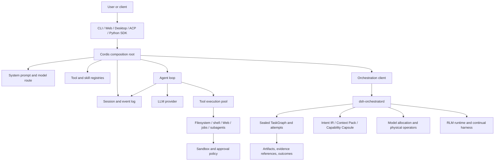

# DSH — DeepSeek Solar Harness

English | [中文](README.zh.md)

**A code-grounded architecture review of the Solar distribution of DeepSeek Harness: an extensible, durable, local-first agent runtime and macOS AI workbench.**

DeepSeek-Solar-Harness (`DSH`) is a downstream product based on [DeepSeek Harness](https://github.com/deepseek-ai/deepseek-harness). It preserves the upstream Cordis plugin runtime, agent loop, session model, tools, Web surface, and package families, then adds an independently governed Solar distribution with a macOS Desktop product, managed plugins, persistent orchestration, intent/context compilation contracts, capability capsules, model allocation, continual harness state, and a bounded recursive language-model runtime.

This README is an implementation analysis rather than a product claim sheet. It distinguishes executable capabilities from evolving contracts and deferred work, and evaluates DSH against general agent frameworks, coding-agent control planes, and deep-research systems.

> **Review baseline:** `solar` branch at `671b308b846f0b53970171fff56a8dad852bbcc5`, inspected on 2026-08-26. Product metadata identifies Desktop `3.4.3`, Node.js `^22.19.0 || >=24.0.0`, pnpm `11.7.0`, and macOS (`darwin`) as the accepted product platform. The repository is under active evolution; implementation details and compatibility may change.

## Executive assessment

DSH is best understood as a **full-stack agent harness and local execution control plane**, not as a finished domain application. Its strongest engineering properties are durable event-sourced sessions, deterministic tool-result ordering, plugin-level composability, fail-closed process confinement, explicit provider seams, owner-local persistent orchestration, content-addressed compilation artifacts, and repository-level provenance and governance.

The repository already contains the substrate required for long-running research and engineering agents: sessions, tools, Web access, delegated workers, workflows, sealed task graphs, model routing, checkpointable RLM execution, bounded continual state, Desktop/Web/CLI/Python entry points, and extensive verification infrastructure. However, it does **not** currently contain a complete deep-research product pipeline with source ingestion, document parsing, evidence normalization, claim-to-source citation validation, report planning, chapter/deep writing, or report export as first-class end-to-end operators.

The architectural bet is therefore different from GPT Researcher or openJiuwen-DeepSearch. Those projects optimize the vertical research workflow; DSH optimizes the horizontal runtime, execution semantics, extensibility, isolation, and product control plane on which multiple vertical workflows can be built.

## Positioning

| Dimension | DSH position |
| --- | --- |
| Primary abstraction | Cordis-composed agent runtime plus durable orchestration and product distribution |
| Main language/runtime | TypeScript/Node.js core; Electron Desktop; Python SDK bridge; native confinement helpers |
| Execution model | Session event log for conversational turns; sealed TaskGraph for persistent multi-node work; bounded RLM for programmable recursive execution |
| Extensibility | Plugins, services, registries, presets, providers, skills, tools, model workers, managed product plugins |
| Persistence | Typed append-only session chronology plus owner-local SQLite/WAL orchestration stores |
| Safety model | Per-session policy, approvals, capability-specific boundaries, fail-closed local sandbox selection |
| Product surfaces | CLI, Web UI, macOS Desktop, ACP, SDK, Python NDJSON-RPC bridge |
| Research readiness | Strong runtime substrate; missing first-class evidence and report-generation vertical |
| Maturity | Core harness is substantial; orchestration/compilation/RLM families are explicitly evolving v1 capabilities |

## Architecture at a glance



The architecture has two complementary execution planes:

- The **interactive agent plane** turns user input into a durable sequence of model requests, stream chunks, tool calls, tool results, and assistant outputs within a Session.
- The **persistent orchestration plane** turns a compiled request into a sealed graph of nodes and attempts, allocates execution providers, persists state through an owner-local daemon, and supports retries, recovery, artifacts, and bounded programmable subexecution.

This separation is important. A conversational event log is the correct source of truth for replaying an agent turn; it is not a sufficient scheduler database for multi-node work. Conversely, a TaskGraph should not be exposed to the model as an unbounded mutable internal state machine. DSH keeps these responsibilities separate and links them through explicit services and artifacts.

## Runtime execution path

A normal interactive turn follows this path:

1. A client creates or resumes a Session and identifies an agent preset, workspace, model route, and product profile.
2. Cordis loads the host plane and agent-plane plugins, resolving services through scoped contexts and isolated realms.
3. The agent loop appends the user turn, builds model history from the durable Session, and renders the deterministic system prompt and current tool catalog.
4. The LLM provider streams response items. Text, reasoning, usage, tool-call fragments, and completion events are normalized and appended to the Session.
5. Tool calls are validated against the typed registry and executed through a concurrency pool. Parallel-safe calls may overlap; exclusive calls create a barrier.
6. Results are committed to model-visible history in original call order, even when execution finishes out of order. Cancellation writes synthetic terminal results so replay never sees an unterminated tool call.
7. The loop continues until the model emits a terminal assistant response, a bounded stop condition fires, or the run is cancelled.

Persistent orchestration adds another path:

1. Raw intent is compiled into versioned `IntentIRV1` with objective, expected outcomes, constraints, non-goals, acceptance requirements, ambiguity flags, source identities, and compiler provenance.
2. Context inputs are compiled into a content-verifiable Context Pack.
3. A capability capsule selects an operator/provider contract and is sealed into the node attempt.
4. The logical graph is admitted by the physical executor and becomes immutable for that run.
5. `dsh-orchestratord` persists runs, attempts, dependencies, resource pools, retries, leases, and artifacts in SQLite/WAL and exposes operations over a Unix socket.
6. A deterministic allocator ranks qualified native-subscription offers before metered API workers, then considers capability, quota buckets, health, role, quality tier, and reset windows.
7. Physical operators execute sealed nodes. RLM nodes may expose only the bounded `typescript_repl` host tool, while ordinary model workers remain text-oriented.
8. Outcomes and artifacts are committed with explicit error and recovery semantics; indeterminate receipts are not silently replayed as success.

## Core implementation

### Cordis as the composition spine

The repository follows the upstream principle that capabilities are plugins rather than hard-coded singleton modules. Cordis contexts provide service discovery, scoped lifetime, events, configuration, and isolated realms. Agent presets demonstrate why this matters: host-plane registries, per-agent state, workflow engines, prompt contributions, and model-facing tools have different ownership and visibility requirements.

The design avoids a common multi-agent failure mode in which every feature imports a global runtime object and mutates shared state. A plugin may register a tool, contribute prompt text, implement a provider seam, or publish an API without forcing the core agent loop to know its implementation.

Trade-off: the dependency graph is cognitively expensive. Correctness depends on understanding context inheritance, service resolution, realm isolation, host-versus-agent ownership, and the timing of plugin activation. This is more powerful than a simple dependency-injection container, but less approachable than a flat Python framework.

### Durable session and event model

Session is a typed, append-only chronology rather than a mutable message array. The log records normalized user/model content, streaming progress, tool calls and results, lifecycle events, usage, and other model-visible state. History is projected from this chronology for the next request.

This gives DSH several useful properties:

- Replay and resume operate on durable facts rather than reconstructed UI state.
- Streaming output does not disappear when a process or client boundary changes.
- Tool execution and model-visible ordering can be audited independently.
- Session projection can evolve without rewriting the original events.
- A remote client, Desktop shell, or Python bridge can observe the same underlying run semantics.

The cost is event-schema discipline. Any item visible to the model must have a stable logged representation; compatibility changes require migrations or projection logic rather than casual object mutation.

### Deterministic agent loop and tool scheduling

The agent loop is not merely `while true: call model`. It owns cancellation, Session writes, stream normalization, stop conditions, tool validation, and continuation. Tool scheduling implements a parallel pool with exclusive barriers and ordered durable commit.

Suppose the model emits calls `A`, `B`, and `C`; `A` and `B` are parallel-safe, while `C` is exclusive. `A` and `B` may execute concurrently, but `C` waits for both. If `B` completes first, DSH can retain the completion internally while committing results to model history in `A`, `B`, `C` order. This preserves the model's causal transcript without discarding execution parallelism.

Cancellation is equally deliberate: every started call receives a terminal result, including a synthetic aborted result when necessary. That prevents a resumed Session from containing a tool-call request with no corresponding outcome.

### Prompt construction and KV-cache awareness

System prompts are assembled from deterministic plugin contributions rather than one monolithic template. Prompt sections, tool catalogs, modes, and product presets explicitly document whether a change affects model-visible request prefixes and therefore KV-cache reuse.

The standard preset keeps the tool catalog stable when entering plan mode and changes behavioral instructions instead of removing mutation tools from the schema. Other product presets can use an anchored first-turn bootstrap and discover additional capabilities later. These choices treat prompt and tool-schema shape as runtime architecture, not copywriting.

Trade-off: cache stability and a smaller first-turn schema improve request efficiency, but dynamic capability discovery can make debugging less obvious. A failure may be caused by the active preset or discovery state rather than the tool implementation itself.

### Tools, skills, workflows, and delegation

The standard agent composition includes filesystem and search, shell execution, background jobs, goals, planning, compaction, skills, subagents, workflows, Ralph-style iteration, user questions, todos, and Web search. Product-specific providers such as Codex or Claude Code can remain disabled in one preset and enabled in another without changing the core loop.

The important boundary is registry ownership. Model-facing tools may be per-agent, while their underlying process-wide registries, continuable setups, or remote API descriptors remain host-plane singletons keyed by Session or agent identity. This reduces duplicate registration and cross-session leakage.

### Process sandboxing and approvals

The local sandbox provider selects one platform mechanism and fails closed when no valid mechanism is available:

- Linux prefers a functional Bubblewrap runner and can use Landlock.
- macOS uses Seatbelt through `sandbox-exec` and probes whether the mechanism works.
- Windows uses a restricted-token and ACL design with per-session temporary authority.

The provider reports enforcement completeness and separates a sandbox-launch failure from a child-command failure. It does not silently execute unconfined after `SANDBOX_UNAVAILABLE`.

The implementation is unusually explicit about residual risk. Windows enforcement is partial because retained identities and NTFS aliases can expose external objects; older Landlock ABIs can be partial; Seatbelt depends on a deprecated public CLI; a configured custom runner is an operator assertion. This is preferable to marketing every backend as equivalent isolation.

## Persistent orchestration

### Control-plane separation

`dsh-orchestratord` is the sole owner-local writer for orchestration SQLite state. Clients communicate over a Unix socket rather than opening the database directly. WAL-backed persistence covers runs, graph state, attempts, leases, resource pools, retry state, and artifacts.

This gives the scheduler a clear authority boundary:

- Multiple clients cannot race as independent SQLite writers.
- Restart recovery is centralized.
- Provider health and resource-pool state survive individual model processes.
- Session ownership and scheduler ownership remain distinct.
- Execution semantics can evolve behind a service protocol.

Current limitation: the daemon is owner-local and v1. Distributed consensus, multi-machine queue ownership, elastic worker fleets, and remote orchestration replication are not established contracts.

### Sealed TaskGraph

The orchestration domain separates a logical graph from its physical execution. Once the physical executor accepts a plan, the run is sealed: graph topology, selected operator contract, and node-attempt inputs cannot be casually rewritten by a running model.

This improves reproducibility and retry semantics. A retry can refer to the same sealed node and inputs, while a deliberate replan becomes a new graph or generation instead of an invisible mutation.

The design also supports explicit conflict waiting, dependency admission, resource-pool exclusion, retryable versus terminal errors, and result artifacts. It is a better foundation for long research or engineering jobs than storing a free-form plan in conversation text.

### Intent Compiler

The Intent Compiler exposes a provider-neutral service and a versioned `IntentIRV1` schema containing:

- objective;
- expected outcomes;
- constraints and non-goals;
- acceptance requirements;
- source and attachment references;
- risk hints and ambiguities;
- a clarification flag;
- compiler ID/version and input/output SHA-256 provenance.

This is an important architectural step toward requirement compilation: downstream planning consumes a normalized, inspectable artifact rather than an unconstrained paraphrase.

Implemented boundary: the schema, service seam, invariants, content identity, and provenance exist. The baseline provider is intentionally deterministic and conservative; it does not yet constitute a powerful model-driven intent compiler with ontology mapping, contradiction resolution, requirement coverage scoring, or iterative clarification policy.

### Context Compiler

The Context Compiler creates a versioned Context Pack with source identities and deterministic provenance. Its contract allows downstream consumers to depend on an immutable context artifact rather than re-reading mutable inputs during an attempt.

Implemented boundary: packaging, identity, validation, and sealing are present. The baseline provider echoes supplied context; retrieval, ranking, deduplication, compression, freshness resolution, cross-source conflict analysis, and token-budget optimization remain provider work.

### Capability Capsules

A capability capsule binds a node to a versioned operator-facing capability description. It can carry input/output schemas, provider identity, execution constraints, and content hashes; sealing the capsule into an attempt prevents provider drift during retries.

This is stronger than choosing a tool by string name at execution time. It makes the selected capability part of the reproducible plan.

Deferred boundary: a production capsule catalog, compatibility negotiation, authorization policy, migration, and broad provider ecosystem are not complete.

## Recursive Language Model runtime

DSH includes a bounded RLM runtime that lets a model use a persistent TypeScript namespace as a programmable working memory and subtask controller. It is not arbitrary Node.js execution: the model receives a restricted `typescript_repl` interface with a controlled host API.

Key implementation properties include:

- persistent namespace snapshots and WAL recovery;
- JSON-compatible values with defined limits;
- asynchronous subtask handles and result collection;
- bounded execution time and step budgets;
- a 16 MiB per-value limit and 256 MiB namespace limit in the local provider;
- prepared/applied receipt states for effectful host calls;
- `RLM_RECEIPT_INDETERMINATE` when restart state cannot prove whether an effect committed;
- deterministic baseline strategy rather than an opaque learned router.

The receipt protocol is the most important detail. Retrying an external effect after a crash can duplicate work; assuming success can lose work. DSH surfaces the uncertainty as a typed failure instead of choosing silently.

RLM is well suited to high-context decomposition, iterative synthesis, structured scratch state, and recursive model calls. It is not yet a general distributed compute substrate, unbounded code interpreter, or replacement for workspace-aware physical operators.

## Model allocation and execution providers

The model-allocation seam normalizes offers from native subscriptions and metered workers. The local policy ranks only qualified offers and considers capability, node role, reported quota buckets, health, model tier, and reset proximity.

Default policy choices are concrete:

- usable native-subscription capacity outranks every metered API offer;
- planning and verification prefer higher-tier models;
- parallel execution can use low/mid-tier models;
- each reported quota bucket is independent;
- near-term quota resets can justify greater current parallelism;
- providers supply offers but never schedule the TaskGraph.

This creates a clean separation between **what capacity exists**, **which offer a node receives**, and **how the graph is scheduled**.

The DeepSeek official API worker is deliberately narrow. Ordinary nodes are text-only; an RLM node receives only the sealed `typescript_repl` function tool. The worker has no workspace tools and no authority to mutate the graph or scheduler.

Current limitation: the allocator is deterministic policy, not a learned cost/latency/quality optimizer. It cannot infer unreported quota windows or forecast price and tail latency.

## Continual harness state

The continual-harness family stores explicit, versioned prompt, memory, skill, subagent, and related harness entries. The local provider persists bounded outcome summaries, tags, and evidence references while refusing to capture raw user prompts, full transcripts, credentials, or model-private state.

Snapshots are scope-filtered, content-addressed, and immutable after sealing into an attempt. Refinement applies valid edits independently, retains structured failures for rejected edits, stores before-images for successful changes, and implements rollback as a new generation.

This is a safer design than allowing an agent to rewrite its global system prompt or memory database in place. It provides an auditable change history and deterministic attempt input.

Current limitation: storage is owner-local and single-writer; distributed replication, cross-machine synchronization, production skill catalogs, and a complete provider compatibility matrix remain deferred.

## Product surfaces

### CLI and Web

`apps/cli/src/bin.ts` is the executable entry point. It boots profiles, composition files, model routes, Session services, tools, and the Web host. The Web client observes runtime domains and communicates over the repository's API/event surfaces rather than owning agent state.

The standard preset exposes Web search but configures direct fetch as disabled. That is sufficient for generic search-assisted agents but not a complete crawler or evidence acquisition layer.

### macOS Desktop

The Desktop product is a separate Yarn workspace under [`products/desktop`](products/desktop). Electron is a thin native host for profiles, lifecycle, packaging, update discovery, terminal integration, and loopback services. The renderer consumes the same Web application over authenticated loopback HTTP/WebSocket; it does not receive arbitrary Electron IPC authority.

This preserves one browser-facing product architecture while adding native lifecycle capabilities. It also avoids a common Electron anti-pattern in which the renderer becomes a privileged orchestration process.

The accepted product contract is currently macOS-only. Core packages contain cross-platform mechanisms, but Windows and Linux are not equivalent accepted Desktop products.

### Python SDK

The Python package does not reimplement the agent runtime. It launches or connects to the DSH executable and exchanges NDJSON-RPC over stdio. Python users therefore access the same TypeScript Session, model, tool, and loop semantics rather than a second divergent backend.

This is a good interoperability choice for notebooks, evaluation harnesses, and Python research stacks. The trade-off is process-boundary overhead and a narrower SDK surface than a native Python framework.

### ACP and external agents

ACP packages and examples expose DSH capabilities to compatible clients and let external agent products participate through explicit protocol boundaries. Optional subagent providers can wrap Codex, Claude Code, or other products without granting them ownership of DSH Session or orchestration state.

## Repository map

```text
deepseek-solar-harness/
├── apps/                    # CLI, Web host/client, protocol-facing applications
├── packages/
│   ├── core/                # Agent loop, Session interfaces, tools, prompt and model foundations
│   ├── orchestration/       # TaskGraph, daemon, compilers, capsules, RLM, allocation, operators
│   ├── session/             # Session stores, projections, compaction and related capabilities
│   ├── shell/ fs/ sandbox/  # Process, filesystem and confinement families
│   ├── workflow/            # Workflows, delegation and continuable execution
│   ├── api/ acp/ sdk/       # External interfaces and client contracts
│   └── ...                  # Context, LLM, model, Web, telemetry and support packages
├── products/desktop/        # macOS Electron product and packaging workspace
├── python/                  # Python SDK and packaged runtime bridge
├── native/                  # Native helpers such as Landlock runner support
├── plugins/managed/         # Solar-owned or Solar-modified managed plugins
├── plugins/registry.yaml    # Machine-readable source, revision, license and test registry
├── distribution/            # Product identity and accepted upstream revisions
├── docs/                    # Architecture, subsystem and development references
├── scripts/                 # Build, generation, invariant, documentation and release gates
├── .agent-governance/       # Change-aware Code-as-Harness verification profile
└── .github/workflows/       # Static, coverage, snapshot, consumer, native and product CI
```

## Capability and maturity inventory

| Capability | Implementation status | Evidence in repository | Important boundary |
| --- | --- | --- | --- |
| Cordis plugin runtime | Implemented core | Contexts, services, events, presets, isolated realms | High conceptual complexity |
| Agent loop | Implemented core | Durable streaming, cancellation, stop conditions, tool continuation | Compatibility tied to event schemas |
| Session/event log | Implemented core | Typed append-only chronology and history projection | Migration discipline required |
| Tool execution | Implemented core | Validation, parallel pool, exclusive barrier, ordered commit | Provider/tool safety remains capability-specific |
| Prompt composition | Implemented core | Deterministic sections and model-experience documentation | Dynamic composition complicates diagnosis |
| Filesystem/shell/jobs | Implemented core | Typed tools, background work and policy integration | Host access depends on sandbox mode |
| Local sandbox | Implemented with documented limits | Bubblewrap, Landlock, Seatbelt, Windows restricted-token/ACL paths | Not all backends provide full isolation |
| Subagents/workflows | Implemented core/evolving providers | Spawn/fork, external providers, workflows, Ralph iteration | Product providers have different depth/tool semantics |
| Persistent orchestrator | Evolving v1 | Unix-socket daemon, SQLite/WAL, attempts, pools, recovery | Owner-local, not distributed |
| Sealed TaskGraph | Evolving v1 | Logical/physical graph and immutable execution plan | Higher-level workflow library still needed |
| Intent IR | Contract implemented | Versioned schema, provenance, hashes, errors | Baseline compiler is not semantically rich |
| Context Pack | Contract implemented | Versioned artifact and sealing | Baseline lacks retrieval/ranking/compression |
| Capability Capsule | Contract implemented | Versioned provider-neutral capsule and attempt sealing | Catalog/policy/migration incomplete |
| RLM runtime | Bounded implementation | Persistent TS namespace, subcalls, receipts, recovery | Not arbitrary code or distributed compute |
| Model allocation | Deterministic implementation | Native-first offer ranking and quota-aware policy | No learned optimization or forecasting |
| Continual harness | Owner-local implementation | Versioned entries, outcomes, refinement and rollback | Cross-machine replication deferred |
| CLI/Web/Desktop | Implemented product surfaces | Shared runtime with thin Desktop host | Accepted Desktop platform is macOS |
| Python SDK | Implemented bridge | NDJSON-RPC to packaged DSH runtime | Not a native Python execution engine |
| Managed-plugin provenance | Implemented distribution control | Registries, accepted SHAs, license evidence, vendor closure | Increases maintenance and qualification cost |
| Code-as-Harness governance | Implemented repository control | Change-aware gates, attestation, CI contracts | Local verification can be expensive |
| Deep-research evidence pipeline | Not first-class | No complete source/evidence/claim/citation operator chain | Must be designed and implemented |
| Report planner/writer/export | Not first-class | No sealed report-planning/chapter-writing product pipeline | Requires a vertical application layer |

## Deep-research readiness

DSH has many primitives required by a serious research system, but primitives are not the workflow. The following matrix separates reusable substrate from missing domain logic.

| Research stage | Reusable DSH substrate | Missing or incomplete vertical capability |
| --- | --- | --- |
| Topic/intent intake | Intent IR, clarification flag, attachments and source refs | Domain taxonomy, ambiguity resolution, research-question quality scoring |
| Source discovery | Web search tool, skills, subagents, workflows | Search strategy operator, query portfolio, freshness and authority policy |
| Acquisition | Shell/fs/Web integrations and sandbox | First-class fetch/crawl connector, robots/policy handling, immutable raw-source Artifact |
| Parsing | Filesystem, subprocess and plugin seams | PDF/HTML/Office parsers, layout/table extraction, parser provenance and quality flags |
| Evidence normalization | Content-addressed artifacts and provenance patterns | Fact/evidence schemas, passage offsets, source versioning, contradiction graph |
| Deduplication/clustering | TaskGraph, RLM, model workers | Canonical document identity, semantic dedup, topic clustering and coverage metrics |
| Research planning | Intent/Context/Capsule/TaskGraph | Report Planner schema, coverage constraints, replanning policy and HITL review |
| Parallel investigation | Subagents, physical operators, allocation and RLM | Research-specific worker roles, shared evidence store and branch merge policy |
| Long-form synthesis | Continual harness, compaction, model routing | Chapter Writer/Deep Writer contracts, cross-chapter consistency and omission checks |
| Citations | Source refs and evidence-reference vocabulary | Claim-level support mapping, citation placement, entailment/coverage validator |
| Quality evaluation | Typed errors, artifacts, CI/evaluation substrate | Source coverage, support ratio, duplication, hallucination and structural evaluators |
| Publication | Web/Desktop and filesystem tools | Markdown/HTML/PDF/DOCX/PPT report renderers and release manifests |
| Continuous update | Persistent orchestration and generation history | Source freshness monitor, incremental evidence diff, selective chapter regeneration |

The recommended architectural direction is to preserve the current runtime and add a research vertical as plugins and explicit artifacts. Source documents, extracted passages, evidence units, model judgments, report plans, chapter drafts, citations, evaluations, and final publications should be separate versioned Artifact kinds connected by upstream references. They should not be collapsed into Session messages or one large prompt.

## Comparison with related projects

### Comparison summary

| Project | Primary center of gravity | Where it is stronger than DSH | Where DSH is stronger | Best use |
| --- | --- | --- | --- | --- |
| DeepSeek Harness | General plugin-first agent harness | Upstream release cadence, smaller distribution scope, official baseline | Solar Desktop, managed plugins, governance, persistent orchestration/RLM extensions | General agent runtime and plugin development |
| LangGraph | Low-level stateful graph orchestration | Mature graph API, checkpoint/HITL ecosystem, Python adoption, LangSmith integration/deployment | Integrated local agent product, tool runtime, Session chronology, sandbox, Desktop and source governance | Programmatic stateful workflows and service deployment |
| Microsoft Agent Framework | Enterprise multi-language agent/workflow framework | Python/.NET breadth, OpenTelemetry, Foundry hosting, middleware and enterprise ecosystem | Local-first product, Cordis composability, detailed tool/session semantics, macOS workbench | Enterprise agent applications in Microsoft/Azure environments |
| OpenHands | Coding-agent control center and automation product | Turnkey developer UX, multiple remote/cloud backends, coding automations and ecosystem | Plugin-granular runtime composition, sealed orchestration contracts, RLM and distribution provenance | Self-hosted software-engineering agents |
| GPT Researcher | Vertical Web/local deep-research application | Turnkey retrieval, scraping, context curation, report writing, citations and export | Durable general runtime, isolation, provider boundaries, product extensibility and execution semantics | Rapid deployment of research-report generation |
| openJiuwen-DeepSearch | Enterprise knowledge-augmented research stack | Hybrid vector/keyword/graph retrieval, report templates, segment provenance, enterprise research workflow | Smaller local-first runtime, plugin/provider isolation, deterministic tool/session behavior | Enterprise knowledge-base and professional report systems |

### Versus upstream DeepSeek Harness

DSH inherits the upstream architecture rather than replacing it. The upstream project describes itself as a developer-preview harness where everything is a plugin. Solar retains that runtime and adds an independently controlled product layer: accepted upstream revisions, managed-plugin source, Desktop packaging, product identity, Code-as-Harness governance, and experimental orchestration families.

Advantages of DSH:

- one repository can coordinate core, Desktop, and Solar-maintained plugins;
- product inputs are tied to source, accepted revisions, licenses, and verification;
- the macOS workbench is an explicit accepted product rather than a generic demo surface;
- orchestration, intent/context artifacts, RLM, model allocation, and continual state create a path toward longer-running workloads.

Disadvantages:

- the fork bears continuous merge and qualification cost;
- Solar can lag upstream while an R2 change is evaluated;
- the codebase is larger and contains both mature core and evolving extensions;
- users must distinguish upstream package versions from Desktop and managed-plugin versions.

### Versus LangGraph

LangGraph is centered on a graph API for stateful, long-running workflows, with checkpointing, interrupts, memory, time travel, and a broad Python ecosystem. It is easier to embed into a conventional Python service and has a clearer public abstraction for application developers who want to define graph nodes and edges directly.

DSH is more vertically integrated below and above the graph: it owns the agent loop, tool registry, Session event vocabulary, prompt composition, sandbox, product presets, Desktop/Web client, provider offers, and repository provenance. Its sealed physical TaskGraph and local daemon emphasize reproducibility and execution authority rather than only application graph state.

Choose LangGraph when the main problem is authoring and deploying a stateful workflow in a Python ecosystem. Choose DSH when the main problem is building a local agent product or execution substrate whose tools, prompts, sessions, providers, plugins, safety, and UI must share one runtime contract.

### Versus Microsoft Agent Framework

Microsoft Agent Framework offers Python and .NET APIs, middleware, graph workflows, checkpointing, streaming, human-in-the-loop, time travel, OpenTelemetry, declarative agents, skills, and Foundry hosting. It has a stronger enterprise-cloud story and a wider language/hosting surface.

DSH is narrower in enterprise deployment but deeper as a local agent workbench. Its Cordis plugin topology, model-visible event discipline, ordered tool transcript, process sandbox, native/subscription allocation, sealed RLM lane, and source-to-package provenance solve different problems from Foundry integration.

Choose Microsoft Agent Framework for Azure/Foundry-centric production services, cross-language enterprise teams, and standardized observability. Choose DSH for a local-first extensible agent workstation, research on runtime semantics, or products that need tight control over tool exposure, host capabilities, and installed source closure.

### Versus OpenHands

OpenHands Agent Canvas is a self-hosted control center for coding agents and automations. It connects to local, Docker, VM, cloud, and ACP-compatible backends and provides a more turnkey software-engineering product and automation experience.

DSH has broader runtime composition and a more granular internal plugin architecture. Its Session and tool-result ordering, provider seams, orchestration compiler artifacts, RLM receipts, and managed source provenance are stronger foundations for experimenting with agent execution semantics. OpenHands has the advantage in ready-made coding workflows, backend fleet topology, integrations, and user-facing automation.

The projects are not mutually exclusive. An ACP or service adapter can let DSH participate as a backend or specialized worker, provided ownership of Session state, workspace capabilities, cancellation, and result artifacts remains explicit.

### Versus GPT Researcher

GPT Researcher implements a direct vertical path: choose a research agent, generate questions, retrieve and scrape sources, curate context, write a report, attach references, and export results. Its `GPTResearcher` class coordinates retrievers, memory, browser management, source curation, deep-research skill, image generation, and report generation. It reaches useful research output much faster than DSH in its current form.

Its architectural trade-off is concentration. Many research concerns converge in one application-level orchestrator and shared runtime state. That is pragmatic for a focused product, but less explicit than DSH's sealed attempt artifacts, independent scheduler authority, provider offer model, typed Session chronology, and fail-closed capability boundaries.

For a research product today, GPT Researcher is closer to turnkey. For a platform intended to support research, coding, analysis, and future agent workloads with auditable execution and multiple product surfaces, DSH offers the stronger substrate. A clean integration would expose GPT Researcher-like acquisition and report functions as namespaced DSH capabilities while translating every source, context, and report into Solar Artifacts; embedding its internals directly into the core would violate DSH's dependency boundaries.

### Versus openJiuwen-DeepSearch

openJiuwen-DeepSearch is designed as an enterprise deep-search and report system. Its stated architecture includes intent routing, structural planning, offline knowledge construction, keyword/vector/graph/hybrid retrieval, online fusion and refinement, report generation, interactive editing, segment-level provenance, and export.

DSH does not currently match that vertical scope. It lacks the knowledge construction and evidence/citation pipeline required for professional research reports. Its advantages are a smaller local-first execution footprint, strong plugin and provider isolation, deterministic Session/tool behavior, explicit sandbox semantics, and an independently packaged Desktop workbench.

For enterprise knowledge-base research, openJiuwen is functionally ahead. For building a modular execution layer that can host multiple research engines or compare providers under sealed contracts, DSH is architecturally attractive.

## Key strengths

### 1. Execution semantics are first-class

DSH records model-visible state, preserves tool-call ordering, closes cancelled calls, separates scheduler authority, and seals attempt inputs. These are the details that determine whether a long-running agent can be resumed and audited.

### 2. Composition extends beyond tools

Models, prompts, tools, skills, sandboxes, Session stores, APIs, subagents, allocators, compilers, and product features all have plugin or provider boundaries. The core does not need a switch statement for every product capability.

### 3. Safety failures are explicit

Sandbox unavailability, partial enforcement, provider incompatibility, invalid intent, unavailable compilers, receipt uncertainty, quota exhaustion, and attempt failure use structured semantics rather than silently degrading.

### 4. Local product and source provenance are integrated

Desktop vendor inputs map back to tracked source; managed plugins retain accepted revisions and license evidence; release identity is separate from upstream package versions; governance selects verification based on the actual diff.

### 5. The architecture anticipates heterogeneous compute

Native subscriptions, metered APIs, resident operators, one-shot workers, RLM lanes, and future providers can advertise offers without gaining control over the graph scheduler. This is a sound basis for cost-aware multi-model systems.

## Key risks and weaknesses

### 1. The repository contains several maturity levels

A reader can mistake a well-specified v1 seam for a production-complete capability. Intent, Context, Capsules, orchestration, allocation, RLM, and continual harness have real code, tests, and contracts, but several providers remain deterministic baselines or owner-local implementations.

### 2. Architecture complexity is high

Cordis scopes, isolated realms, host/agent planes, generated APIs, multiple package families, Desktop's separate workspace, managed plugins, and governance rules create a steep contribution curve. The cost is justified only when the product needs this degree of composability and lifecycle control.

### 3. The deep-research vertical is missing

The current runtime should not be marketed as a finished deep-research engine. Web search alone does not provide acquisition provenance, source normalization, evidence coverage, citation entailment, report planning, or export.

### 4. Distributed operation is not established

The scheduler, RLM store, and continual state are owner-local. A multi-machine research service would require remote worker identity, lease/fencing semantics, Artifact storage, replication, telemetry, and operational controls beyond the current contracts.

### 5. Fork maintenance is a permanent systems cost

Every upstream movement can affect Session schemas, plugin APIs, prompt/tool behavior, persistence, packaging, and Desktop closure. Solar's qualification process reduces risk but cannot eliminate integration effort.

### 6. Accepted product scope is narrower than package portability

Core packages and sandbox implementations address multiple operating systems, but the accepted Desktop product is macOS. Cross-platform code presence should not be interpreted as equivalent product validation.

## Best-fit use cases

DSH is a strong fit for:

- a local all-in-one AI workbench with multiple agent profiles and tools;
- a coding/research hybrid where filesystem, shell, Web, subagents, and long-running jobs share one Session model;
- experimentation with prompt/tool-schema stability, model allocation, recursive execution, and continual harness state;
- a host platform for multiple domain plugins that require explicit lifecycle and isolation;
- auditable local or single-owner persistent workflows;
- a foundation for a new deep-research system whose evidence and report layers will be implemented as explicit plugins and Artifacts.

DSH is a weaker fit when the immediate requirement is:

- a minimal Python library with a small public API;
- a turnkey enterprise distributed scheduler;
- a finished citation-rich research report generator;
- a zero-configuration coding-agent SaaS;
- a framework that hides all provider, prompt, tool, and persistence details behind one agent class.

## Quick start

The accepted Desktop product is macOS-first. Core development requires Git, Node.js `22.19+` or `24+`, Corepack, and pnpm.

```sh
git clone https://github.com/lisihao/deepseek-solar-harness.git
cd deepseek-solar-harness
git switch solar
corepack pnpm install --frozen-lockfile
corepack pnpm run build
corepack pnpm dsh web
```

For Desktop development:

```sh
cd products/desktop
corepack yarn install --immutable
corepack yarn check
corepack yarn dev
```

For the Python package and runtime bridge, start with [`python/README.md`](python/README.md). For package families, use [`packages/README.md`](packages/README.md). For the runtime model, read [`docs/architecture.md`](docs/architecture.md) and [`docs/subsystems`](docs/subsystems).

## Development and verification

The repository has extensive generated-contract, type, lint, test, snapshot, package, documentation, product, native, and governance gates. Common root commands include:

```sh
corepack pnpm run build
corepack pnpm run typecheck
corepack pnpm run lint
corepack pnpm run test
corepack pnpm run check:all
corepack pnpm run doc-sync
```

Solar's Code-as-Harness entry points select and attest the required gates for the actual outgoing diff:

```sh
python3 tools/agent-development-governance/governance.py audit --project . --strict-warnings
python3 tools/agent-development-governance/governance.py plan --project . --scope auto --level full --changed-from origin/solar
python3 tools/agent-development-governance/governance.py verify --project . --scope auto --level full --changed-from origin/solar --report @git
python3 tools/agent-development-governance/governance.py attest --project . --report @git --require-level full
```

Read [`AGENTS.md`](AGENTS.md), the nearest scoped `AGENTS.md`, and [`docs/AGENTS.md`](docs/AGENTS.md) before changing code or documentation. Root documentation is maintained as an equal-authority English/Chinese pair, with exact content hashes recorded in [`README.i18n.yaml`](README.i18n.yaml).

## Source provenance and upstream policy

DSH is a downstream product and does not represent an official DeepSeek AI release. Accepted core and product ancestors are recorded in [`distribution/upstreams.yaml`](distribution/upstreams.yaml). Solar-owned or Solar-modified plugins are recorded in [`plugins/registry.yaml`](plugins/registry.yaml) with source path, accepted revision, license evidence, and native verification commands.

Unmodified optional plugins remain external profile extensions. Once Solar modifies or bundles a component, it becomes a managed source input and must satisfy provenance, license, package-closure, compatibility, and test contracts.

The protected `solar` branch is the integration line. Upstream revisions are discovered as candidates, classified by risk, imported mechanically on isolated branches, adapted separately, verified, reviewed, and only then recorded as accepted. “Newest upstream” and “accepted Solar input” are intentionally different concepts.

## Review methodology

This analysis was produced from repository structure and executable implementation, including the CLI and product entry points, core agent-loop and tool-call source, Session contracts, orchestration and RLM providers, compilation schemas, sandbox implementation, package and plugin registries, CI, Desktop boundaries, and Python bridge. Project READMEs were used to identify declared contracts and explicit limitations, then cross-checked against source packages and configuration.

Comparisons describe architectural center of gravity rather than a synthetic feature score. A mature vertical application can be more useful for one task even when its general runtime is less explicit; a sophisticated runtime can be the better long-term substrate while still lacking the domain pipeline needed for immediate output.

## License

The core repository is licensed under [MIT](LICENSE). Imported components retain their own license files and declarations. Third-party runtime dependencies are disclosed in [`THIRD_PARTY_NOTICES.md`](THIRD_PARTY_NOTICES.md), while managed-component evidence is recorded in [`plugins/registry.yaml`](plugins/registry.yaml).
