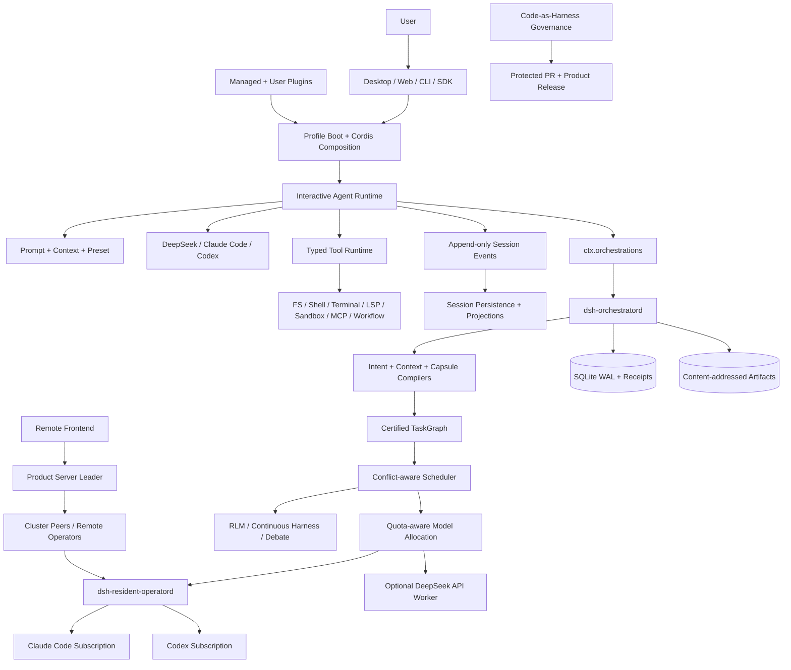

# DSH（DeepSeek Solar Harness）

简体中文 | [English](README.zh.md)

> 本页是 DSH 3.9.9 的完整中文说明；英文文档见 [README.zh.md](README.zh.md)。

**DSH 3.9.9 是一个插件化、可持久恢复、可在本机或多台 Server 上运行的 Agent Runtime 与 macOS 工作台。** 它既能直接使用 DeepSeek API，也能在没有 DeepSeek API Key 时，以用户自己的 Claude Code / Codex 订阅作为第一模型和持久物理算子。

| 3.9.9 快照 | 状态 | 说明 |
| --- | --- | --- |
| 正式产品 | `ok` | DSH Desktop `3.9.9`，当前接受平台为 macOS |
| 源码身份 | `ok` | [`solar@009ec761`](https://github.com/lisihao/deepseek-solar-harness/commit/009ec761e4247dcc63ae1499a47dc4ed4b37e5e5) |
| 产品形态 | `ok` | 本地 Desktop、Remote Frontend、Product Server、CLI / Web / SDK |
| 项目关系 | `warn` | 社区下游发行版，并非 DeepSeek 官方产品 |

## DSH 是什么

DSH 不只是终端 coding agent，也不只是 workflow library。它把三个平面组合在同一个插件化产品中：

1. **交互数据平面**——模型对话、类型化工具、文件、shell、terminal、LSP、sandbox、Session、Memory、Web UI 与 Desktop UI。
2. **持久控制平面**——Intent、Context、Capability、TaskGraph、密封执行计划、Receipt、审批、Evidence、恢复、远程 Worker 与集群权威。
3. **产品与治理平面**——密封的 Desktop/Product Server 组合、受管插件来源、计费、Trace、发行身份与 Code-as-Harness 门禁。

核心架构决策是：外层控制环归 DSH 所有，DeepSeek、Claude Code 和 Codex 是可替换执行 Provider。一次简单请求可以直接完成；长任务则可以变成持久 DAG，其状态、Evidence、Authority 和算子 Receipt 可跨应用与 daemon 重启继续存在。

DSH 基于 [DeepSeek Harness](https://github.com/deepseek-ai/deepseek-harness) 及其 Cordis 组合模型构建。它是社区下游发行版，并非 DeepSeek AI 官方产品。

## 产品形态

| 形态 | 用途 | 运行权威 |
| --- | --- | --- |
| DSH Desktop · Local Server | MacBook 完整 cockpit，包含本地 Host、插件、Session、算子、编排与原生集成 | 本地 Host 与本地 daemon |
| DSH Desktop · Remote Frontend | 完整浏览器/Desktop 体验，从具名多 Server 目录连接一个选定 Product Server | 被选中的远端 Product Server；Frontend 只是投影与控制客户端 |
| DSH Product Server | Plain-Node 长期运行的产品组合，包含 Resident、Orchestration、RLM、Debate、Memory、Billing、Remote Modules 与治理 | Server Host 及其 owner-local daemon |
| CLI / Web / SDK | Headless、浏览器、自动化、配置、插件和开发者入口 | 被选中的 profile 与已挂载 Provider |

Desktop 与 Product Server 从同一个密封组合生成，加载相同产品能力，只有 Host adapter 不同。上游兼容的普通 `dsh server` 命令仍是 bare Server profile，不是完整 DSH Product Server。

## 功能全景

| 能力 | 3.9.9 已提供 | 边界 |
| --- | --- | --- |
| Cordis 插件 runtime | Service Definition / Provider / Consumer 接缝、scoped context、类型化 event、可逆 effect、profile 与 bundle 组合 | 加载顺序与 scope 是可观察行为；Consumer 不得导入具体 Provider |
| 交互式 Agent | Streaming turn/step loop、inbox、steering、follow-up、取消、模型可见日志、preset 切换 | 默认 loop 可替换，但必须保持持久 event 语义兼容 |
| 模型与凭据 | DeepSeek 与多 Provider adapter、模型目录、effort/thinking 选择、retry 与 usage metadata | 凭据资格由各 Provider 所有；没有隐藏 API fallback |
| 第一模型订阅 | Claude Code 与 Codex 可带着 DSH prompt、tool scope、审批、日志和插件驱动主 DSH turn | 使用用户的原生订阅登录；DSH 不导入产品私有 token |
| 物理算子 | Provider-neutral 发现、准入、执行模式、生命周期、有界结果与插件接缝 | 未指定 mode 时仍默认 `ephemeral`；不支持的模式明确失败 |
| Resident 算子 | 持久 Claude Code/Codex Session、Receipt、Lease、lane、interrupt、compact、reset、event、Artifact ref | Daemon 是唯一写者；indeterminate 命令绝不自动重放 |
| Smart Collaboration | 自动或手动算子策略、实时模型/强度目录、主动委派、每个原生产品最多四个 lane | 它只是同一物理算子接缝上的策略，不是第二个 Scheduler |
| AgentTeams | 具备有界 Worker 身份与所选 preset persona 的并行委派 Agent | Team 协作仍受 Session 与 Tool Authority 约束 |
| TaskGraph 编排 | 持久 DAG、依赖、并行 readiness、scope/effect 冲突控制、retry、审批、暂停/恢复/取消与重启恢复 | `dsh-orchestratord` 是唯一编排写者 |
| Compiler 流水线 | 版本化 Intent IR、Context Packet、Capability Binding Plan、Graph Certificate、per-attempt 密封 ExecutionPlan | Compiler Provider 不能执行节点或修改 Scheduler 状态 |
| 模型分配 | 套餐优先 offer、quota pool、目标策略、Luna/Terra 自适应执行、高阶规划/验证、计费 fallback | Allocator 只消费归一化 offer，不预测私有订阅限流 |
| RLM | 持久 TypeScript REPL、可编程 `context`、异步 `rlm()`、message、goal、compact、skill、有界递归、Agents View attach/input/detach | 当前是 **Compatible subset**，尚未宣称所有真实 Provider 都与 Prime 完全忠实对齐 |
| Continuous Harness | Session、workspace、user-global 条目；版本化 prompt addenda、memory、skill、subagent definition、snapshot、refinement、rollback | 在密封 attempt/turn 边界生效；暂不支持 mid-turn mutation 与跨机器同步 |
| Autonomous continuation | 同一密封 RLM lane 上可选的 end-condition loop，包含持久 budget 与 gate 计数 | 达到限制不等于成功；始终服从 TaskGraph 权威 |
| Debate | 有界 proposer/falsifier/auditor/judge 阵容、盲首轮、Claim Ledger、收敛、异议、Artifact、审批与 UI | Debate 是可选模式；没有对照证据时不保证答案更好 |
| Remote Frontend | 具名 Server 目录、增删改选、本地/远端切换、健康资格、Leader 跟随与恢复页 | Live state 留在权威 Server；Frontend 不成为第二写者 |
| 远程执行 | 精确 commit 的仓库物化、per-command 隔离 workspace、持久 Resident 执行、Artifact 回传 | 仅允许 allowlist 仓库；凭据与发送端绝对路径不跨 wire |
| 多 Server 集群 | 固定成员、majority-backed Leader Lease、term/vote fencing、逻辑状态复制、Frontend Leader 发现 | 首版使用有界完整 snapshot；成员变更与无界增量复制后置 |
| Session handoff | Frontend/local Server/Product Server 间按 revision 传输完整且已闭合的事件日志 | 不复制 open turn、SQLite/WAL，也不做 continuous dual write |
| Memory | Mnemon Memory Space、多 Provider adapter、Recall、Graph Projection、Runtime Memory、受监督写入与备份面 | Memory 是受管插件能力，不是编排事实源 |
| Trace 与 Evidence | Session event、Collaboration Trace、Orchestration event、算子阶段、有界输出、不可变 Evidence/Artifact ref | 私有推理、原始 prompt、完整 terminal screen 与产品私有 transcript 不进入通用投影 |
| Billing | 本地 usage ledger、DeepSeek 官方余额、分时价格、模型明细、本地节省、多 Server 聚合 | DSH 本地总额不是 Provider 官方账单；不可用来源会显式显示，不冒充零 |
| Desktop 体验 | Thin Electron Host、官方 Web carrier、advanced/compatibility mode、profile、tray、terminal、update、theme 与 plugin | 当前稳定发行合同是 macOS；Windows/Linux 路径不是已接受的稳定 Desktop 发行版 |
| 受管插件 | 密封 Better Sidebar、GenUI、diagnostics、code graph、Mnemon、Aegis skill、billing、remote module 与来源 registry | 可选第三方插件仍是 profile extension，除非进入密封产品 |
| 治理 | Agent Note、双语文档、包约束、Code-as-Harness、source/package/runtime identity、受保护 PR 交付 | 需要真实安装产品验收时，治理通过不能替代它 |

## 系统架构



### 权威边界

| 所有者 | 权威内容 | 不得拥有 |
| --- | --- | --- |
| Session runtime | 模型可见 transcript、turn/step/tool event 顺序与用户投影 | TaskGraph 调度或原生产品 history |
| Orchestration daemon | Graph/run/node/attempt 状态、Receipt、审批、generation、Evidence 与 CAS ref | 模型内自然语言解释或产品私有 Session state |
| Resident daemon | 原生算子 Session 映射、Command Receipt、Lease、进展 event 与有界结果 | Global TaskGraph state 或 Desktop UI state |
| Claude Code / Codex | 各自原生产品 Session 与执行行为 | DSH Global Scheduler、插件组合、Evidence graph 或发行权威 |
| Product Server | 连接 Frontend 所使用的远程 Live Session 与 Service | Frontend 非活动本地状态或 GitHub 源码权威 |
| Desktop Frontend | 展示、算子控制、Server 目录与显式同步请求 | 静默 failover 写入、复制 open turn 或第二份 canonical database |

## 执行模式

| 用户选择 | 执行行为 | 适合场景 |
| --- | --- | --- |
| 标准 | 一个主模型遵循普通 Agent Loop 并使用标准 DSH 工具 | 对话、聚焦修改、可预测基线 |
| 智能自动 | DSH 根据策略与实时能力选择直接执行、物理委派、TaskGraph、RLM 或其他已准入策略 | 系统可以综合优化质量、速度和成本时的通用默认 |
| RLM | Root 模型获得持久 TypeScript REPL，把 context 与异步 child agent 当成可编程变量 | 大上下文分解、递归分析、受控综合 |
| Debate | 多个有界高阶角色互相质询，Judge 保留异议并综合 | 有争议的架构、审查、风险与重证据决策 |
| TaskGraph | Certified DAG 在 scope、effect、Receipt 与 acceptance 规则下并行派发独立节点 | 多步骤开发与必须跨重启继续的工作 |

RLM 与 Debate 是执行策略，不是竞争控制平面。它们运行在既有 Session/TaskGraph Authority 内，并使用同一套物理算子。显式 RLM 使用面向 Prime 的 strict profile；Smart Auto 可以使用 DSH 的成本与 quota-aware 分配。两个模式都不被宣传为必然提升质量：发行判断应优先复用固定离线 fixture，只在受影响时执行一次获准的最小真实订阅盲测。

## 没有 DeepSeek API Key 时使用原生订阅

只要至少一个 Claude Code 或 Codex 原生订阅 Provider 通过资格检查，DSH 就可以在没有 DeepSeek API Key 时运行。同一订阅可以承担两种角色：

1. 作为**受委派物理算子**，接收当前 DSH Agent 发出的有界任务。
2. 作为**第一模型 DSH Agent**，接收已组装 system prompt，以及到当前 DSH 工具全集的密封 bridge。

两种路径中，插件组合、Tool Schema、审批策略、Event Logging、Collaboration Trace、Receipt 与有界结果仍由 DSH 掌握；原生产品保留自己的登录 token 和 Native Session。订阅 Provider 禁止 API fallback；登录资格不成立时明确失败，不会静默花费计费 API Key。

## 持久编排流水线

```text
Raw request
  -> IntentIR
  -> RequirementIR
  -> Logical TaskGraph
  -> validation + Plan Certificate
  -> durable Run

Ready node
  -> Capability resolution
  -> Continuous Harness snapshot
  -> Context compilation
  -> Operator/model allocation
  -> sealed NodeExecutionPlan
  -> approval/admission
  -> local or remote physical execution
  -> Evidence + Artifact + receipt settlement
```

Scheduler 只有在 dependency、graph limit、read/write scope、effect、live capacity、quota 与 approval 都兼容时才准入节点。独立节点可以并行；冲突 scope 或 effect 只串行化受影响节点，不设置 phase-wide barrier。Settled 失败重试会生成新 attempt 与 execution identity；结果不确定的外部命令绝不自动重放。

## 远程与多 Server 运行

DSH 3.9.9 把 cockpit 与 compute 分离：

1. MacBook Desktop 可以运行自己的 Local Server，也可以不替换 App 就切换到已保存 Product Server。
2. 一个 Frontend 可以维护多个具名 Server，并跟随当前可调度 Leader。
3. Product Server 可以本地执行，也可以向集群提供已资格确认的远程 Resident capacity。
4. 远程工作使用 clean Git repository identity 与精确 commit；接收端创建 Server-local 隔离 checkout。
5. GitHub 仍是源码权威。可选 Tailscale/SSH 路径只用于加速传输和认证访问，不成为源码事实源。

集群调度必须持有未过期的 majority Lease。Follower 不能重放已接受命令，过期 term 的结果不能结算新 generation。首版集群协议有意使用固定成员和有界完整逻辑 snapshot；两节点集群失去一个成员后会因不再有多数派而停止调度。

## 插件架构

| 角色 | 职责 | 依赖规则 |
| --- | --- | --- |
| Service Definition | 拥有公共 type、event、error 与 capability contract | 不导入具体 Provider |
| Provider | 实现一种 local、remote、native 或 test backend | 依赖 Definition，不依赖 Consumer |
| Consumer | 暴露模型 tool、UI、command、API 或更高层组合 | 依赖 Definition 与注入 service |
| Bundle/Profile | 为一个产品 surface 选择并配置实现 | 只负责组合，不重定义 contract |

该规则覆盖 filesystem、subprocess、model、Resident Operator、orchestration、Intent/Context Compiler、Capsule、RLM、Continuous Harness、Debate、memory 与 remote service。移除可选 bundle 会同时移除其能力与 UI，而不会把它的状态机复制进 DSH Core。

## 持久化、恢复与可观察性

| 状态族 | 持久表示 | 恢复规则 |
| --- | --- | --- |
| Conversation | Append-only Session Event 加 JSONL/SQLite persistence 与 projection | 从 event 重建模型可见 history；遇到不支持的 required event 明确失败 |
| Resident command | Owner DSH home 下的 Session、Receipt、Lease、Event 与 Artifact record | 相同 command/hash 复用 Receipt；原生结果不确定时进入 indeterminate |
| Orchestration | SQLite WAL 加不可变 Compilation、Plan、Event、Evidence 与 CAS Artifact | 单 daemon 写入；新 dispatch 前先 reconcile 已 accepted attempt |
| Remote cluster | Term、Vote、Leader Lease、Commit Index 与 digest-verified logical snapshot | 只有 majority-backed Leader 可以调度外部 effect |
| Memory 与 Billing | 插件自有 Store，带显式 provenance 与 aggregation status | 可以投影进产品，但不能成为 Scheduler 或 Provider invoice 真相 |

UI 提供有界运维视图：Physical Operators、Orchestrations、Debate、Memory、Billing、Plugin Diagnostics，以及 per-session Collaboration/Governance Trace。大型输出保存在 Artifact 中；原始 prompt、私有 chain-of-thought、完整 terminal screen、Native Credential 与产品私有 transcript 不会复制到通用投影。

## 代码地图

| 区域 | 主要路径 | 职责 |
| --- | --- | --- |
| CLI 与 Profile Boot | [`apps/cli`](apps/cli) | 入口模式、profile/bundle 解析、launch provenance、shutdown |
| Agent Loop | [`packages/core/agent-loop`](packages/core/agent-loop) | Turn/Step 状态机、模型调用、Streaming、Tool Dispatch |
| Session model | [`packages/core/session`](packages/core/session) 与 [`packages/session`](packages/session) | Event Vocabulary、Persistence、Projection、Replay、Recovery |
| Tool 与 Prompt | [`packages/core/tools`](packages/core/tools) 与 [`packages/core/system-prompt`](packages/core/system-prompt) | Tool ABI、Policy、Code Mode、Prompt/Context 组装 |
| 物理算子 | [`packages/physical-operator`](packages/physical-operator) | Ephemeral/Resident capability seam 与本地 daemon Provider |
| 编排 | [`packages/orchestration`](packages/orchestration) | TaskGraph、Compiler、Allocator、RLM、Harness、Debate、本地 daemon |
| 远程连接 | [`packages/client/connection`](packages/client/connection) | 认证 Host Description、Event Stream、Sync、Remote Execution、Cluster Projection |
| Desktop/Product Server | [`products/desktop/dsh-plugin-desktop`](products/desktop/dsh-plugin-desktop) | Electron Host、Product Server Adapter、产品组合、打包与验收 |
| 受管插件 | [`plugins/managed`](plugins/managed) | 密封产品插件、Memory、Billing、Governance、UI 与来源证明 |
| 产品 Identity | [`distribution/product.json`](distribution/product.json) | Platform、稳定 Desktop Version、Branch 与 Tag Contract |

## 诚实边界

1. **RLM 当前是 Compatible subset。** TypeScript Runtime 已实现核心可编程机制，但在固定 DeepSeek、Claude Code、Codex 与 Continuous Harness 端到端矩阵通过前，DSH 不宣称与 Prime 完全忠实。
2. **质量提升不作保证。** RLM 与 Debate 提供方法和 Evidence surface；是否改善具体任务必须与标准模式对照测量。
3. **Cluster v1 有意保持有界。** Membership 固定、复制是有大小上限的 Full Snapshot，两节点不具备容忍一个节点失败的可用性。
4. **能力注入发生在边界。** 当前 Native Operator 支持 pre-dispatch 或 next-turn 变更，不支持任意 in-turn checkpoint/rebind。
5. **已接受稳定 Desktop 是 macOS。** Windows/Linux 源码路径不代表 3.9.9 已接受稳定发行。
6. **当前 Release Identity 不含 Developer ID Notarization。** 本地验收可以使用 ad-hoc signed App；正式公开分发需要 Apple 签名/公证凭据。
7. **本地 Billing 是有范围的统计。** 它不能替代 Provider 对其他程序、API Key 或账号的完整官方账单。
8. **仓库复杂度仍然显著。** pnpm monorepo、隔离 Desktop Yarn workspace、受管源码输入、Native Code、双语文档与 Release Gate 都会增加修改成本。

## 何时选择 DSH

### 适合场景

- 你需要的是插件化本地 AI 工作台，而不是一个固定模型客户端。
- Claude Code 或 Codex 订阅需要在没有 DeepSeek API Key 时作为持久第一模型 Agent 使用。
- 长任务需要 DAG 并行、显式 Authority、Receipt、Evidence、Approval 与 Restart Recovery。
- MacBook cockpit 需要使用一个或多个远程 Product Server 与远程算子容量。
- 产品来源、受管插件、Traceability 与 Release Governance 是一级需求。

### 优先选择更小或不同基础的场景

- 你只需要最小、model-native 的终端 Coding Loop。
- 主要产品是 Hosted Python/.NET/Go Workflow Library，而不是本地 Agent Workbench。
- 你现在就需要弹性、无界、multi-region consensus。
- 唯一问题是专业研究/报告流水线，不需要通用 Coding Runtime。

<a id="run"></a><a id="run-from-source"></a>

## 从源码运行

前置条件是 macOS、Git、Corepack，以及 Node.js `22.19+` 或 `24+`。Root pnpm graph 与 Desktop Yarn graph 有意隔离。

```sh
git clone https://github.com/lisihao/deepseek-solar-harness.git
cd deepseek-solar-harness
corepack pnpm install --frozen-lockfile
corepack pnpm run build
corepack pnpm dsh web

cd products/desktop
corepack yarn install --immutable
corepack yarn check
# Run only in a graphical session:
corepack yarn dev
```

Product Server 部署、Cluster 配置、远程仓库 Allowlist、Desktop Packaging 与 D00–D08 验收见 [`products/desktop/dsh-plugin-desktop/README.md`](products/desktop/dsh-plugin-desktop/README.md)。[`distribution/product.json`](distribution/product.json) 的机器可读 Product Identity 是稳定版本与支持平台的权威来源。

## 验证与贡献

修改仓库前先阅读 [`AGENTS.md`](AGENTS.md)，并通过 [`docs/architecture.md`](docs/architecture.md) 了解上游 Runtime Map。[`distribution/upstreams.yaml`](distribution/upstreams.yaml) 记录已接受 ancestry；[`plugins/registry.yaml`](plugins/registry.yaml) 记录受管插件源码、revision、license evidence 与 native check；[`THIRD_PARTY_NOTICES.md`](THIRD_PARTY_NOTICES.md) 记录第三方 runtime disclosure。

`solar` 是受保护分支。改动通过隔离 branch 与 Pull Request 进入，并执行 change-aware Code-as-Harness 验证。Full Governance 与真实订阅验收只在受影响边界要求时运行；输入未改变时复用仍然有效的 Evidence。

## License

核心仓库使用 [MIT](LICENSE) 许可证。导入组件保留自己的许可证与 notice。
