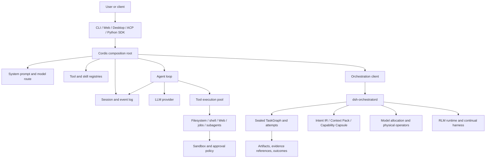

# DSH — DeepSeek Solar Harness

[English](README.md) | 中文

**一份基于真实代码的 DeepSeek Harness Solar 发行版架构评审：面向可扩展、耐久、本地优先 Agent Runtime 与 macOS AI 工作台。**

DeepSeek-Solar-Harness（`DSH`）是基于 [DeepSeek Harness](https://github.com/deepseek-ai/deepseek-harness) 的下游产品。它保留上游 Cordis 插件 Runtime、Agent Loop、Session 模型、工具、Web 表面和各类 Package Family，并在此基础上增加独立治理的 Solar 发行层，包括 macOS Desktop 产品、受管插件、持久编排、Intent/Context 编译契约、Capability Capsule、模型分配、Continual Harness 状态，以及有界的 Recursive Language Model Runtime。

本文不是产品能力宣言，而是实现分析。它区分可执行能力、仍在演进的契约和延期工作，并将 DSH 与通用 Agent Framework、Coding Agent 控制平面和 Deep Research 系统进行对比评估。

> **评审基线：** 2026-08-26 检查的 `solar` 分支 commit 为 `671b308b846f0b53970171fff56a8dad852bbcc5`。产品元数据标识 Desktop 版本为 `3.4.3`、Node.js 为 `^22.19.0 || >=24.0.0`、pnpm 为 `11.7.0`，并将 macOS（`darwin`）定义为已验收产品平台。仓库仍在持续演进，实现细节与兼容性可能变化。

## 核心结论

DSH 最准确的定位是**全栈 Agent Harness 与本地执行控制平面**，而不是已经完成的垂直领域应用。它最强的工程属性包括耐久事件溯源 Session、确定性的工具结果顺序、插件级可组合性、fail-closed 进程约束、显式 Provider Seam、owner-local 持久编排、内容寻址的编译 Artifact，以及仓库级 Provenance 与治理。

仓库已经包含长任务研究和工程 Agent 所需的大量底座：Session、工具、Web 访问、委派 Worker、Workflow、封存 TaskGraph、模型路由、可 checkpoint 的 RLM 执行、有界 Continual State、Desktop/Web/CLI/Python 入口，以及覆盖面广的验证基础设施。但它目前**没有**形成完整的 Deep Research 产品流水线，尚缺作为一等端到端 Operator 的来源采集、文档解析、Evidence 规范化、Claim-to-Source 引用验证、报告规划、Chapter/Deep Writing 和报告导出。

因此，它的架构押注与 GPT Researcher 或 openJiuwen-DeepSearch 不同。后两者优化垂直研究 Workflow；DSH 优化横向 Runtime、执行语义、可扩展性、隔离与产品控制平面，以承载多个垂直 Workflow。

## 项目定位

| 维度 | DSH 定位 |
| --- | --- |
| 首要抽象 | Cordis 组合的 Agent Runtime，加上耐久编排与产品发行层 |
| 主要语言/Runtime | TypeScript/Node.js Core；Electron Desktop；Python SDK Bridge；原生约束辅助程序 |
| 执行模型 | 对话 Turn 使用 Session Event Log；持久多节点任务使用封存 TaskGraph；可编程递归执行使用有界 RLM |
| 可扩展性 | Plugin、Service、Registry、Preset、Provider、Skill、Tool、Model Worker、受管产品插件 |
| 持久化 | 类型化 append-only Session Chronology，加上 owner-local SQLite/WAL 编排存储 |
| 安全模型 | Per-session Policy、Approval、Capability-specific Boundary、fail-closed 本地 Sandbox 选择 |
| 产品表面 | CLI、Web UI、macOS Desktop、ACP、SDK、Python NDJSON-RPC Bridge |
| 研究就绪度 | Runtime 底座强；缺少一等 Evidence 与报告生成垂直层 |
| 成熟度 | Core Harness 已较完整；Orchestration/Compilation/RLM Family 明确处于演进中的 v1 能力阶段 |

## 总体架构



该架构包含两个互补的执行平面：

- **交互式 Agent 平面**把用户输入转换为 Session 内耐久的模型请求、Stream Chunk、Tool Call、Tool Result 和 Assistant Output 序列。
- **持久编排平面**把编译后的请求转换为封存的 Node/Attempt Graph，分配执行 Provider，通过 owner-local Daemon 持久化状态，并支持重试、恢复、Artifact 与有界可编程子执行。

这种分离很关键。对话 Event Log 是回放 Agent Turn 的正确事实源，但不足以充当多节点任务的 Scheduler Database；反过来，TaskGraph 也不应作为无边界可变内部状态机暴露给模型。DSH 将两类职责分开，并通过显式 Service 与 Artifact 连接。

## Runtime 执行路径

普通交互 Turn 按以下路径执行：

1. Client 创建或恢复 Session，并确定 Agent Preset、Workspace、Model Route 与 Product Profile。
2. Cordis 加载 Host Plane 与 Agent Plane 插件，通过 Scoped Context 和 Isolated Realm 解析 Service。
3. Agent Loop 追加用户 Turn，从耐久 Session 构建 Model History，并渲染确定性的 System Prompt 与当前 Tool Catalog。
4. LLM Provider 流式返回 Response Item。Text、Reasoning、Usage、Tool-call Fragment 和 Completion Event 被规范化并追加到 Session。
5. Tool Call 经类型化 Registry 校验后进入并发池执行。Parallel-safe Call 可以重叠执行；Exclusive Call 建立屏障。
6. 即使实际完成顺序不同，Result 仍按原始 Call 顺序提交到 Model-visible History。取消时会写入合成 Terminal Result，确保回放不会出现无结果的 Tool Call。
7. 循环持续到模型输出 Terminal Assistant Response、有界 Stop Condition 触发或 Run 被取消。

持久编排增加另一条路径：

1. 原始 Intent 被编译为版本化 `IntentIRV1`，包含 Objective、Expected Outcome、Constraint、Non-goal、Acceptance Requirement、Ambiguity Flag、Source Identity 与 Compiler Provenance。
2. Context 输入被编译为可内容校验的 Context Pack。
3. Capability Capsule 选择 Operator/Provider Contract，并封存到 Node Attempt。
4. Logical Graph 被 Physical Executor 接纳后，该 Run 进入不可变状态。
5. `dsh-orchestratord` 在 SQLite/WAL 中持久化 Run、Attempt、Dependency、Resource Pool、Retry、Lease 与 Artifact，并通过 Unix Socket 暴露操作。
6. 确定性 Allocator 先对合格的 Native-subscription Offer 排名，再考虑 Metered API Worker，同时纳入 Capability、Quota Bucket、Health、Role、Quality Tier 与 Reset Window。
7. Physical Operator 执行封存 Node。RLM Node 只能暴露有界 `typescript_repl` Host Tool，普通 Model Worker 保持 Text-oriented。
8. Outcome 与 Artifact 按显式 Error/Recovery 语义提交；不确定 Receipt 不会被静默重放为成功。

## 核心实现

### Cordis 作为组合主干

仓库遵循上游原则：能力由插件提供，而不是硬编码为 Singleton Module。Cordis Context 提供 Service Discovery、Scoped Lifetime、Event、Configuration 与 Isolated Realm。Agent Preset 展示了这种设计的必要性：Host-plane Registry、Per-agent State、Workflow Engine、Prompt Contribution 与 Model-facing Tool 具有不同 Ownership 与 Visibility Requirement。

这一设计避免了常见的 Multi-agent 失败模式：所有 Feature 都导入一个全局 Runtime Object 并修改 Shared State。Plugin 可以注册 Tool、贡献 Prompt Text、实现 Provider Seam 或发布 API，而无需 Core Agent Loop 了解具体实现。

代价是 Dependency Graph 的认知负担很高。正确性取决于对 Context Inheritance、Service Resolution、Realm Isolation、Host/Agent Ownership 以及 Plugin Activation Timing 的理解。它比简单的 Dependency Injection Container 更强，但也比扁平 Python Framework 更难上手。

### 耐久 Session 与事件模型

Session 是类型化、append-only 的 Chronology，而不是可变 Message Array。日志记录规范化 User/Model Content、Streaming Progress、Tool Call/Result、Lifecycle Event、Usage 与其他 Model-visible State。下一次请求所需的 History 由这条 Chronology 投影得到。

这为 DSH 带来以下属性：

- Replay 与 Resume 基于耐久事实，而不是重建的 UI State。
- Streaming Output 不会因 Process 或 Client Boundary 变化而消失。
- Tool Execution 与 Model-visible Ordering 可以独立审计。
- Session Projection 可以演进，而不必重写原始 Event。
- Remote Client、Desktop Shell 与 Python Bridge 可以观察同一套底层 Run 语义。

代价是必须严格管理 Event Schema。任何对模型可见的 Item 都需要稳定的日志表示；兼容性变更需要 Migration 或 Projection Logic，而不能随意修改对象。

### 确定性 Agent Loop 与工具调度

Agent Loop 不只是 `while true: call model`。它负责 Cancellation、Session Write、Stream Normalization、Stop Condition、Tool Validation 与 Continuation。Tool Scheduler 实现带 Exclusive Barrier 和有序耐久提交的并发池。

假设模型依次发出 `A`、`B`、`C` 三个 Call，其中 `A`、`B` 可并行，`C` 为 Exclusive。`A` 与 `B` 可以并行执行，但 `C` 必须等待两者结束。即使 `B` 先完成，DSH 也可以先在内部保留结果，再按 `A`、`B`、`C` 顺序提交到 Model History，从而在不放弃执行并行性的情况下保持模型 Transcript 的因果顺序。

取消语义同样明确：每个已开始的 Call 都会获得 Terminal Result，必要时写入合成 Aborted Result。这避免恢复后的 Session 出现没有对应 Outcome 的 Tool-call Request。

### Prompt 构建与 KV-cache 意识

System Prompt 由确定性的 Plugin Contribution 组合，而不是一个 Monolithic Template。Prompt Section、Tool Catalog、Mode 与 Product Preset 会明确记录某项变化是否影响 Model-visible Request Prefix，进而影响 KV-cache 复用。

Standard Preset 在进入 Plan Mode 时保持 Tool Catalog 稳定，仅修改 Behavior Instruction，而不是从 Schema 中移除 Mutation Tool。其他 Product Preset 可以使用 Anchored First-turn Bootstrap，并在后续发现更多 Capability。这些选择把 Prompt 与 Tool-schema Shape 当作 Runtime Architecture，而不是文案。

代价是，Cache Stability 与更小的 First-turn Schema 可以提高请求效率，但 Dynamic Capability Discovery 会增加诊断难度。失败原因可能是当前 Preset 或 Discovery State，而不是 Tool 实现本身。

### Tool、Skill、Workflow 与委派

Standard Agent Composition 包括 Filesystem/Search、Shell Execution、Background Job、Goal、Planning、Compaction、Skill、Subagent、Workflow、Ralph-style Iteration、User Question、Todo 与 Web Search。Codex、Claude Code 等产品特定 Provider 可以在一个 Preset 中禁用、在另一个 Preset 中启用，而无需修改 Core Loop。

关键边界是 Registry Ownership。Model-facing Tool 可以是 Per-agent 的，而底层 Process-wide Registry、Continuable Setup 或 Remote API Descriptor 则保持 Host-plane Singleton，并按 Session 或 Agent Identity 索引，从而减少重复注册与 Cross-session Leakage。

### 进程 Sandbox 与 Approval

本地 Sandbox Provider 选择一种平台机制；如果没有有效机制则 fail closed：

- Linux 优先使用可工作的 Bubblewrap Runner，也可以使用 Landlock。
- macOS 通过 `sandbox-exec` 使用 Seatbelt，并探测机制是否实际工作。
- Windows 使用 Restricted-token 与 ACL 设计，并提供 Per-session Temporary Authority。

Provider 报告 Enforcement Completeness，并区分 Sandbox Launch Failure 与 Child-command Failure。出现 `SANDBOX_UNAVAILABLE` 后不会静默降级为无约束执行。

实现对 Residual Risk 的描述异常明确。Windows Enforcement 仍是 Partial，因为保留的 Identity 与 NTFS Alias 可能暴露外部对象；旧版 Landlock ABI 可能只提供 Partial Enforcement；Seatbelt 依赖已弃用的公共 CLI；配置的 Custom Runner 属于 Operator Assertion。相比把所有 Backend 宣传为等价隔离，这种处理更可信。

## 持久编排

### 控制平面分离

`dsh-orchestratord` 是编排 SQLite State 唯一的 owner-local Writer。Client 通过 Unix Socket 通信，而不是直接打开 Database。WAL-backed Persistence 覆盖 Run、Graph State、Attempt、Lease、Resource Pool、Retry State 与 Artifact。

这为 Scheduler 建立清晰的权威边界：

- 多个 Client 不会以独立 SQLite Writer 身份竞争。
- Restart Recovery 被集中管理。
- Provider Health 与 Resource-pool State 可以跨单个 Model Process 生命周期保留。
- Session Ownership 与 Scheduler Ownership 保持分离。
- Execution Semantics 可以在 Service Protocol 后演进。

当前限制：Daemon 是 owner-local v1。Distributed Consensus、Multi-machine Queue Ownership、Elastic Worker Fleet 与 Remote Orchestration Replication 尚未成为已确立契约。

### 封存 TaskGraph

Orchestration Domain 将 Logical Graph 与 Physical Execution 分离。Physical Executor 一旦接受 Plan，Run 即被封存：Graph Topology、选定的 Operator Contract 与 Node-attempt Input 不能被运行中的模型随意改写。

这提升了可复现性与 Retry Semantics。重试可以引用同一个封存 Node 和 Input；有意的 Replan 则成为新 Graph 或 Generation，而不是隐式 Mutation。

该设计还支持显式 Conflict Waiting、Dependency Admission、Resource-pool Exclusion、Retryable/Terminal Error 与 Result Artifact。对于长时间研究或工程任务，它比把 Free-form Plan 存在对话文本中更合适。

### Intent Compiler

Intent Compiler 暴露 Provider-neutral Service 和版本化 `IntentIRV1` Schema，其中包括：

- Objective；
- Expected Outcome；
- Constraint 与 Non-goal；
- Acceptance Requirement；
- Source 与 Attachment Reference；
- Risk Hint 与 Ambiguity；
- Clarification Flag；
- Compiler ID/Version，以及 Input/Output SHA-256 Provenance。

这是走向 Requirement Compilation 的重要一步：下游 Planning 消费的是规范化、可检查的 Artifact，而不是无约束的 Paraphrase。

已实现边界：Schema、Service Seam、Invariant、Content Identity 与 Provenance 已存在。Baseline Provider 有意保持确定性和保守性；它还不是具备 Ontology Mapping、Contradiction Resolution、Requirement Coverage Scoring 或 Iterative Clarification Policy 的强大模型驱动 Intent Compiler。

### Context Compiler

Context Compiler 创建带 Source Identity 与确定性 Provenance 的版本化 Context Pack。其契约允许下游 Consumer 依赖不可变 Context Artifact，而不是在 Attempt 期间重新读取可变输入。

已实现边界：Packaging、Identity、Validation 与 Sealing 已存在。Baseline Provider 只是回显给定 Context；Retrieval、Ranking、Deduplication、Compression、Freshness Resolution、Cross-source Conflict Analysis 与 Token-budget Optimization 仍属于 Provider 工作。

### Capability Capsule

Capability Capsule 将 Node 绑定到版本化、面向 Operator 的 Capability Description。它可以携带 Input/Output Schema、Provider Identity、Execution Constraint 与 Content Hash；将 Capsule 封存到 Attempt 可以防止 Retry 期间发生 Provider Drift。

这比执行时按字符串名称选择 Tool 更强，因为选定 Capability 成为可复现 Plan 的组成部分。

延期边界：Production Capsule Catalog、Compatibility Negotiation、Authorization Policy、Migration 与广泛 Provider Ecosystem 尚未完成。

## Recursive Language Model Runtime

DSH 包含有界 RLM Runtime，使模型可以把持久 TypeScript Namespace 作为可编程 Working Memory 与 Subtask Controller。它不是任意 Node.js 执行：模型只能获得受限 `typescript_repl` Interface 和受控 Host API。

关键实现属性包括：

- Persistent Namespace Snapshot 与 WAL Recovery；
- 带明确定义上限的 JSON-compatible Value；
- Asynchronous Subtask Handle 与 Result Collection；
- 有界 Execution Time 与 Step Budget；
- 本地 Provider 中 16 MiB Per-value Limit 与 256 MiB Namespace Limit；
- Effectful Host Call 的 Prepared/Applied Receipt State；
- Restart State 无法证明 Effect 是否提交时返回 `RLM_RECEIPT_INDETERMINATE`；
- 使用确定性 Baseline Strategy，而不是不透明 Learned Router。

Receipt Protocol 是最重要的细节。Crash 后重试 External Effect 可能重复工作；直接假设成功则可能丢失工作。DSH 将这种不确定性暴露为 Typed Failure，而不是静默选择一种结果。

RLM 适合 High-context Decomposition、Iterative Synthesis、Structured Scratch State 与 Recursive Model Call。它还不是通用 Distributed Compute Substrate、Unbounded Code Interpreter 或 Workspace-aware Physical Operator 的替代品。

## 模型分配与执行 Provider

Model-allocation Seam 规范化 Native Subscription 与 Metered Worker 的 Offer。本地 Policy 只对合格 Offer 排名，并考虑 Capability、Node Role、Reported Quota Bucket、Health、Model Tier 与 Reset Proximity。

默认 Policy 的选择非常具体：

- 可用 Native-subscription Capacity 优先于所有 Metered API Offer；
- Planning 与 Verification 偏好 Higher-tier Model；
- Parallel Execution 可以使用 Low/Mid-tier Model；
- 每个 Reported Quota Bucket 独立处理；
- 临近 Reset 的 Quota 可以支持当前更高的并行度；
- Provider 只提供 Offer，永远不调度 TaskGraph。

这清晰分离了**有哪些 Capacity**、**Node 获得哪个 Offer**以及**Graph 如何调度**。

DeepSeek Official API Worker 有意保持狭窄。普通 Node 仅支持 Text；RLM Node 只接收封存的 `typescript_repl` Function Tool。Worker 没有 Workspace Tool，也没有修改 Graph 或 Scheduler 的权限。

当前限制：Allocator 是确定性 Policy，而不是 Learned Cost/Latency/Quality Optimizer。它无法推断未报告的 Quota Window，也不能预测 Price 与 Tail Latency。

## Continual Harness 状态

Continual-harness Family 存储显式、版本化的 Prompt、Memory、Skill、Subagent 与相关 Harness Entry。本地 Provider 持久化有界 Outcome Summary、Tag 与 Evidence Reference，同时拒绝捕获 Raw User Prompt、Full Transcript、Credential 或 Model-private State。

Snapshot 按 Scope 过滤、Content-addressed，并在封存到 Attempt 后保持不可变。Refinement 独立应用有效 Edit，为被拒绝的 Edit 保留 Structured Failure，为成功变更存储 Before-image，并把 Rollback 实现为新 Generation。

这比允许 Agent 原地重写 Global System Prompt 或 Memory Database 更安全，因为它提供可审计 Change History 与确定性 Attempt Input。

当前限制：Storage 是 owner-local、single-writer；Distributed Replication、Cross-machine Synchronization、Production Skill Catalog 与完整 Provider Compatibility Matrix 仍被延期。

## 产品表面

### CLI 与 Web

`apps/cli/src/bin.ts` 是可执行入口。它启动 Profile、Composition File、Model Route、Session Service、Tool 与 Web Host。Web Client 观察 Runtime Domain，并通过仓库 API/Event Surface 通信，而不拥有 Agent State。

Standard Preset 暴露 Web Search，但将直接 Fetch 配置为禁用。这足以支持通用 Search-assisted Agent，却不是完整 Crawler 或 Evidence Acquisition Layer。

### macOS Desktop

Desktop 产品是 [`products/desktop`](products/desktop) 下独立的 Yarn Workspace。Electron 是 Profile、Lifecycle、Packaging、Update Discovery、Terminal Integration 与 Loopback Service 的薄原生宿主。Renderer 通过认证的 Loopback HTTP/WebSocket 使用同一个 Web Application，不获得任意 Electron IPC 权限。

这在增加 Native Lifecycle 能力的同时保留统一的 Browser-facing Product Architecture，也避免让 Renderer 成为特权 Orchestration Process 这一常见 Electron 反模式。

当前已验收 Product Contract 只覆盖 macOS。Core Package 包含 Cross-platform Mechanism，但 Windows 与 Linux 不是等价的已验收 Desktop Product。

### Python SDK

Python Package 不会重新实现 Agent Runtime。它启动或连接 DSH Executable，并通过 stdio 交换 NDJSON-RPC。Python 用户因此访问同一套 TypeScript Session、Model、Tool 与 Loop Semantics，而不是第二套分叉 Backend。

对于 Notebook、Evaluation Harness 与 Python Research Stack，这是良好的互操作选择。代价是 Process-boundary Overhead，以及比 Native Python Framework 更窄的 SDK Surface。

### ACP 与外部 Agent

ACP Package 与 Example 将 DSH Capability 暴露给兼容 Client，并允许外部 Agent 产品通过显式 Protocol Boundary 参与。可选 Subagent Provider 可以封装 Codex、Claude Code 或其他产品，但不会获得 DSH Session 或 Orchestration State 的 Ownership。

## 仓库结构

```text
deepseek-solar-harness/
├── apps/                    # CLI, Web host/client, protocol-facing applications
├── packages/
│   ├── core/                # Agent loop, Session interfaces, tools, prompt and model foundations
│   ├── orchestration/       # TaskGraph, daemon, compilers, capsules, RLM, allocation, operators
│   ├── session/             # Session stores, projections, compaction and related capabilities
│   ├── shell/ fs/ sandbox/  # Process, filesystem and confinement families
│   ├── workflow/            # Workflows, delegation and continuable execution
│   ├── api/ acp/ sdk/       # External interfaces and client contracts
│   └── ...                  # Context, LLM, model, Web, telemetry and support packages
├── products/desktop/        # macOS Electron product and packaging workspace
├── python/                  # Python SDK and packaged runtime bridge
├── native/                  # Native helpers such as Landlock runner support
├── plugins/managed/         # Solar-owned or Solar-modified managed plugins
├── plugins/registry.yaml    # Machine-readable source, revision, license and test registry
├── distribution/            # Product identity and accepted upstream revisions
├── docs/                    # Architecture, subsystem and development references
├── scripts/                 # Build, generation, invariant, documentation and release gates
├── .agent-governance/       # Change-aware Code-as-Harness verification profile
└── .github/workflows/       # Static, coverage, snapshot, consumer, native and product CI
```

## 能力与成熟度盘点

| 能力 | 实现状态 | 仓库依据 | 重要边界 |
| --- | --- | --- | --- |
| Cordis Plugin Runtime | 已实现 Core | Context、Service、Event、Preset、Isolated Realm | 概念复杂度高 |
| Agent Loop | 已实现 Core | 耐久 Streaming、Cancellation、Stop Condition、Tool Continuation | 兼容性与 Event Schema 绑定 |
| Session/Event Log | 已实现 Core | 类型化 append-only Chronology 与 History Projection | 需要严格 Migration Discipline |
| Tool Execution | 已实现 Core | Validation、Parallel Pool、Exclusive Barrier、Ordered Commit | Provider/Tool Safety 仍是 Capability-specific |
| Prompt Composition | 已实现 Core | Deterministic Section 与 Model-experience Documentation | Dynamic Composition 增加诊断复杂度 |
| Filesystem/Shell/Job | 已实现 Core | Typed Tool、Background Work 与 Policy Integration | Host Access 取决于 Sandbox Mode |
| Local Sandbox | 已实现并记录限制 | Bubblewrap、Landlock、Seatbelt、Windows Restricted-token/ACL 路径 | 并非所有 Backend 都提供完整隔离 |
| Subagent/Workflow | Core 已实现，Provider 演进中 | Spawn/Fork、External Provider、Workflow、Ralph Iteration | 不同 Product Provider 的 Depth/Tool Semantics 不同 |
| Persistent Orchestrator | 演进中的 v1 | Unix-socket Daemon、SQLite/WAL、Attempt、Pool、Recovery | Owner-local，非 Distributed |
| Sealed TaskGraph | 演进中的 v1 | Logical/Physical Graph 与不可变 Execution Plan | 仍需更高层 Workflow Library |
| Intent IR | Contract 已实现 | Versioned Schema、Provenance、Hash、Error | Baseline Compiler 语义能力有限 |
| Context Pack | Contract 已实现 | Versioned Artifact 与 Sealing | Baseline 缺少 Retrieval/Ranking/Compression |
| Capability Capsule | Contract 已实现 | Versioned Provider-neutral Capsule 与 Attempt Sealing | Catalog/Policy/Migration 未完成 |
| RLM Runtime | 有界实现 | Persistent TS Namespace、Subcall、Receipt、Recovery | 不是任意代码或 Distributed Compute |
| Model Allocation | 确定性实现 | Native-first Offer Ranking 与 Quota-aware Policy | 没有 Learned Optimization 或 Forecasting |
| Continual Harness | Owner-local 实现 | Versioned Entry、Outcome、Refinement、Rollback | Cross-machine Replication 延期 |
| CLI/Web/Desktop | 已实现产品表面 | Shared Runtime 与 Thin Desktop Host | 已验收 Desktop Platform 为 macOS |
| Python SDK | 已实现 Bridge | NDJSON-RPC 到打包 DSH Runtime | 不是 Native Python Execution Engine |
| Managed-plugin Provenance | 已实现 Distribution Control | Registry、Accepted SHA、License Evidence、Vendor Closure | 增加维护与 Qualification Cost |
| Code-as-Harness Governance | 已实现 Repository Control | Change-aware Gate、Attestation、CI Contract | 本地完整验证成本较高 |
| Deep-research Evidence Pipeline | 非一等能力 | 没有完整 Source/Evidence/Claim/Citation Operator Chain | 必须设计并实现 |
| Report Planner/Writer/Export | 非一等能力 | 没有封存的 Report Planning/Chapter Writing 产品流水线 | 需要垂直 Application Layer |

## Deep Research 就绪度

DSH 已有严肃研究系统需要的许多 Primitive，但 Primitive 不等于 Workflow。下表区分可复用底座与缺失的领域逻辑。

| 研究阶段 | 可复用 DSH 底座 | 缺失或不完整的垂直能力 |
| --- | --- | --- |
| Topic/Intent Intake | Intent IR、Clarification Flag、Attachment 与 Source Ref | Domain Taxonomy、Ambiguity Resolution、Research-question Quality Scoring |
| Source Discovery | Web Search Tool、Skill、Subagent、Workflow | Search Strategy Operator、Query Portfolio、Freshness/Authority Policy |
| Acquisition | Shell/fs/Web Integration 与 Sandbox | First-class Fetch/Crawl Connector、Robots/Policy Handling、不可变 Raw-source Artifact |
| Parsing | Filesystem、Subprocess 与 Plugin Seam | PDF/HTML/Office Parser、Layout/Table Extraction、Parser Provenance 与 Quality Flag |
| Evidence Normalization | Content-addressed Artifact 与 Provenance Pattern | Fact/Evidence Schema、Passage Offset、Source Versioning、Contradiction Graph |
| Deduplication/Clustering | TaskGraph、RLM、Model Worker | Canonical Document Identity、Semantic Dedup、Topic Clustering、Coverage Metric |
| Research Planning | Intent/Context/Capsule/TaskGraph | Report Planner Schema、Coverage Constraint、Replanning Policy、HITL Review |
| Parallel Investigation | Subagent、Physical Operator、Allocation、RLM | Research-specific Worker Role、Shared Evidence Store、Branch Merge Policy |
| Long-form Synthesis | Continual Harness、Compaction、Model Routing | Chapter Writer/Deep Writer Contract、Cross-chapter Consistency、Omission Check |
| Citation | Source Ref 与 Evidence-reference Vocabulary | Claim-level Support Mapping、Citation Placement、Entailment/Coverage Validator |
| Quality Evaluation | Typed Error、Artifact、CI/Evaluation Substrate | Source Coverage、Support Ratio、Duplication、Hallucination、Structural Evaluator |
| Publication | Web/Desktop 与 Filesystem Tool | Markdown/HTML/PDF/DOCX/PPT Report Renderer 与 Release Manifest |
| Continuous Update | Persistent Orchestration 与 Generation History | Source Freshness Monitor、Incremental Evidence Diff、Selective Chapter Regeneration |

建议的架构方向是保留当前 Runtime，并以 Plugin 与显式 Artifact 添加 Research Vertical。Source Document、Extracted Passage、Evidence Unit、Model Judgment、Report Plan、Chapter Draft、Citation、Evaluation 与 Final Publication 应成为彼此分离、带上游引用的版本化 Artifact Kind，而不是被压进 Session Message 或一个大 Prompt。

## 与相关项目对比

### 对比摘要

| 项目 | 首要重心 | 相对 DSH 的优势 | DSH 的优势 | 最适合场景 |
| --- | --- | --- | --- | --- |
| DeepSeek Harness | 通用 Plugin-first Agent Harness | 上游 Release Cadence、更小 Distribution Scope、官方 Baseline | Solar Desktop、受管插件、治理、Persistent Orchestration/RLM Extension | 通用 Agent Runtime 与 Plugin 开发 |
| LangGraph | Low-level Stateful Graph Orchestration | 成熟 Graph API、Checkpoint/HITL 生态、Python 普及度、LangSmith Integration/Deployment | 集成本地 Agent 产品、Tool Runtime、Session Chronology、Sandbox、Desktop 与 Source Governance | 编程式 Stateful Workflow 与 Service Deployment |
| Microsoft Agent Framework | Enterprise Multi-language Agent/Workflow Framework | Python/.NET 广度、OpenTelemetry、Foundry Hosting、Middleware 与企业生态 | Local-first 产品、Cordis Composability、细粒度 Tool/Session Semantics、macOS Workbench | Microsoft/Azure 环境中的企业 Agent 应用 |
| OpenHands | Coding-agent Control Center 与 Automation Product | Turnkey Developer UX、多种 Remote/Cloud Backend、Coding Automation 与生态 | Plugin-granular Runtime Composition、Sealed Orchestration Contract、RLM 与 Distribution Provenance | Self-hosted Software-engineering Agent |
| GPT Researcher | 垂直 Web/Local Deep-research Application | Turnkey Retrieval、Scraping、Context Curation、Report Writing、Citation、Export | 耐久通用 Runtime、Isolation、Provider Boundary、Product Extensibility、Execution Semantics | 快速部署 Research-report Generation |
| openJiuwen-DeepSearch | Enterprise Knowledge-augmented Research Stack | Hybrid Vector/Keyword/Graph Retrieval、Report Template、Segment Provenance、Enterprise Research Workflow | 更小的 Local-first Runtime、Plugin/Provider Isolation、确定性 Tool/Session Behavior | 企业知识库与专业报告系统 |

### 对比上游 DeepSeek Harness

DSH 继承上游架构，而不是替换它。上游将自身描述为“Everything is a Plugin”的 Developer-preview Harness。Solar 保留该 Runtime，并增加独立控制的 Product Layer：Accepted Upstream Revision、Managed-plugin Source、Desktop Packaging、Product Identity、Code-as-Harness Governance 与实验性 Orchestration Family。

DSH 的优势：

- 一个仓库可以协调 Core、Desktop 与 Solar-maintained Plugin；
- Product Input 绑定 Source、Accepted Revision、License 与 Verification；
- macOS Workbench 是明确的已验收产品，而不是通用 Demo Surface；
- Orchestration、Intent/Context Artifact、RLM、Model Allocation 与 Continual State 为长任务提供演进路径。

劣势：

- Fork 需要持续承担 Merge 与 Qualification Cost；
- Solar 在评估 R2 变更时可能落后于上游；
- Codebase 更大，同时包含成熟 Core 与演进 Extension；
- 用户必须区分 Upstream Package Version、Desktop Version 与 Managed-plugin Version。

### 对比 LangGraph

LangGraph 以 Stateful、Long-running Workflow 的 Graph API 为中心，提供 Checkpoint、Interrupt、Memory、Time Travel，并拥有广泛 Python 生态。对于希望直接定义 Graph Node 与 Edge 的 Application Developer，它更容易嵌入常规 Python Service，也具有更清晰的公共抽象。

DSH 在 Graph 上下两侧都更垂直集成：它拥有 Agent Loop、Tool Registry、Session Event Vocabulary、Prompt Composition、Sandbox、Product Preset、Desktop/Web Client、Provider Offer 与 Repository Provenance。其 Sealed Physical TaskGraph 与本地 Daemon 更强调可复现性和执行权威，而不只是 Application Graph State。

当主要问题是在 Python 生态中编写和部署 Stateful Workflow 时，应选择 LangGraph；当主要问题是构建本地 Agent 产品或执行底座，并要求 Tool、Prompt、Session、Provider、Plugin、Safety 与 UI 共用一套 Runtime Contract 时，DSH 更合适。

### 对比 Microsoft Agent Framework

Microsoft Agent Framework 提供 Python 与 .NET API、Middleware、Graph Workflow、Checkpoint、Streaming、Human-in-the-loop、Time Travel、OpenTelemetry、Declarative Agent、Skill 与 Foundry Hosting。它具有更强的 Enterprise-cloud 路线和更广的 Language/Hosting Surface。

DSH 在企业部署方面更窄，但作为本地 Agent Workbench 的垂直深度更高。Cordis Plugin Topology、Model-visible Event Discipline、Ordered Tool Transcript、Process Sandbox、Native/Subscription Allocation、Sealed RLM Lane 与 Source-to-package Provenance 解决的是不同于 Foundry Integration 的问题。

Azure/Foundry-centric Production Service、跨语言企业团队与标准化 Observability 更适合 Microsoft Agent Framework；Local-first 可扩展 Agent Workstation、Agent Runtime Semantics 研究，或需要严格控制 Tool Exposure、Host Capability 与 Installed Source Closure 的产品更适合 DSH。

### 对比 OpenHands

OpenHands Agent Canvas 是面向 Coding Agent 与 Automation 的 Self-hosted Control Center。它可连接 Local、Docker、VM、Cloud 与 ACP-compatible Backend，并提供更 Turnkey 的 Software-engineering Product 和 Automation Experience。

DSH 具有更广的 Runtime Composition 与更细粒度的内部 Plugin Architecture。其 Session/Tool-result Ordering、Provider Seam、Orchestration Compiler Artifact、RLM Receipt 与 Managed Source Provenance 更适合实验 Agent Execution Semantics。OpenHands 则在 Ready-made Coding Workflow、Backend Fleet Topology、Integration 与 User-facing Automation 方面占优。

两者并不互斥。ACP 或 Service Adapter 可以让 DSH 作为 Backend 或 Specialized Worker 参与，但必须明确 Session State、Workspace Capability、Cancellation 与 Result Artifact 的 Ownership。

### 对比 GPT Researcher

GPT Researcher 实现了一条直接的垂直路径：选择 Research Agent、生成问题、检索并抓取来源、整理 Context、写报告、附加 Reference 并导出结果。其 `GPTResearcher` Class 协调 Retriever、Memory、Browser Management、Source Curation、Deep-research Skill、Image Generation 与 Report Generation。以当前状态衡量，它比 DSH 更快产出可用研究结果。

其架构 Trade-off 是集中化。许多 Research Concern 汇聚到一个 Application-level Orchestrator 与 Shared Runtime State。对于聚焦产品这很务实，但不如 DSH 的 Sealed Attempt Artifact、独立 Scheduler Authority、Provider Offer Model、Typed Session Chronology 与 Fail-closed Capability Boundary 明确。

就今天的研究产品而言，GPT Researcher 更接近 Turnkey；对于希望以可审计执行和多个产品表面支持研究、Coding、Analysis 与未来 Agent Workload 的平台，DSH 是更强底座。干净的集成方式应把类似 GPT Researcher 的 Acquisition/Report Function 暴露为 Namespaced DSH Capability，并把每个 Source、Context 与 Report 转换为 Solar Artifact；把其 Internal 直接嵌入 Core 会破坏 DSH 的 Dependency Boundary。

### 对比 openJiuwen-DeepSearch

openJiuwen-DeepSearch 定位为 Enterprise Deep-search 与 Report System。其声明架构包含 Intent Routing、Structural Planning、Offline Knowledge Construction、Keyword/Vector/Graph/Hybrid Retrieval、Online Fusion/Refinement、Report Generation、Interactive Editing、Segment-level Provenance 与 Export。

DSH 当前不具备同等垂直范围。它缺少生成专业研究报告所需的 Knowledge Construction 与 Evidence/Citation Pipeline。其优势是更小的 Local-first Execution Footprint、强 Plugin/Provider Isolation、确定性 Session/Tool Behavior、显式 Sandbox Semantics，以及独立打包的 Desktop Workbench。

Enterprise Knowledge-base Research 方面，openJiuwen 在功能上领先；如果目标是构建可承载多个 Research Engine、或在 Sealed Contract 下比较 Provider 的模块化执行层，DSH 更具架构吸引力。

## 关键优势

### 1. 执行语义是一等能力

DSH 记录 Model-visible State、保持 Tool-call Ordering、关闭被取消的 Call、分离 Scheduler Authority，并封存 Attempt Input。这些细节决定长任务 Agent 是否真正可恢复、可审计。

### 2. 组合范围不止 Tool

Model、Prompt、Tool、Skill、Sandbox、Session Store、API、Subagent、Allocator、Compiler 与 Product Feature 都具有 Plugin 或 Provider Boundary。Core 不需要为每个产品能力增加 Switch Statement。

### 3. 安全失败显式化

Sandbox Unavailability、Partial Enforcement、Provider Incompatibility、Invalid Intent、Unavailable Compiler、Receipt Uncertainty、Quota Exhaustion 与 Attempt Failure 使用 Structured Semantics，而不是静默降级。

### 4. 本地产品与 Source Provenance 集成

Desktop Vendor Input 映射回 Tracked Source；Managed Plugin 保留 Accepted Revision 与 License Evidence；Release Identity 与 Upstream Package Version 分离；Governance 根据实际 Diff 选择 Verification。

### 5. 架构预留异构计算能力

Native Subscription、Metered API、Resident Operator、One-shot Worker、RLM Lane 与未来 Provider 可以发布 Offer，但不能取得 Graph Scheduler 控制权。这为 Cost-aware Multi-model System 提供了合理基础。

## 关键风险与弱点

### 1. 仓库包含多种成熟度层级

读者可能把规格完整的 v1 Seam 误认为 Production-complete Capability。Intent、Context、Capsule、Orchestration、Allocation、RLM 与 Continual Harness 确实有代码、测试和契约，但多个 Provider 仍是确定性 Baseline 或 Owner-local Implementation。

### 2. 架构复杂度高

Cordis Scope、Isolated Realm、Host/Agent Plane、Generated API、多种 Package Family、Desktop 独立 Workspace、Managed Plugin 与 Governance Rule 形成较陡的贡献曲线。只有产品确实需要这种可组合性和 Lifecycle Control 时，这个成本才值得承担。

### 3. Deep Research 垂直层缺失

当前 Runtime 不应被宣传为已完成的 Deep-research Engine。只有 Web Search 并不能提供 Acquisition Provenance、Source Normalization、Evidence Coverage、Citation Entailment、Report Planning 或 Export。

### 4. 分布式运行尚未建立

Scheduler、RLM Store 与 Continual State 都是 owner-local。Multi-machine Research Service 还需要 Remote Worker Identity、Lease/Fencing Semantics、Artifact Storage、Replication、Telemetry 与超出当前契约的 Operational Control。

### 5. Fork 维护是长期系统成本

每次 Upstream Movement 都可能影响 Session Schema、Plugin API、Prompt/Tool Behavior、Persistence、Packaging 与 Desktop Closure。Solar Qualification Process 可以降低风险，但不能消除集成工作。

### 6. 已验收产品范围小于 Package 可移植性

Core Package 与 Sandbox Implementation 覆盖多个操作系统，但已验收 Desktop Product 是 macOS。Cross-platform Code 的存在不能被解释为等价 Product Validation。

## 最适合的使用场景

DSH 很适合：

- 带多 Agent Profile 与 Tool 的本地 All-in-one AI Workbench；
- Filesystem、Shell、Web、Subagent 与 Long-running Job 共享一套 Session Model 的 Coding/Research Hybrid；
- 对 Prompt/Tool-schema Stability、Model Allocation、Recursive Execution 与 Continual Harness State 的实验；
- 需要显式 Lifecycle 与 Isolation 的多领域 Plugin Host Platform；
- 可审计的本地或 Single-owner 持久 Workflow；
- 以显式 Plugin 和 Artifact 实现 Evidence/Report Layer 的新 Deep-research System 底座。

以下即时需求不太适合 DSH：

- 具有小型 Public API 的 Minimal Python Library；
- Turnkey Enterprise Distributed Scheduler；
- 已完成、引用丰富的研究报告生成器；
- Zero-configuration Coding-agent SaaS；
- 用一个 Agent Class 隐藏全部 Provider、Prompt、Tool 与 Persistence Detail 的 Framework。

## 快速开始

已验收 Desktop Product 以 macOS 为先。Core 开发需要 Git、Node.js `22.19+` 或 `24+`、Corepack 与 pnpm。

```sh
git clone https://github.com/lisihao/deepseek-solar-harness.git
cd deepseek-solar-harness
git switch solar
corepack pnpm install --frozen-lockfile
corepack pnpm run build
corepack pnpm dsh web
```

Desktop 开发：

```sh
cd products/desktop
corepack yarn install --immutable
corepack yarn check
corepack yarn dev
```

Python Package 与 Runtime Bridge 请从 [`python/README.md`](python/README.md) 开始；Package Family 请查看 [`packages/README.md`](packages/README.md)；Runtime Model 请阅读 [`docs/architecture.md`](docs/architecture.md) 与 [`docs/subsystems`](docs/subsystems)。

## 开发与验证

仓库拥有大量 Generated-contract、Type、Lint、Test、Snapshot、Package、Documentation、Product、Native 与 Governance Gate。常用根命令包括：

```sh
corepack pnpm run build
corepack pnpm run typecheck
corepack pnpm run lint
corepack pnpm run test
corepack pnpm run check:all
corepack pnpm run doc-sync
```

Solar Code-as-Harness Entry Point 会按实际 Outgoing Diff 选择并证明所需 Gate：

```sh
python3 tools/agent-development-governance/governance.py audit --project . --strict-warnings
python3 tools/agent-development-governance/governance.py plan --project . --scope auto --level full --changed-from origin/solar
python3 tools/agent-development-governance/governance.py verify --project . --scope auto --level full --changed-from origin/solar --report @git
python3 tools/agent-development-governance/governance.py attest --project . --report @git --require-level full
```

修改代码或文档前，请阅读 [`AGENTS.md`](AGENTS.md)、最近作用域内的 `AGENTS.md` 与 [`docs/AGENTS.md`](docs/AGENTS.md)。根文档以中英文同等权威 Pair 维护，并在 [`README.i18n.yaml`](README.i18n.yaml) 中记录精确 Content Hash。

## Source Provenance 与上游策略

DSH 是下游产品，不代表 DeepSeek AI 官方发行版。已接受的 Core 与 Product Ancestor 记录在 [`distribution/upstreams.yaml`](distribution/upstreams.yaml)。Solar-owned 或 Solar-modified Plugin 记录在 [`plugins/registry.yaml`](plugins/registry.yaml)，其中包含 Source Path、Accepted Revision、License Evidence 与 Native Verification Command。

未修改的 Optional Plugin 保持 External Profile Extension。一旦 Solar 修改或打包某个 Component，它就成为 Managed Source Input，并必须满足 Provenance、License、Package-closure、Compatibility 与 Test Contract。

受保护的 `solar` 分支是 Integration Line。Upstream Revision 先作为 Candidate 被发现，经过 Risk Classification、在隔离 Branch 上机械导入、单独适配、验证和评审后，才会被记录为 Accepted。“Newest Upstream”与“Accepted Solar Input”有意保持为不同概念。

## 评审方法

本分析基于仓库结构与可执行实现，包括 CLI/Product Entry Point、Core Agent-loop 与 Tool-call Source、Session Contract、Orchestration/RLM Provider、Compilation Schema、Sandbox Implementation、Package/Plugin Registry、CI、Desktop Boundary 与 Python Bridge。各项目 README 用于识别声明契约与显式限制，再与 Source Package 和 Configuration 交叉核对。

对比部分描述 Architecture Center of Gravity，而不是合成 Feature Score。成熟垂直应用即使通用 Runtime 不够显式，也可能对某个任务更有用；复杂 Runtime 即使是更好的长期底座，仍可能缺少立即产出所需的 Domain Pipeline。

## 许可证

Core Repository 使用 [MIT](LICENSE) License。导入 Component 保留各自 License File 与 Declaration。Third-party Runtime Dependency 记录在 [`THIRD_PARTY_NOTICES.md`](THIRD_PARTY_NOTICES.md)，Managed-component Evidence 记录在 [`plugins/registry.yaml`](plugins/registry.yaml)。
