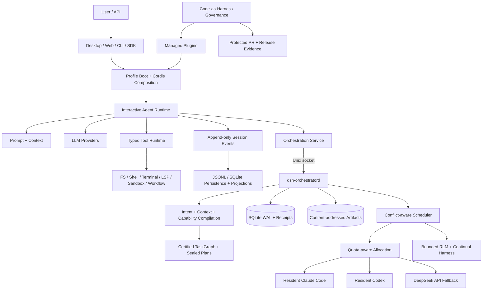

# DSH — DeepSeek Solar Harness

[English](README.md) | 简体中文

**一个具备治理闭环、插件化组合、持久 TaskGraph 编排能力的 Agent Runtime 与 macOS 工作台。**

**快照说明：** DeepSeek-Solar-Harness（`DSH`）是 [DeepSeek Harness](https://github.com/deepseek-ai/deepseek-harness) 的社区下游发行版，不是 DeepSeek AI 官方发行版。本分析固定在 2026-08-27 的 `solar@a3cd4397efc5294704e9d7384515ab285f81bd06`，对应 DSH Desktop `3.6.6`。当前已接受的产品合同只覆盖 macOS；在该快照之后，机器可读 manifest 仍是事实来源。

## 项目定位

DSH 不只是终端 coding agent，也不只是 agent workflow 库。它把交互式 Agent 数据平面、持久编排控制平面以及产品与治理平面放进同一个源码仓库。

交互平面保留 DeepSeek Harness 的 Cordis 模型：Agent、模型、工具、Session、UI、子进程、sandbox、subagent 和 workflow 都以具备生命周期的插件挂载。Solar 控制平面增加 intent 编译、受限 context packet、认证 TaskGraph、capability budget、冲突感知调度、receipt、artifact、审批、quota-aware 物理 Operator 路由和重启恢复。产品平面进一步把这些源码闭环成 macOS Desktop 发行版，并维护受管插件来源证明与 Code-as-Harness 验证。

关键架构决策是：把 Codex 与 Claude Code 作为内层 coding loop 的**物理 Operator**，而由 DSH 掌握外层控制环。因此 DSH 优化的不是“一条 prompt 最快得到一次回答”，而是长任务能否持续可检查、可恢复、authority 有界且可复现。

## 已实现能力盘点

| 能力 | 本仓库代码证据 | 重要边界 |
| --- | --- | --- |
| Cordis 插件 runtime | Service、类型化 event、可逆 effect、scoped context、profile 组合 | 扩展由配置和生命周期驱动；加载顺序与 scope 仍会影响行为 |
| 交互式 agent loop | [`ReactLoopAgent`](packages/core/agent-loop/src/agent.ts)、inbox 路由、turn/step 边界、streaming、steering、follow-up、cancellation | 默认 loop 可替换，但修改它会影响持久 event 语义 |
| 类型化工具执行 | [`executeToolCalls`](packages/core/agent-loop/src/tool-calls.ts)、schema 校验、policy waterfall、有序结果提交、有界并行池 | 并行必须由每次调用的 safety classifier 显式声明；取消是 cooperative 的 |
| Event-sourced Session | [`packages/core/session`](packages/core/session)、append-only event、surface projection、fork、compaction、crash repair | 当前 Session format 仍处于 prerelease；reader 会拒绝不支持的 required event |
| Prompt 与 context 组装 | [`packages/core/system-prompt`](packages/core/system-prompt)、有序 section、变量、工具排序、runtime context | Prompt 或 schema 变化会破坏 KV-cache prefix，且模型可见内容必须能从 log 重建 |
| LLM Provider seam | Direct DeepSeek 与多 Provider adapter、retry policy、token meter、routed request metadata | Provider default 与 replay metadata 绑定到精确的已解析模型路由 |
| 执行能力族 | Filesystem、shell、持久 terminal、LSP、subprocess、sandbox、E2B、workflow、subagent、MCP-facing tool | Worker thread 与 `node:vm` 是隔离机制，不是安全边界 |
| 持久编排 | 本地 `dsh-orchestratord`、Unix socket、SQLite WAL、immutable plan、event、审批、暂停/恢复/取消 | Daemon 是本地 single writer，不是分布式集群 scheduler |
| Intent/context/capability 编译 | 带版本的 Service Definition 与确定性本地 Provider | Tool、MCP、secret 与 executable-guard capsule binding 在无 enforcement 时保持 fail closed |
| Resident Operator 与 RLM | Quota-aware 分配、Resident Claude Code/Codex、有界递归 child、Continual Harness | Operator capability 更新在 dispatch 前或后续 turn generation 生效，不支持任意 in-turn hot swap |
| Desktop 产品 | Thin Electron host、loopback Host/Web client、profile 切换、原生生命周期、package closure | 已接受的发行合同以 macOS 为先 |
| 受管插件治理 | [`plugins/registry.yaml`](plugins/registry.yaml)、accepted revision、license evidence、native check、sealed-source 验证 | 未修改的可选插件仍属于外部 profile extension |

## 系统架构



这里刻意分离了交互 transcript 与 orchestration run。普通 DSH Session 记录什么内容进入模型可见 turn、模型生成什么以及调用了哪些工具。TaskGraph run 则记录任务为何这样分解、每个 node 密封了哪些 context 与 authority、哪个物理 attempt 被接受、哪些 effect 可以重叠、产生了什么证据，以及 UI 或 Harness 重启后如何恢复。

## Runtime 执行路径

1. [`apps/cli/src/bin.ts`](apps/cli/src/bin.ts) 解析 invocation mode，并动态加载 profile、plugin、resident、remote 或 configuration 路径。
2. [`apps/cli/src/profile-boot.ts`](apps/cli/src/profile-boot.ts) 解析 bundle、profile patch、home patch、命令 overlay、telemetry policy、immutable launch environment 与 bounded shutdown。
3. Cordis 挂载配置树；每次注册由 fiber 所有，并随插件 scope 一同 unwind，而不是变成未记录的 process-global state。
4. `ReactLoopAgent` 打开持久 turn、领取 inbox 输入、组装 prompt section 与可见 tool schema、从 Session log 推导 message history，并解析精确 LLM call。
5. Stream chunk 与 canonical assistant message 分开追加，使 replay 同时保留 Provider fidelity 和稳定的模型可见 message。
6. Tool call 依次经过 pre-policy、monotonic guard、around-execute wrapper、post-policy、definition finalization、持久 call/result 关联和 next-step context 插入；exclusive call 构成 barrier，显式安全的 call 使用 bounded rolling pool。
7. 持久编排把 request 编译成带版本 IR，校验并认证 graph，密封 per-attempt plan，分发物理 Operator，持久化 receipt/event/artifact，并在重启后 reconcile 已接受或结果不确定的 attempt。

## 持久 TaskGraph 控制平面

| 阶段 | 主要实现 | 合同 |
| --- | --- | --- |
| Intent IR | `ctx.intentCompiler` | 生成带版本、Provider-neutral 的需求表示 |
| Context packet | `ctx.contextCompiler` | 绑定受限 instruction 与 source/resource reference，而不是传递不受约束的 conversation dump |
| Capability capsule | `ctx.capabilityCapsules` | 解析已接受 capability、effect、secret 与 enforcement generation；不支持的 authority fail closed |
| Graph validation | [`validateGraph`](packages/orchestration/orchestration-local/src/graph.ts) | 拒绝非法 ID、dependency、cycle、budget、timeout 与缺少 completion-critical verification coverage 的 graph |
| Plan certification | Canonical JSON 加 SHA-256 | 在物理 dispatch 前使 graph 与 node order 可按内容验证 |
| Scheduling | Conflict 与 dependency algorithm | 在 graph、worker、scope、effect 与实时 capacity 上限内运行独立 node，而不是使用 phase-wide barrier |
| Persistence | [`OrchestrationStore`](packages/orchestration/orchestration-local/src/store.ts) | SQLite WAL single-writer state、command idempotency receipt、attempt reconciliation、append-only event、content-addressed artifact |
| Physical execution | Resident Operator 组合 | 把 Claude Code、Codex 与 metered fallback worker 作为同一 sealed-plan authority 下的路由 Provider |

这个控制平面比 prompt 级 supervisor 更强，因为 scheduler state 与 evidence 不依赖任何单一模型对话；它也比普通 graph library 更重，因为 daemon、artifact lineage、receipt protocol、approval state、release identity 与 Desktop projection 共同形成的是产品 operating model，而不只是开发 API。

## 与相关项目的对比

| 项目族 | 相对 DSH 更强之处 | DSH 更强之处 |
| --- | --- | --- |
| [上游 DeepSeek Harness](https://github.com/deepseek-ai/deepseek-harness) | 上游差异更小、贡献路径更简单、社区基线更统一 | Solar Desktop、受管插件源码闭环、治理化发布、持久 TaskGraph daemon、Resident Operator 路由、Continual Harness |
| [OpenAI Codex](https://github.com/openai/codex)、Claude Code、[Gemini CLI](https://github.com/google-gemini/gemini-cli)、[OpenCode](https://github.com/anomalyco/opencode) | 启动与运维复杂度更低；model-native coding loop 高度优化；其中多个项目提供更广平台打包 | 外置持久编排、显式 effect/read/write scope、Operator-independent receipt 与 artifact、Provider 路由、可复现产品组合 |
| [LangGraph](https://github.com/langchain-ai/langgraph) | 任意 Python graph、checkpoint、interrupt、deployment integration 与应用嵌入的 library ergonomics 更成熟 | 集成 coding workbench、event-sourced model transcript、tool ABI、本地物理 Operator、Desktop、受管插件、源码到发布治理 |
| [Microsoft Agent Framework](https://github.com/microsoft/agent-framework) 与 AutoGen 谱系 | 多语言企业 API、分布式/应用托管模式、广泛 Provider 生态和标准协作 pattern | 更具主张的本地 coding 控制平面、可执行 profile 组合、per-node capability sealing、本地 Resident Operator、产品源码闭环 |
| AI4Research、GPT Researcher、Open Deep Research、OpenJiuwen DeepSearch、Octos 等深度研究流水线 | 领域化来源采集、证据综合、报告规划、引用与发布 workflow | 通用可执行 Agent runtime、coding tool、持久 Session、底层 capability seam、物理 Operator 编排、Desktop 生命周期 |

DSH 不应替换所有专业研究流水线。在 Solar 类系统中，它更适合作为研究 Operator 下方的执行底座：研究专用 Artifact schema、citation support、coverage evaluation、Report Planner、Chapter Writer 与发布仍应由领域 service 负责，而 DSH 提供有界执行、状态、恢复、Operator 路由、工具和治理。

## 优势

1. **Durability 同时覆盖模型与非模型状态。** Session event 重建模型可见 history；TaskGraph state、receipt 与 artifact 独立于 conversation 持久存在。
2. **Authority 比 prompt-supervised 系统更显式。** Node 声明 dependency、read/write scope、effect budget、capability budget、secret、timeout、retry 与 verification criticality。
3. **扩展点是真实 runtime contract。** Service、Provider、Consumer、scope、event、configuration 与 disposal 都在代码中表示，而不是隐藏在一个 supervisor prompt 内。
4. **产品可复现。** Desktop package closure、受管插件源码、accepted revision、license evidence 与 release identity 一起被跟踪。
5. **强 coding agent 仍是可替换资源。** Codex、Claude Code 与 metered worker 可由 policy 选择，但不会取得 global scheduler、evidence graph 或 release authority。

## 关键技术设计

### Cordis 插件 runtime

Cordis 提供 service、可声明合并的类型化 event、waterfall/serial dispatch、child context 与可逆 effect。DSH package 通常把 capability 拆成 Service Definition、Service Provider 与 Consumer 三种角色。Consumer 依赖 definition 而不是某个本地 Provider，因此 filesystem、shell、sandbox、subagent、model 或 persistence 实现可以迁移，而不必 fork 所有调用方。

### Event-sourced Session

Session log 是模型 history 的事实来源。`turn/*`、`step/*`、`user/message`、`assistant/*` 与 `tool/*` 记录建立持久 enclosure 与 provenance；projection 推导模型 surface 和 UI state。所有模型可见输入必须能从 log 重建。Compaction 通过追加 replacement event 而不是删除历史来缩短 context；crash repair 会区分“工具从未被持久记录为已启动”和“attempt 已启动但外部结果未知”。

### 类型化工具与 Code Mode

Tool registry 统一拥有参数校验、output schema、rendering、policy interception、timeout/retry wrapping、concurrency classification 与 tool-owned UI presentation。Native function calling 和 Code Mode 使用同一 registry。Code Mode 把可见 definition 收敛到生成的 `run_code` transport 与 TypeScript/Python SDK，从而降低直接 schema 压力，同时不绕过执行 policy。

### Prompt 与 context 组装

Prompt 由插件拥有的有序 section、严格变量、动态 context 与可见工具全集组装。Scoped contribution 可以为单个 agent shadow global 内容。未知变量、非法 interpolation、多个 complete section、无效 tool order，或 runtime language 缺少 SDK renderer，都会在模型请求前明确失败。

### 执行与 sandbox 边界

Filesystem、subprocess、shell、terminal、LSP、workflow、code runtime 与 sandbox 是独立 capability family，但必须描述同一个一致的 execution world。本地 sandbox Provider 实现平台相关 confinement；远程隔离通过替换完整 Provider 实现。Cooperative cancellation 会等待所拥有工作 quiesce。Worker thread 与动态 `node:vm` execution 都不能视为 hostile-code containment。

### Desktop 与受管插件

Desktop 是 thin Electron host：Host runtime 仍然基于 Cordis，通过 loopback HTTP/WebSocket 提供普通 Web UI，并只公开受限 Desktop service，而不是把原始 Electron API 暴露给页面。根目录保持 pnpm workspace，[`products/desktop`](products/desktop) 则是隔离 Yarn workspace。受管插件保留 source history、accepted SHA、license、native test 与 packaged-byte closure，使 clean clone 能解释默认应用的每一项输入。

## 代码地图

| 区域 | 主要路径 | 关键作用 |
| --- | --- | --- |
| CLI 分发 | [`apps/cli/src/bin.ts`](apps/cli/src/bin.ts) | 在不预先耦合全部 surface 的前提下选择 runtime mode |
| Profile boot | [`apps/cli/src/profile-boot.ts`](apps/cli/src/profile-boot.ts) | 管理有序组合、live patch reload、launch provenance 与 shutdown |
| Agent state machine | [`packages/core/agent-loop/src/agent.ts`](packages/core/agent-loop/src/agent.ts) | 定义 turn/step admission、request construction、streaming、cancellation 与 continuation |
| Tool scheduler | [`packages/core/agent-loop/src/tool-calls.ts`](packages/core/agent-loop/src/tool-calls.ts) | 只重叠显式安全的 dispatch body，同时保持模型顺序提交 |
| Session model | [`packages/core/session`](packages/core/session) | 拥有持久 event vocabulary、surface replacement、fork 与 request reconstruction |
| Tool ABI | [`packages/core/tools`](packages/core/tools) | 拥有 schema、policy、execution、result、Code Mode 与 presentation contract |
| Prompt registry | [`packages/core/system-prompt`](packages/core/system-prompt) | 为每个 scoped request 组装精确 prompt/tool prefix |
| Orchestration API | [`packages/orchestration/orchestration`](packages/orchestration/orchestration) | Provider-neutral TaskGraph、control、event、artifact 与 execution-plan type |
| Graph algorithm | [`packages/orchestration/orchestration-local/src/graph.ts`](packages/orchestration/orchestration-local/src/graph.ts) | 校验 graph，并计算 dependency/effect conflict |
| 持久 store | [`packages/orchestration/orchestration-local/src/store.ts`](packages/orchestration/orchestration-local/src/store.ts) | 实现 WAL state、migration、receipt、attempt、event 与 CAS artifact |
| 本地 daemon | [`packages/orchestration/orchestration-local`](packages/orchestration/orchestration-local) | 唯一 orchestration writer 与物理 Operator coordinator |
| Desktop 架构 | [`products/desktop/docs/architecture.en.md`](products/desktop/docs/architecture.en.md) | 说明 Electron、Host、Web client、profile、native runtime 与 packaging closure |
| Plugin provenance | [`plugins/registry.yaml`](plugins/registry.yaml) | 记录 source、accepted revision、license evidence 与 native check |
| 产品 identity | [`distribution/product.json`](distribution/product.json) | 定义 platform、Desktop version 与稳定 tag 合同 |

## 限制与风险

1. **上游分叉成本高。** Solar 必须持续验证 event vocabulary、persistence、package export、profile composition、Desktop 行为与受管插件。
2. **系统包含多个 failure domain。** Cordis lifecycle、profile composition、Session persistence、orchestration daemon、物理 Operator、native helper 与 Desktop packaging 都需要独立诊断。
3. **macOS 才是已接受产品面。** Cross-platform 代码路径或上游支持不等于 Solar 已支持 Windows/Linux Desktop release。
4. **部分隔离机制不是安全边界。** Dynamic package、worker-authored workflow、本地 tool、MCP server 与第三方插件都需要 trusted-computing-base review。
5. **没有分布式编排。** SQLite WAL 加 owner-local daemon 提供强本地恢复，不提供 horizontal availability 或 multi-region consensus。
6. **Capsule enforcement 有意不完整。** 不支持的 tool/MCP/secret/guard binding 会拒绝而不是静默授权；这更安全，但限制可部署场景。
7. **仓库与发布复杂度高。** Root pnpm、Desktop Yarn、Python/native build、sealed archive 与大量验证 gate 会提高变更延迟。

## 何时选择 DSH

### 适合场景

- macOS 本地 AI 工作台需要同时组合 conversation、coding、tool、memory、Web/Desktop UI 与长任务。
- 工作必须跨 UI/runtime 重启继续，并具备显式 receipt、artifact、approval、retry 与 indeterminate-outcome 处理。
- Codex 或 Claude Code 可以执行受限 node，但不能拥有 global scheduler、evidence graph 或 release authority。
- Plugin provenance、package closure 与 agent-generated code verification 是产品一级要求。

### 优先其他基础的场景

- 需求只是最小、model-native 的 terminal coding loop，几乎不需要外层编排。
- 主要交付物是 cloud-native Python/.NET/Go workflow service，而不是本地 macOS workbench。
- 必须立即具备多节点分布式调度、multi-region availability 或 enterprise hosted control plane。
- 核心问题仅是领域化研究证据与报告生成，并不需要通用 coding/runtime 底座。

<a id="run"></a><a id="run-from-source"></a>

## 开发

前置条件是 macOS、Git、Corepack，以及 Node.js `22.19+` 或 `24+`。根目录与 Desktop dependency graph 有意分离。

```sh
git clone https://github.com/lisihao/deepseek-solar-harness.git
cd deepseek-solar-harness
corepack pnpm install --frozen-lockfile
corepack pnpm run build
corepack pnpm dsh web

cd products/desktop
corepack yarn install --immutable
corepack yarn check
# Run only in a graphical session:
corepack yarn dev
```

根验证包含 typecheck、lint、unit/coverage test、snapshot、E2E suite、runtime-closure check、generated catalog、documentation check、package constraint 与 release verification。Desktop 使用独立的 headless `yarn check`，应用交付范围内还执行 D00–D08 acceptance。真实 Provider test 需要对应 credential；被跳过的测试不得报告为通过。

## 验证与来源证明

先阅读 [`AGENTS.md`](AGENTS.md) 获取长期仓库规则，再阅读 [`docs/architecture.md`](docs/architecture.md) 获取上游 runtime map。[`distribution/upstreams.yaml`](distribution/upstreams.yaml) 记录已接受 core/Desktop ancestry，[`plugins/registry.yaml`](plugins/registry.yaml) 记录受管插件 revision、license 与 native command。第三方 runtime disclosure 位于 [`THIRD_PARTY_NOTICES.md`](THIRD_PARTY_NOTICES.md)。

`solar` 是受保护分支。改动通过隔离 task branch 与 Pull Request 进入，并执行 change-aware Code-as-Harness audit、plan、verification、attestation、remote-SHA equality 以及适用的 runtime/release evidence。只有 PR 或 build artifact 不等于交付完成。

## 许可证

核心仓库使用 [MIT](LICENSE) 许可证。导入组件保留自己的许可证证据与 notice。