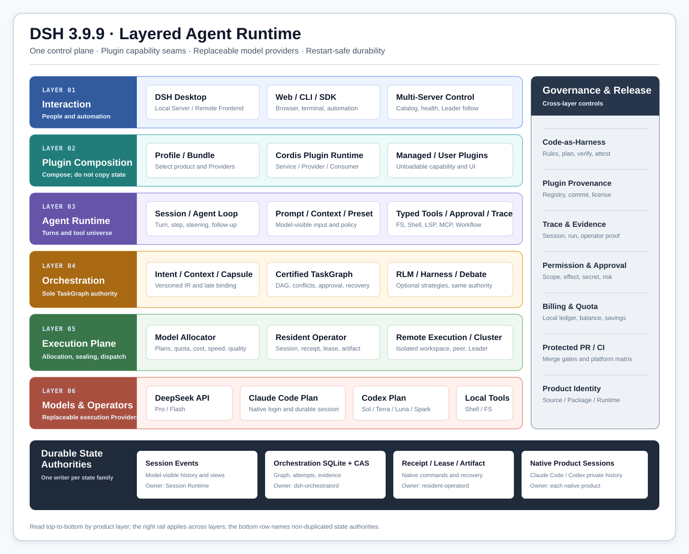

# DSH — DeepSeek Solar Harness

[简体中文](README.md) | English

> This page is the complete English reference for DSH 3.9.9. The default [repository homepage is Chinese](README.md).

**DSH 3.9.9 is a plugin-composed, durably recoverable Agent Runtime and macOS workbench that runs locally or across multiple Servers.** It can use the DeepSeek API directly, or run without a DeepSeek API key by using the user's own Claude Code and Codex subscriptions as first-class models and persistent physical operators.

| 3.9.9 snapshot | Status | Description |
| --- | --- | --- |
| Released product | `ok` | DSH Desktop `3.9.9`; the currently accepted platform is macOS |
| Source identity | `ok` | [`solar@009ec761`](https://github.com/lisihao/deepseek-solar-harness/commit/009ec761e4247dcc63ae1499a47dc4ed4b37e5e5) |
| Product surfaces | `ok` | Local Desktop, Remote Frontend, Product Server, CLI / Web / SDK |
| Project relationship | `warn` | Community downstream distribution, not an official DeepSeek product |

## What DSH is

DSH is not only a terminal coding agent or a workflow library. It combines three planes in one plugin-composed product:

1. **Interactive data plane** — model conversations, typed tools, files, shells, terminals, LSP, sandboxes, sessions, memory, Web UI, and Desktop UI.
2. **Durable control plane** — Intent, Context, Capability, TaskGraph, sealed execution plans, receipts, approvals, evidence, recovery, remote workers, and cluster authority.
3. **Product and governance plane** — sealed Desktop/Product Server composition, managed-plugin provenance, billing, traceability, release identity, and Code-as-Harness gates.

The central architectural decision is to keep the outer control loop in DSH while treating DeepSeek, Claude Code, and Codex as replaceable execution providers. One model turn can be simple and direct; a long task can instead become a persistent DAG whose state, evidence, authority, and operator receipts survive application and daemon restarts.

DSH is based on [DeepSeek Harness](https://github.com/deepseek-ai/deepseek-harness) and its Cordis composition model. It is a community downstream distribution, not an official DeepSeek AI release.

## Product surfaces

| Surface | Purpose | Runtime authority |
| --- | --- | --- |
| DSH Desktop · Local Server | Full MacBook cockpit with local Host, plugins, sessions, operators, orchestration, and native integration | The local Host and local daemons |
| DSH Desktop · Remote Frontend | Full browser/Desktop experience connected to one selected Product Server from a named multi-Server catalog | The selected remote Product Server; the Frontend is a projection and control client |
| DSH Product Server | Plain-Node, long-running product composition with Resident, Orchestration, RLM, Debate, Memory, Billing, Remote Modules, and governance | The Server Host and its owner-local daemons |
| CLI / Web / SDK | Headless, browser, automation, configuration, plugin, and developer entry points | The selected profile and mounted Providers |

Desktop and Product Server are generated from one sealed composition. They load the same product capabilities; only the Host adapter differs. The ordinary upstream-compatible `dsh server` command remains a bare Server profile and is not the full DSH Product Server.

## Feature atlas

| Capability | What 3.9.9 provides | Boundary |
| --- | --- | --- |
| Cordis plugin runtime | Service Definition / Provider / Consumer seams, scoped contexts, typed events, reversible effects, profile and bundle composition | Load order and scope are observable behavior; Consumers must not import concrete Providers |
| Interactive agent | Streaming turn/step loop, inbox, steering, follow-ups, cancellation, model-visible logging, preset switching | The default loop is replaceable, but durable event semantics must remain compatible |
| Models and credentials | DeepSeek and provider adapters, model catalogs, effort/thinking selection, retry and usage metadata | Credential qualification belongs to each Provider; no hidden API fallback |
| First-class subscriptions | Claude Code and Codex may drive the main DSH turn with DSH prompt, tool scope, approvals, logs, and plugins | Uses the user's native subscription login; private product tokens are never imported into DSH |
| Physical Operators | Provider-neutral discovery, admission, execution mode, lifecycle, bounded results, and plugin seam | Default omission remains `ephemeral`; unsupported modes fail explicitly |
| Resident Operators | Durable Claude Code/Codex sessions, receipts, leases, lanes, interrupt, compact, reset, events, artifact refs | The daemon is the only writer; indeterminate commands are never auto-replayed |
| Smart Collaboration | Automatic or manual operator policy, live model/effort catalog, proactive delegation, up to four lanes per native product | It is policy over the same physical-operator seam, not another Scheduler |
| AgentTeams | Parallel delegated agents with bounded worker identity and the selected preset persona | Team coordination remains subordinate to session and tool authority |
| TaskGraph orchestration | Persistent DAG, dependencies, parallel readiness, scope/effect conflict control, retry, approval, pause/resume/cancel, recovery | `dsh-orchestratord` is the sole orchestration writer |
| Compiler pipeline | Versioned Intent IR, Context Packet, Capability Binding Plan, graph certificate, sealed per-attempt ExecutionPlan | Compiler Providers cannot execute nodes or mutate Scheduler state |
| Model allocation | Native-subscription-first offers, quota pools, goal policies, adaptive Luna/Terra execution, high-tier planning/verification, metered fallback | The allocator consumes normalized offers; it does not predict private subscription throttling |
| RLM | Persistent TypeScript REPL, programmable `context`, async `rlm()`, messages, goals, compact, skills, bounded recursion, Agents View attach/input/detach | **Compatible subset**, not yet claimed fully faithful to Prime across every real Provider |
| Continuous Harness | Session, workspace, and user-global entries; versioned prompt addenda, memories, skills, subagent definitions, snapshots, refinement, rollback | Applies at sealed attempt/turn boundaries; no mid-turn mutation or cross-machine sync yet |
| Autonomous continuation | Optional end-condition loop over the same sealed RLM lane with durable budget and gate accounting | A limit exit is not success; it remains subordinate to TaskGraph authority |
| Debate | Bounded proposer/falsifier/auditor/judge roster, blind first drafts, claim ledger, convergence, dissent, artifacts, approval and UI | Debate is optional and does not guarantee better answers without comparative evidence |
| Remote Frontend | Named Server catalog, add/edit/remove/select, local/remote switch, health qualification, Leader following, recovery page | Live state remains on its authoritative Server; the Frontend does not become a second writer |
| Remote execution | Exact-commit repository materialization, isolated per-command workspaces, durable Resident execution, artifact return | Only allowlisted repositories; credentials and sender absolute paths never cross the wire |
| Multi-Server cluster | Fixed membership, majority-backed Leader lease, term/vote fencing, logical state replication, Frontend Leader discovery | First release uses bounded full snapshots; membership changes and unbounded incremental replication are deferred |
| Session handoff | Revision-aware transfer of complete balanced event logs between Frontend/local Server/Product Server | No open-turn replication, SQLite/WAL copying, or continuous dual writing |
| Memory | Mnemon memory spaces, multi-provider adapters, recall, graph projection, runtime memory, supervised writes, backup surfaces | Memory is a managed plugin capability, not orchestration truth |
| Trace and evidence | Session events, Collaboration Trace, orchestration events, operator phases, bounded output, immutable Evidence/Artifact refs | Private reasoning, raw prompts, terminal screens, and native product transcripts stay outside projections |
| Billing | Local usage ledger, DeepSeek official balance, time-of-day pricing, model detail, local savings, multi-Server aggregation | Local DSH totals are not the provider's official invoice; unavailable sources are shown, not projected as zero |
| Desktop experience | Thin Electron Host, official Web carrier, advanced/compatibility modes, profiles, tray, terminal, updates, themes, plugins | Current stable release contract is macOS; Windows/Linux paths are not accepted stable Desktop releases |
| Managed plugins | Sealed Better Sidebar, GenUI, diagnostics, code graph, Mnemon, Aegis skills, billing, remote modules, provenance registry | Optional third-party plugins remain profile extensions unless admitted into the sealed product |
| Governance | Agent Notes, bilingual docs, package constraints, Code-as-Harness, source/package/runtime identity, protected PR delivery | Passing governance does not replace real installed-product acceptance where required |

## Architecture



### Authority boundaries

| Owner | Authoritative for | Must not own |
| --- | --- | --- |
| Session runtime | Model-visible transcript, turn/step/tool event order, user-facing projections | TaskGraph scheduling or native product history |
| Orchestration daemon | Graph/run/node/attempt state, receipts, approval, generations, Evidence and CAS refs | Natural-language interpretation inside a model or product-private session state |
| Resident daemon | Native operator Session mapping, command receipts, leases, progress events, bounded results | Global TaskGraph state or Desktop UI state |
| Claude Code / Codex | Their native product session and execution behavior | DSH global scheduler, plugin composition, Evidence graph, or release authority |
| Product Server | Live remote sessions and services for connected Frontends | A Frontend's inactive local state or GitHub source authority |
| Desktop Frontend | Presentation, operator controls, Server catalog, explicit sync requests | Silent failover writes, replicated open turns, or a second canonical database |

## Execution modes

| User choice | Execution behavior | Best fit |
| --- | --- | --- |
| Standard | One primary model follows the ordinary agent loop and uses normal DSH tools | Conversation, focused edits, predictable baseline |
| Smart Auto | DSH chooses direct execution, physical delegation, TaskGraph, RLM, or another admitted strategy from policy and live capability | General default when the system may optimize quality, speed, and cost |
| RLM | A root model receives a persistent TypeScript REPL and treats context plus async child agents as programmable values | Large-context decomposition, recursive analysis, controlled synthesis |
| Debate | Several bounded high-tier roles challenge claims and a judge synthesizes with dissent retained | Contested architecture, review, risk, and evidence-heavy decisions |
| TaskGraph | A certified DAG dispatches independent nodes in parallel under scopes, effects, receipts, and acceptance rules | Multi-step development and work that must survive restarts |

RLM and Debate are execution strategies, not competing control planes. They run inside the existing session/TaskGraph authority and use the same physical operators. Explicit RLM uses the Prime-oriented strict profile; Smart Auto may use DSH's cost- and quota-aware allocation. Neither mode is marketed as a universal quality improvement: release decisions should use fixed offline fixtures and one authorized minimal real-subscription blind comparison when affected.

## Native subscriptions without a DeepSeek API key

DSH can operate without a DeepSeek API key when at least one qualified Claude Code or Codex native subscription Provider is available. The same subscription may serve in two roles:

1. As a **delegated physical operator**, receiving a bounded task from the current DSH agent.
2. As the **first-class DSH model**, receiving the assembled system prompt and a sealed bridge to the current DSH tool universe.

In both cases DSH keeps plugin composition, tool schemas, approval policy, event logging, collaboration trace, receipts, and bounded results. The native product keeps its own login token and native session. API fallback is forbidden for the subscription Providers; an unqualified login fails explicitly instead of silently spending a metered API key.

## Durable orchestration pipeline

```text
Raw request
  -> IntentIR
  -> RequirementIR
  -> Logical TaskGraph
  -> validation + Plan Certificate
  -> durable Run

Ready node
  -> Capability resolution
  -> Continuous Harness snapshot
  -> Context compilation
  -> Operator/model allocation
  -> sealed NodeExecutionPlan
  -> approval/admission
  -> local or remote physical execution
  -> Evidence + Artifact + receipt settlement
```

The Scheduler admits a node only after dependencies, graph limits, read/write scopes, effects, live capacity, quota, and approval are compatible. Independent nodes may run in parallel; conflicting scopes or effects serialize only the affected nodes rather than imposing a phase-wide barrier. A settled retry receives a new attempt and execution identity. An indeterminate external command is never automatically replayed.

## Remote and multi-Server operation

DSH 3.9.9 separates cockpit from compute:

1. A MacBook Desktop can run its own Local Server or switch to a saved Product Server without replacing the application.
2. One Frontend can maintain several named Servers and follow the current schedulable Leader.
3. A Product Server can execute locally or offer qualified remote Resident capacity to the cluster.
4. Remote work names a clean Git repository identity and exact commit; the receiver creates a Server-local isolated checkout.
5. GitHub remains source authority. Optional Tailscale/SSH paths accelerate transfer and authenticated access but do not become source truth.

Cluster scheduling requires a non-expired majority lease. A follower cannot replay an accepted command, and stale-term results cannot settle a newer generation. The first cluster protocol deliberately uses fixed membership and bounded full logical snapshots; a two-member cluster cannot continue after one member fails because it no longer has a majority.

## Plugin architecture

| Role | Responsibility | Dependency rule |
| --- | --- | --- |
| Service Definition | Owns public types, events, errors, and capability contract | Imports no concrete Provider |
| Provider | Implements one local, remote, native, or test backend | Depends on the Definition, not a Consumer |
| Consumer | Exposes a model tool, UI, command, API, or higher-level composition | Depends on the Definition and injected service |
| Bundle/Profile | Selects and configures implementations for one product surface | Composition only; it does not redefine contracts |

This applies to filesystems, subprocesses, models, Resident Operators, orchestration, Intent/Context compilers, capsules, RLM, Continuous Harness, Debate, memory, and remote services. Removing an optional bundle removes its capability and UI without copying its state machine into DSH Core.

## Persistence, recovery, and observability

| State family | Durable representation | Recovery rule |
| --- | --- | --- |
| Conversation | Append-only Session events with JSONL/SQLite persistence and projections | Rebuild model-visible history from events; unsupported required events fail loudly |
| Resident command | Session, Receipt, Lease, Event, and Artifact records under the owner DSH home | Same command/hash reuses the receipt; uncertain native outcome becomes indeterminate |
| Orchestration | SQLite WAL plus immutable compilation, plan, event, Evidence, and CAS artifacts | One daemon writes; accepted attempts are reconciled before new dispatch |
| Remote cluster | Term, vote, Leader lease, commit index, digest-verified logical snapshots | Only the majority-backed Leader schedules external effects |
| Memory and billing | Plugin-owned stores with explicit provenance and aggregation status | They project into the product but do not become Scheduler or provider invoice truth |

The UI exposes bounded operational views: Physical Operators, Orchestrations, Debate, Memory, billing, plugin diagnostics, and per-session Collaboration/Governance Trace. Large outputs remain artifacts; raw prompts, private chain-of-thought, complete terminal screens, native credentials, and product-private transcripts are not copied into general projections.

## Code map

| Area | Primary path | Responsibility |
| --- | --- | --- |
| CLI and profile boot | [`apps/cli`](apps/cli) | Entry modes, profile/bundle resolution, launch provenance, shutdown |
| Agent loop | [`packages/core/agent-loop`](packages/core/agent-loop) | Turn/step state machine, model calls, streaming, tool dispatch |
| Session model | [`packages/core/session`](packages/core/session) and [`packages/session`](packages/session) | Event vocabulary, persistence, projections, replay, recovery |
| Tools and prompt | [`packages/core/tools`](packages/core/tools) and [`packages/core/system-prompt`](packages/core/system-prompt) | Tool ABI, policies, Code Mode, prompt/context assembly |
| Physical Operators | [`packages/physical-operator`](packages/physical-operator) | Ephemeral and Resident capability seams plus local daemon Provider |
| Orchestration | [`packages/orchestration`](packages/orchestration) | TaskGraph, compilers, allocator, RLM, Harness, Debate, local daemon |
| Remote connection | [`packages/client/connection`](packages/client/connection) | Authenticated Host description, event streams, sync, remote execution, cluster projection |
| Desktop/Product Server | [`products/desktop/dsh-plugin-desktop`](products/desktop/dsh-plugin-desktop) | Electron Host, Product Server adapter, product composition, packaging and acceptance |
| Managed plugins | [`plugins/managed`](plugins/managed) | Sealed product plugins, memory, billing, governance, UI and provenance |
| Product identity | [`distribution/product.json`](distribution/product.json) | Platform, stable Desktop version, branch and tag contract |

## Honest boundaries

1. **RLM is currently a compatible subset.** The TypeScript runtime implements the core programmable mechanism, but DSH does not claim full Prime fidelity until the fixed DeepSeek, Claude Code, Codex, and Continuous Harness end-to-end matrix passes.
2. **Quality uplift is not guaranteed.** RLM and Debate provide methods and evidence surfaces; whether they improve a task must be measured against Standard mode.
3. **Cluster v1 is deliberately bounded.** Membership is fixed, replication is full-snapshot and size-bounded, and two members do not provide one-failure availability.
4. **Hot capability injection is boundary-based.** Current native operators support pre-dispatch or next-turn changes, not arbitrary in-turn checkpoint/rebind.
5. **The accepted stable Desktop is macOS.** Windows and Linux source paths do not constitute an accepted 3.9.9 stable release.
6. **Developer ID notarization is not part of the current release identity.** Local acceptance can use an ad-hoc signed application; formal public distribution requires Apple signing/notarization credentials.
7. **Local billing is scoped accounting.** It cannot replace a provider's complete official bill across other programs, API keys, or accounts.
8. **Repository complexity remains material.** The pnpm monorepo, isolated Desktop Yarn workspace, managed source inputs, native code, bilingual docs, and release gates increase change cost.

## When to choose DSH

### Good fit

- You want a plugin-composed local AI workbench rather than one fixed model client.
- Claude Code or Codex subscriptions should work as durable first-class agents without requiring a DeepSeek API key.
- Long tasks need DAG parallelism, explicit authority, receipts, evidence, approval, and restart recovery.
- A MacBook cockpit should use one or more remote Product Servers and remote operator capacity.
- Product provenance, managed plugins, traceability, and release governance are first-class requirements.

### Prefer a smaller or different base

- You need only a minimal, model-native terminal coding loop.
- Your primary product is a hosted Python/.NET/Go workflow library rather than a local agent workbench.
- You require elastic, unbounded, multi-region consensus today.
- Your only problem is a specialized research/report pipeline and you do not need a general coding runtime.

<a id="run"></a><a id="run-from-source"></a>

## Run from source

Prerequisites are macOS, Git, Corepack, and Node.js `22.19+` or `24+`. The root pnpm graph and Desktop Yarn graph are intentionally separate.

```sh
git clone https://github.com/lisihao/deepseek-solar-harness.git
cd deepseek-solar-harness
corepack pnpm install --frozen-lockfile
corepack pnpm run build
corepack pnpm dsh web

cd products/desktop
corepack yarn install --immutable
corepack yarn check
# Run only in a graphical session:
corepack yarn dev
```

Product Server deployment, cluster configuration, remote repository allowlists, Desktop packaging, and D00–D08 acceptance are documented in [`products/desktop/dsh-plugin-desktop/README.md`](products/desktop/dsh-plugin-desktop/README.md). The machine-readable product identity in [`distribution/product.json`](distribution/product.json) is authoritative for the stable version and supported platform.

## Verification and contribution

Read [`AGENTS.md`](AGENTS.md) before changing the repository and [`docs/architecture.md`](docs/architecture.md) for the upstream runtime map. [`distribution/upstreams.yaml`](distribution/upstreams.yaml) records accepted ancestry; [`plugins/registry.yaml`](plugins/registry.yaml) records managed-plugin source, revision, license evidence, and native checks; [`THIRD_PARTY_NOTICES.md`](THIRD_PARTY_NOTICES.md) records third-party runtime disclosures.

`solar` is protected. Changes enter through an isolated branch and Pull Request with change-aware Code-as-Harness verification. Full governance and real subscription acceptance are run only when the affected boundary requires them; still-valid evidence is reused when inputs are unchanged.

## License

The core repository is licensed under [MIT](LICENSE). Imported components retain their own licenses and notices.
