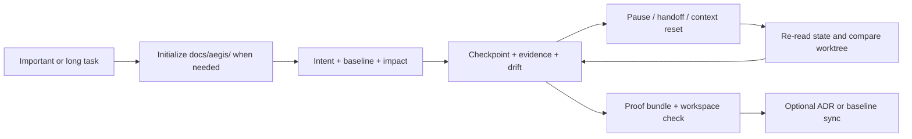

# Aegis Fast-Track Playbook

Status: `Approved`

> Aegis helps an AI coding agent ask the right question at the right layer,
> change the right owner, preserve long-task state, and prove what is actually
> complete—without making small work ceremonial.

## 1. Quick Install: Give Your Agent One Prompt

The fastest recommended installation path is to give this prompt to your AI
coding agent:

```text
Read https://github.com/GanyuanRan/Aegis, identify my current AI coding host, and install Aegis globally using the correct host guide. If the host is the official DeepSeek Harness (`dsh`), treat global/minimal installation as native profile-plugin installation with `dsh plugin --profile <profile> add github:GanyuanRan/Aegis`; do not silently substitute the direct-child compatibility path unless the plugin manager is unavailable and I explicitly approve compatibility mode. Restart or reload the host if needed, then run complete-install verification from the installed Aegis method-pack root. Do not run the doctor command from the target project directory. First locate `<aegis-method-pack-root>`, then run `cd <aegis-method-pack-root> && python scripts/aegis-doctor.py --write-config --json`. Treat the install as complete only if the JSON includes `"ok": true`, `"workspaceSupport": "available"`, and `"configStatus": "configured"`; if the host uses a separate skill discovery directory, also verify it with `--discovery-root <path>`; if the host guide declares a skill directory name prefix, also pass `--discovery-name-prefix <prefix>`. Also complete the selected host guide's native activation and automatic-entry checks; file discovery or a generic doctor result alone is not sufficient when the host provides a plugin, hook, or session-start bootstrap contract.
```

### How To Know Installation Is Complete

1. The agent identified your actual host and used that host's installation
   guide.
2. Aegis was installed globally and the host was restarted or reloaded when
   required.
3. `aegis-doctor.py` ran from the installed method-pack root, not from the
   target project.
4. The JSON result reported `"ok": true`,
   `"workspaceSupport": "available"`, and
   `"configStatus": "configured"`.
5. Hosts with a separate discovery directory or required skill-name prefix
   also passed the corresponding discovery check.
6. Hosts with a native plugin, hook, or session-start bootstrap also passed the
   host guide's activation and automatic-entry checks.

This distinction matters: a copy-only or skills-only install may expose Aegis
methods while leaving project workspace support unavailable.

For manual installation, start with [Codex](../README.codex.md),
[OpenCode](../README.opencode.md), [Claude Code](../README.claude-code.md),
[DeepSeek Harness](../README.deepseek-harness.md), or the full
[Host Compatibility Matrix](AEGIS_HOST_COMPATIBILITY_MATRIX_SNAPSHOT.md).

After a complete install, future updates can usually be requested with
`update Aegis` or `aegis:update`.

## 2. Start Using Aegis In 30 Seconds

Describe the work normally. Add a direct mode phrase only when you want to make
the method unambiguous.

```text
This regression appeared after the cache change. Trace the real cause before editing.

Review this direction from first principles. Do we need this new service at all?

Grill me about this migration plan; ask one decision question at a time.

Create Aegis workspace records for this long task and keep checkpoints between slices.

Before we merge, independently review the change and verify what remains uncovered.
```

Natural language is the normal entry point. Explicit names such as
`aegis:systematic-debugging` are useful when the host supports them and you
want to remove ambiguity.

## 3. Lightweight By Design, Strong Where Risk Concentrates

Aegis is not a heavyweight workflow that runs in full on every request. Its
cost shape is deliberately progressive:

| Task pressure | Default Aegis shape |
| --- | --- |
| Tiny question or local edit | Fast path; no spec, plan, workspace record, or structured trace by default. |
| Normal single-owner work | Compact routing plus the smallest relevant method and baseline read set. |
| Bug or regression | Root-cause discipline expands, while the report can remain compact for a proven low-risk case. |
| Architecture, contract, migration, or long task | Planning, checkpoints, drift, retirement, and broader verification expand only where risk requires them. |
| Explicit audit need | A structured `Trace Digest` is available on demand instead of consuming every interaction. |

Other lightweight defaults reinforce this design:

- project workspace records are lazy, not universal
- TDD defaults to `off`, while completion verification remains active
- large logs and tool output are indexed or summarized before raw readback
- the compact router stays separate from task-specific deep methods
- Aegis runs as a plugin-installable method layer, without requiring a daemon,
  background runner, or authoritative runtime core

### How It Differs From A Typical Standalone Skill Pack

Standalone skill packs vary widely. This comparison describes the common
“collection of reusable recipes” model, not every plugin or product.

| Dimension | Typical standalone skill pack | Aegis Method Pack |
| --- | --- | --- |
| Primary unit | An isolated recipe for a named task. | Coordinated methods covering decision, diagnosis, execution, review, continuation, and closeout. |
| Routing | Explicit invocation or host-native matching. | Compact task routing plus an owner workflow; explicit invocation still works. |
| Engineering depth | Optimizes the procedure inside one skill. | Connects baseline, owner, causality, complexity, retirement, evidence, and authority boundaries across the lifecycle. |
| Project memory | Usually depends on host/session state or project-specific conventions. | Adds an optional indexed `docs/aegis/` workspace for durable intent, checkpoints, evidence, drift, and ADR signals. |
| Small-task cost | Depends on the selected skill's recipe. | Protects a fast path and avoids workspace, plan, TDD, and trace ceremony by default. |
| Long-task safety | Depends on conversational memory or an external task system. | Reconstructs state from checkpoints and compares it with the current worktree before resuming. |
| Completion language | Often ends when the requested procedure or tests finish. | Separates fresh evidence from completion, merge, release, policy, and acceptance authority. |
| Portability | Host and package dependent. | Designed as a multi-host, plugin-installable method layer with host-specific evidence boundaries. |

Aegis performance is judged by engineering behavior: route correctness,
fast-path cheapness, evidence freshness, workspace laziness, artifact stability,
and authority safety. Cost, time, token count, and diff size can be supporting
metrics, but Aegis does not claim a fixed saving percentage across arbitrary
projects.

## 4. The Five Engineering Moats

| Engineering moat | What Aegis changes | Risk it reduces |
| --- | --- | --- |
| **Seven-Layer Root-Cause Analysis** | Traces a failure from the visible symptom toward logic, systems, architecture, contracts, platform constraints, or a specification gap. | Symptom patches and repeated “fixes” at the wrong layer. |
| **First-Principles Decision Review** | Challenges whether a new owner, fallback, adapter, compatibility path, or long-term abstraction should exist. | Building the wrong thing cleanly. |
| **Anti-Entropy Code Change Loop** | Checks change necessity and owner fit before editing, then complexity delta and retirement after editing. | Silent complexity growth, duplicate owners, and permanent temporary paths. |
| **Workspace-Backed Long-Task Continuity** | Persists intent, baseline use, checkpoints, evidence, drift, and resume state in the project when durable state is needed. | Context-reset amnesia, unsafe handoffs, and stale-plan execution. |
| **Evidence-Based Closeout** | Requires fresh verification, covered and uncovered scope, residual risk, and confidence before a completion claim. | “Looks done” becoming “is done.” |

These methods are pressure-sensitive. Aegis keeps a small, clear task small and
expands only when the work carries meaningful uncertainty or engineering risk.

### 4.1 Seven-Layer Root-Cause Analysis

When a bug is not obviously local, Aegis can drill upward through seven
diagnostic layers:

```text
L1 Symptom
  → L2 Logic
  → L3 System / component boundary
  → L4 Architecture / ownership
  → L5 Cross-system contract
  → L6 Platform constraint
  → L7 Specification gap
```

It reproduces the problem, traces the causal path, identifies the canonical
owner, checks a falsifier when needed, and stops where the evidence closes the
cause. It does not mechanically visit all seven layers for every bug.

The practical difference is simple: a caller-side guard may hide the symptom,
while a deeper owner or contract fix removes the bug class.

Try:

```text
Diagnose this through the Aegis seven-layer model. Show which altitude the diagnosis stops at and why.
```

### 4.2 First-Principles Decision Review

Before accepting a complex direction, Aegis asks questions such as:

- Does this new surface need to exist?
- Can an existing owner or contract absorb the responsibility?
- Is the proposal fixing the root boundary or carrying a local workaround?
- Is compatibility proven, or are we preserving a fallback by habit?
- What simpler direction would make the proposed complexity unnecessary?

Use this when a plan introduces a new service, owner, adapter, fallback,
compatibility layer, source of truth, or “stable long-term” abstraction.

Try:

```text
Review this from first principles before we choose an approach.
```

### 4.3 Anti-Entropy Code Change Loop

Aegis treats code change as a lifecycle, not just an edit:

```text
User-visible need
  → Change Necessity: should code change at all?
  → Canonical owner: where should correctness live?
  → Pre-Edit Complexity Check: is this owner already under pressure?
  → Minimum sufficient change
  → Fresh verification
  → Complexity Delta + Complexity Closure
  → extract / split / retire / bounded follow-up when pressure remains
```

Before editing, `Change Necessity` distinguishes `no-change`,
`docs/config-only`, `code-change`, and `needs-clarification`. The owner-fit and
pre-edit complexity checks prevent new responsibility from being pushed into
an overloaded or downstream file merely because it is convenient.

After editing, Aegis checks whether branches, fallbacks, adapters, owners, or
artifact complexity increased. It can recommend extracting a helper, splitting
an owner or task, retiring an old path, or opening a bounded follow-up. It does
not silently expand scope or promise automatic refactoring.

For repairs and migrations, the loop also keeps two tracks visible:

- **Repair track** — what was fixed at the correct owner and how it was proven.
- **Retirement track** — what old path was removed, retained with evidence, or
  scheduled for deletion.

Try:

```text
Before editing, check whether code is necessary and whether this is the right owner.
After the change, report the complexity delta and any split or retirement needed.
```

### 4.4 Workspace-Backed Long-Task Continuity

Long work should not depend on chat memory. Aegis can persist the task's intent,
baseline use, checkpoints, evidence, drift state, and resume hints in the
target project. A later session or agent re-reads that state and compares it
with the current worktree before continuing.

This is explained in detail in [Aegis Project Workspace](#5-aegis-project-workspace).

### 4.5 Evidence-Based Closeout

Before saying a task is complete, Aegis asks for fresh evidence and reports:

- what command or manual check was run and its result
- which behavior, files, hosts, or paths were covered
- what remains unverified
- residual risk and confidence
- whether complexity, retirement, baseline, or ADR follow-up remains

This is advisory engineering evidence. It does not grant merge, release,
policy, or user-acceptance authority.

## 5. Aegis Project Workspace

The Aegis Project Workspace is the project-local memory and evidence surface
under `docs/aegis/`. It is created lazily when a medium/high-complexity or
long-running task benefits from durable records. Fast questions and tiny edits
should not create workspace files by default.



### What It Creates

```text
docs/aegis/
├── README.md
├── INDEX.md
├── BASELINE-GOVERNANCE.md
├── baseline/    project snapshots and baseline evidence
├── specs/       approved feature or design intent
├── plans/       implementation plans when a durable plan is justified
├── work/        task intent, checkpoints, evidence, drift, and proof bundles
└── adr/         project-local method-pack ADRs when no stronger ADR owner exists
```

The workspace index makes records discoverable. `BASELINE-GOVERNANCE.md`
defines the workspace's local method discipline, while the target project's
existing rules, architecture docs, and formal ADR system remain higher
authority.

### How A Long Task Moves Through It

1. **Start** — record outcome, goal, success evidence, stop condition,
   non-goals, baseline refs, affected owners, invariants, and compatibility.
2. **Slice** — record the current todo, intended edits, explicit non-edits,
   evidence, blockers, next step, and drift decision.
3. **Pause or hand off** — update the checkpoint and `ResumeStateHint`.
4. **Resume** — re-read intent, baseline refs, checkpoint, resume hint, and
   current worktree; pause if they disagree.
5. **Close** — assemble a structural proof bundle, validate workspace/index
   coverage, then run normal completion verification.
6. **Remember durable decisions** — create or update an ADR only when executed,
   verified architecture work and the project's authority model justify it.

Useful natural-language requests:

```text
Create Aegis workspace records for this task and keep checkpoints after each slice.

Resume from the Aegis workspace. Check drift against the current worktree first.

Bundle the current work evidence and check the workspace before closeout.
```

The helper-backed lifecycle uses commands such as `init`, `new-work`,
`add-checkpoint`, `add-baseline-usage`, `add-evidence`, `add-drift-check`,
`bundle`, and `check`. A complete host install must retain access to the
installed method-pack helper; skill discovery alone does not prove workspace
support.

Workspace records are method-pack drafts, hints, and evidence. They are not an
authoritative `GateDecision`, `PolicySnapshot`, source of project truth, or
completion authority.

## 6. Capability Map: Say What You Need

### Think And Decide

| You want to | Say something like | Aegis contribution |
| --- | --- | --- |
| Frame an important outcome | `Aegis goal: add SSO without changing password sign-in.` | Pins goal, success evidence, stop condition, and non-goals. |
| Design unclear behavior | `Help me decide how this should work before implementation.` | Clarifies requirements, compares approaches, and stabilizes the design boundary. |
| Pressure-test your own judgment | `Grill me about this launch plan.` / `审问我这个方案。` | Gives a recommendation and trade-off, then asks one decision question per turn. |
| Challenge a complex direction | `Review this from first principles.` | Tests existence, owner, fallback, compatibility, and simpler alternatives. |
| Understand a new project | `Establish project context and key terms first.` | Reads the smallest relevant authority set and builds shared vocabulary. |

### Diagnose And Build

| You want to | Say something like | Aegis contribution |
| --- | --- | --- |
| Find the real cause of a bug | `Use the seven-layer diagnosis and stop at the proven cause.` | Reproduces, traces causality, finds the canonical owner, and avoids symptom patches. |
| Turn approved intent into work | `Write the implementation plan for this approved design.` | Produces bounded tasks, owner/file map, compatibility, retirement, and verification. |
| Execute a plan safely | `Execute this plan in slices and keep checkpoints.` | Re-checks boundaries, records evidence, and stops on drift. |
| Use strict test-first work | `TDD Route: strict` / `Use strict TDD.` | Runs RED → GREEN → REFACTOR for a suitable approved slice. |
| Parallelize independent work | `These tasks are independent; use parallel agents safely.` | Delegation only when coordination clearly beats inline cost; otherwise run inline. Splits independent ownership and reviews combined evidence. |
| Isolate feature work | `Use a worktree for this feature.` | Exception-only: concurrent checkout, blocking unrelated dirty state, or explicit user/repository authority. Task complexity, TDD, planning, or subagents alone are not enough. |

### Review, Simplify, And Continue

| You want to | Say something like | Aegis contribution |
| --- | --- | --- |
| Review before merge | `Independently review this diff before merge.` | Reports findings first across owners, contracts, baselines, compatibility, and tests. |
| Evaluate review feedback | `Assess this feedback before implementing it.` | Checks whether the recommendation is correct, safe, and worth adopting. |
| Retire stale logic | `Can we delete this old path instead of adding another fallback?` | Classifies deletion risk and requires evidence for compatibility retention. |
| Resume a long task | `Resume from the latest Aegis checkpoint and verify drift.` | Reconstructs state from project records rather than memory alone. |
| Verify readiness | `Can we really call this complete?` | Requires fresh evidence and makes uncovered scope and residual risk visible. |
| Finish a branch | `The work is verified; what is the safest integration step?` | Helps choose PR, merge, cleanup, or handoff without taking unauthorized git action. |
| Record a durable decision | `Should this verified change become an ADR?` | Chooses create, amend, supersede, or skip and checks baseline sync. |
| Update Aegis | `aegis:update` / `Is Aegis current?` | Uses the host-scoped installed update path and verifies the result. |

## 7. Controls You May Want To Set

### Activation Mode

`auto` is the usual behavior: matching requests can select Aegis methods.
`explicit` is for supported host bootstrap/profile paths that only enter Aegis
when asked. Native host matchers can behave differently, so read the host guide
before assuming the switch hides every skill.

Read [Activation Mode](AEGIS_ACTIVATION_MODE.md) for exact semantics.

### TDD Mode

TDD defaults to `off`:

- Risk wording alone does not automatically load strict test-first work.
- Focused regression tests and completion verification still apply when useful.
- Say `strict TDD`, `test-first`, or `TDD Route: strict` when you explicitly
  want RED → GREEN → REFACTOR.

Read [TDD Mode](AEGIS_TDD_MODE.md) for `off` and `auto` configuration.

## 8. When A Capability Does Not Trigger

Do not begin by adding more keywords. Check the trigger chain:

1. installed version
2. host skill discovery
3. activation/bootstrap or native matching behavior
4. task-to-skill routing clarity
5. context pressure or compaction
6. complete-install workspace helper availability when workspace support is expected

Use [Trigger Health](AEGIS_TRIGGER_HEALTH_BASELINE.md) and the relevant host
guide for the full diagnostic path.

## 9. Go Deeper Only When Needed

- [Workflow Guide](AEGIS_WORKFLOW_GUIDE.md) — full workflow and boundary model.
- [Workflow Quality Baseline](AEGIS_WORKFLOW_QUALITY_BASELINE.md) — compactness,
  evidence, complexity, and closeout contracts.
- [Artifact Schema Baseline](AEGIS_ARTIFACT_SCHEMA_BASELINE.md) — workspace and
  runtime-ready draft shapes.
- [Host Compatibility Matrix](AEGIS_HOST_COMPATIBILITY_MATRIX_SNAPSHOT.md) —
  current support evidence and limitations.
- [Codex](../README.codex.md), [OpenCode](../README.opencode.md), and
  [Claude Code](../README.claude-code.md) — host installation and usage notes.

## 10. Important Boundary

Aegis is a method pack. It supplies workflow discipline, advisory judgment,
project-local evidence, and runtime-ready drafts. It is not an authoritative
runtime core and does not own final completion, policy, release, or project
truth.
