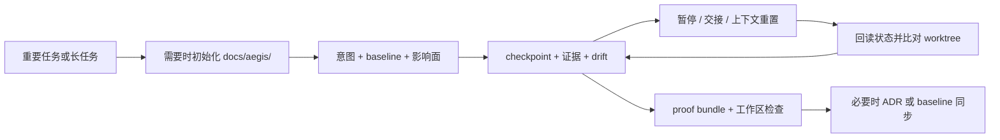

# Aegis 速通秘籍

状态：`Approved`

> Aegis 让 AI 编程 Agent 在正确层级提出正确问题、修改正确 owner、保存长任务状态，
> 并证明真正完成了什么；同时不让小任务背上沉重流程。

## 1. 极简安装：把一段话交给 Agent

最快、最推荐的方式，是把下面这段话交给你的 AI 编程 Agent：

```text
请阅读 https://github.com/GanyuanRan/Aegis，识别我当前使用的 AI 编程宿主，并按对应宿主说明全局安装 Aegis。如果宿主是官方 DeepSeek Harness（`dsh`），必须把全局/极简安装分流为原生 profile plugin 安装：`dsh plugin --profile <profile> add github:GanyuanRan/Aegis`；除非 plugin manager 不可用且我明确同意 compatibility mode，否则不要静默改用 direct-child 兼容路径。如果需要重启或重新加载宿主，请明确告诉我；然后从已安装的 Aegis method-pack 根目录运行完整安装验证。不要在目标项目目录中运行 doctor 命令。先定位 `<aegis-method-pack-root>`，再运行 `cd <aegis-method-pack-root> && python scripts/aegis-doctor.py --write-config --json`。只有当 JSON 输出包含 `"ok": true`、`"workspaceSupport": "available"` 和 `"configStatus": "configured"` 时，才把安装视为完成；如果宿主有单独的 skill discovery 目录，也要额外用 `--discovery-root <path>` 验证它指向当前版本；如果宿主说明声明了 skill 目录名前缀，也同时传 `--discovery-name-prefix <prefix>`。还必须完成对应宿主说明中的原生活化与自动入口验证；当宿主提供 plugin、hook 或 session-start bootstrap 时，仅通过文件发现或通用 doctor 检查不能视为安装完成。
```

### 怎样才算真正安装完成

1. Agent 识别了你实际使用的宿主，并采用对应宿主安装说明。
2. Aegis 已完成全局安装，并在需要时重启或 reload 宿主。
3. `aegis-doctor.py` 从已安装的 method-pack 根目录运行，而不是从目标项目运行。
4. JSON 结果包含 `"ok": true`、`"workspaceSupport": "available"` 和
   `"configStatus": "configured"`。
5. 有独立 discovery 目录或 skill 名称前缀要求的宿主，也通过了对应检查。
6. 提供原生 plugin、hook 或 session-start bootstrap 的宿主，也通过了宿主说明中的
   活化与自动入口检查。

这个区别很重要：只复制 skills 可能让宿主看见 Aegis 方法，却不能证明项目工作区
支持完整可用。

如果希望手动安装，从 [Codex](../README.codex.md)、
[OpenCode](../README.opencode.md)、[Claude Code](../README.claude-code.md)、
[DeepSeek Harness](../README.deepseek-harness.md) 或完整
[宿主兼容性矩阵](AEGIS_HOST_COMPATIBILITY_MATRIX_SNAPSHOT.md) 开始。

完成安装后，后续通常可以直接说 `更新 Aegis` 或 `aegis:update`。

## 2. 30 秒开始使用 Aegis

正常描述工作即可。只有想让方法更确定时，才直接点名模式。

```text
这个回归在缓存改动后出现。先追到真实根因，再编辑。

用第一性原理审查这个方向：我们真的需要新增这个服务吗？

审问我这个迁移方案；每轮只问一个决策问题。

为这个长任务建立 Aegis 工作区记录，每个切片后保存 checkpoint。

合并前独立审查这个改动，并验证还有哪些范围没有覆盖。
```

自然语言是默认入口。宿主支持时，也可以显式写
`aegis:systematic-debugging` 这类名称来消除歧义。

## 3. 轻量，但把力量集中在高风险处

Aegis 不是每次请求都完整展开的重型 workflow。它采用渐进式成本结构：

| 任务压力 | Aegis 默认形态 |
| --- | --- |
| 微小问答或局部编辑 | 走 fast path；默认不写 spec、plan、工作区记录或结构化 trace。 |
| 常规单 owner 工作 | 紧凑路由，只加载最相关方法与最小 baseline read set。 |
| Bug 或回归 | 展开根因纪律；已证实的低风险问题仍可使用紧凑报告。 |
| 架构、contract、迁移或长任务 | 仅在风险需要时展开规划、checkpoint、drift、退役与更广验证。 |
| 明确审计需求 | 按需输出结构化 `Trace Digest`，不让每次交互承担审计成本。 |

其它轻量默认也服务于这一目标：

- 项目工作区记录按需创建，不是每个任务都写
- TDD 默认 `off`，但完成前验证仍然生效
- 大日志与工具输出先索引或摘要，再按需回读原文
- 紧凑 router 与任务专属深方法分离
- Aegis 是 plugin-installable method layer，不要求 daemon、后台 runner 或
  authoritative runtime core

### 它与典型独立 Skill Pack 有什么不同

独立 skill pack 的实现差异很大。这里比较的是常见的“可复用方法集合”模型，
不是对每一个插件或产品下结论。

| 维度 | 典型独立 Skill Pack | Aegis Method Pack |
| --- | --- | --- |
| 基本单元 | 面向一个命名任务的独立方法。 | 协同覆盖决策、诊断、实施、审查、续接与收尾的方法系统。 |
| 路由 | 显式调用或宿主原生匹配。 | 紧凑任务路由加 owner workflow；同时保留显式调用。 |
| 工程深度 | 优化单个 skill 内部流程。 | 跨生命周期连接 baseline、owner、因果、复杂度、退役、证据与权限边界。 |
| 项目记忆 | 通常依赖宿主/会话状态或项目自定义约定。 | 提供可选、可索引的 `docs/aegis/` 工作区，持久化意图、checkpoint、证据、drift 与 ADR signal。 |
| 小任务成本 | 取决于被选 skill 的完整流程。 | 保护 fast path，默认不引入工作区、计划、TDD 与 trace 仪式。 |
| 长任务安全 | 依赖对话记忆或外部任务系统。 | 从 checkpoint 重建状态，并在恢复前与当前 worktree 比较。 |
| 完成表达 | 常在流程或测试结束时收尾。 | 把 fresh evidence 与完成、合并、发布、策略、验收 authority 明确分开。 |
| 可移植性 | 取决于宿主与包形态。 | 以多宿主、plugin-installable method layer 为目标，并保留宿主证据边界。 |

Aegis 的出色表现用工程行为衡量：路由正确性、fast-path 轻量度、证据新鲜度、
工作区懒加载、artifact 稳定性与 authority 安全。成本、耗时、token 和 diff 大小可以
作为辅助指标，但 Aegis 不宣称在任意项目上固定节省某个百分比。

## 4. Aegis 的五道工程护城河

| 工程护城河 | Aegis 改变了什么 | 降低什么风险 |
| --- | --- | --- |
| **七层根因穿透** | 从可见症状向逻辑、系统、架构、跨系统契约、平台约束或规格缺口逐层追因。 | 在错误层级反复打补丁。 |
| **第一性原理决策审查** | 挑战新 owner、fallback、adapter、兼容路径或长期抽象是否真的应该存在。 | 把错误方向实现得很漂亮。 |
| **代码反熵增闭环** | 修改前检查变更必要性与 owner 适配，修改后检查复杂度增量与旧路径退役。 | 复杂度静默增长、重复 owner 与永久临时方案。 |
| **工作区驱动的长任务续接** | 在确实需要持久状态时，把意图、baseline、checkpoint、证据、drift 与恢复状态写入项目。 | 上下文重置失忆、不安全交接与按旧计划盲目执行。 |
| **证据式收尾** | 完成声明前要求 fresh verification、已覆盖/未覆盖范围、残余风险与置信度。 | 把“看起来完成”当成“已经完成”。 |

这些方法按压力触发。清晰的小任务保持轻量；只有不确定性或工程风险增加时，
Aegis 才展开更完整的纪律。

### 4.1 七层根因穿透

当 bug 不明显是局部问题时，Aegis 可以沿七个诊断层向上追因：

```text
L1 症状
  → L2 逻辑
  → L3 系统 / 组件边界
  → L4 架构 / 所有权
  → L5 跨系统契约
  → L6 平台约束
  → L7 规格缺口
```

它会复现问题、追踪因果路径、定位 canonical owner，必要时检查 falsifier，并在
证据闭合的位置停止。不是每个 bug 都机械地跑满七层。

实际差别很直接：caller-side guard 可能只隐藏症状；更深层的 owner 或 contract
修复，才能消除整个 bug class。

可以这样说：

```text
按 Aegis 七层诊断模型分析这个问题，并说明诊断停在哪一层、为什么。
```

### 4.2 第一性原理决策审查

接受复杂方向前，Aegis 会追问：

- 这个新实体真的需要存在吗？
- 现有 owner 或 contract 能否承接这项责任？
- 方案是在修根边界，还是长期携带局部 workaround？
- 兼容性是否有真实证据，还是习惯性保留 fallback？
- 有没有更简单的方向，能直接消除这份复杂度？

当方案准备增加 service、owner、adapter、fallback、兼容层、source of truth 或
“长期稳定抽象”时，优先使用它。

可以这样说：

```text
选择方案前，用第一性原理审查这个方向。
```

### 4.3 代码反熵增闭环

Aegis 把代码变更视为完整生命周期，而不是一次编辑：

```text
用户可见需求
  → Change Necessity：代码真的需要改吗？
  → Canonical owner：正确性应该由哪里负责？
  → Pre-Edit Complexity Check：这个 owner 是否已经过载？
  → 最小充分变更
  → Fresh verification
  → Complexity Delta + Complexity Closure
  → 压力仍在时：提取 / 拆分 / 退役 / 有边界的后续项
```

修改前，`Change Necessity` 区分 `no-change`、`docs/config-only`、
`code-change` 与 `needs-clarification`。owner-fit 和修改前复杂度检查会阻止新责任
因为“改这里最方便”而被塞进过载文件或下游调用方。

修改后，Aegis 检查分支、fallback、adapter、owner 或文档/计划复杂度是否增长，
并可建议提取 helper、拆分 owner/任务、退役旧路径或创建有边界的后续项。它不会
静默扩大范围，也不会虚假承诺自动重构。

对于修复和迁移，还会同时保留两条轨道：

- **Repair track**：正确 owner 上修了什么，以及如何证明。
- **Retirement track**：旧路径是已删除、有证据地保留，还是已安排退役。

可以这样说：

```text
修改前检查代码是否真的必要，以及这里是不是正确 owner。
修改后报告复杂度增量，并说明是否需要拆分或退役旧路径。
```

### 4.4 工作区驱动的长任务续接

长任务不能只依赖聊天记忆。Aegis 可以把任务意图、baseline 使用情况、checkpoint、
证据、drift 状态和恢复提示持久化到目标项目。后续会话或 Agent 先回读这些状态，
再与当前 worktree 比较后继续。

完整机制见 [Aegis 项目工作区](#5-aegis-项目工作区)。

### 4.5 证据式收尾

在说“完成”前，Aegis 会要求新鲜证据，并说明：

- 运行了什么命令或人工检查，结果是什么
- 覆盖了哪些行为、文件、宿主或路径
- 哪些范围尚未验证
- 残余风险与置信度
- 是否仍有复杂度、退役、baseline 或 ADR 后续项

这些是 advisory 工程证据，不授予合并、发布、策略或用户验收 authority。

## 5. Aegis 项目工作区

Aegis 项目工作区是目标项目下 `docs/aegis/` 中的本地记忆与证据面。只有中高
复杂度、长任务或确实需要持久记录时才按需创建；快速问答和微小编辑默认不写
工作区文件。



### 它会创建什么

```text
docs/aegis/
├── README.md
├── INDEX.md
├── BASELINE-GOVERNANCE.md
├── baseline/    项目快照与 baseline 证据
├── specs/       已确认的功能或设计意图
├── plans/       确实需要持久计划时的实施计划
├── work/        任务意图、checkpoint、证据、drift 与 proof bundle
└── adr/         没有更高优先级 ADR owner 时的项目内 method-pack ADR
```

`INDEX.md` 让记录可发现；`BASELINE-GOVERNANCE.md` 定义这个工作区的方法纪律。
目标项目既有规则、架构文档和正式 ADR 系统仍然拥有更高 authority。

### 一个长任务如何流转

1. **开始**：记录 outcome、goal、成功证据、停止条件、非目标、baseline refs、
   受影响 owner、不变量与兼容边界。
2. **切片推进**：记录当前 todo、计划编辑、明确不改什么、证据、阻塞项、下一步与
   drift 决策。
3. **暂停或交接**：更新 checkpoint 与 `ResumeStateHint`。
4. **恢复**：回读 intent、baseline refs、checkpoint、resume hint 和当前 worktree；
   不一致时暂停，而不是凭记忆继续。
5. **收尾**：组装结构化 proof bundle，检查工作区和索引覆盖，再执行正常完成验证。
6. **沉淀长期决策**：只有已实施、已验证的架构工作，并且项目 authority 模型允许时，
   才创建或更新 ADR。

可以直接这样说：

```text
为这个任务建立 Aegis 工作区记录，每个切片后保存 checkpoint。

从 Aegis 工作区续接任务；先检查 checkpoint 与当前 worktree 是否漂移。

组装当前任务的证据包，并在收尾前检查工作区结构。
```

helper-backed 生命周期提供 `init`、`new-work`、`add-checkpoint`、
`add-baseline-usage`、`add-evidence`、`add-drift-check`、`bundle` 与 `check`。
完整宿主安装必须保留对已安装 method-pack helper 的访问；仅发现 skills 不能证明
工作区支持完整可用。

工作区记录是 method-pack draft、hint 与 evidence，不是 authoritative
`GateDecision`、`PolicySnapshot`、项目事实 source of truth 或 completion authority。

## 6. 能力地图：直接说你要什么

### 思考与决策

| 你想做什么 | 可以这样说 | Aegis 的贡献 |
| --- | --- | --- |
| 框定重要目标 | `Aegis goal: 增加 SSO，但不改变密码登录。` | 固定目标、成功证据、停止条件与非目标。 |
| 设计不清晰行为 | `先帮我决定这个功能应该怎么工作，再实施。` | 澄清需求、比较方案并稳定设计边界。 |
| 审问自己的判断 | `Grill me about this plan.` / `审问我这个方案。` | 给出推荐与取舍，然后每轮询问一个决策问题。 |
| 挑战复杂方向 | `用第一性原理审查这个方案。` | 检查存在必要性、owner、fallback、兼容与更简单方向。 |
| 理解新项目 | `先建立项目上下文和关键术语。` | 读取最小相关 authority 集并建立共享词汇。 |

### 诊断与实施

| 你想做什么 | 可以这样说 | Aegis 的贡献 |
| --- | --- | --- |
| 找到 bug 真实根因 | `用七层诊断追因，在证据闭合层停止。` | 复现、追踪因果、定位 canonical owner，避免症状补丁。 |
| 将确认意图转成任务 | `为已批准设计写实施计划。` | 产出有边界任务、owner/文件图、兼容、退役与验证。 |
| 安全执行计划 | `分切片执行这个计划，并持续保存 checkpoint。` | 重查边界、记录证据，并在 drift 时停下。 |
| 严格测试先行 | `TDD Route: strict` / `使用 strict TDD。` | 对合适且已确认的切片执行 RED → GREEN → REFACTOR。 |
| 并行独立工作 | `这些任务彼此独立，安全使用并行 Agent。` | 仅当并行委派明显优于 inline 成本时使用，否则 inline 执行。按独立 owner 拆分，并审查汇总后的证据。 |
| 隔离功能开发 | `这个功能使用 worktree。` | 仅限例外：并发 checkout、阻塞性的无关 dirty state、或用户/仓库明确 authority。任务复杂度、TDD、计划或 subagent 单独都不构成理由。 |

### 审查、简化与续接

| 你想做什么 | 可以这样说 | Aegis 的贡献 |
| --- | --- | --- |
| 合并前审查 | `合并前独立审查这个 diff。` | findings-first 检查 owner、contract、baseline、兼容与测试。 |
| 评估 review 反馈 | `实施前先判断这条反馈是否应该采纳。` | 验证建议是否正确、安全和值得实施。 |
| 退役旧逻辑 | `能否删除旧路径，而不是再加 fallback？` | 判断删除风险，并要求兼容保留有真实证据。 |
| 续接长任务 | `从最新 Aegis checkpoint 续接，并先检查 drift。` | 从项目记录重建状态，不只依赖记忆。 |
| 验证交付状态 | `现在真的能说完成了吗？` | 要求新鲜证据，并暴露未覆盖范围与残余风险。 |
| 结束开发分支 | `工作已验证，最安全的集成方式是什么？` | 帮助选择 PR、合并、清理或交接，不擅自执行 git 动作。 |
| 记录长期决策 | `这个已验证变更需要成为 ADR 吗？` | 选择 create、amend、supersede 或 skip，并检查 baseline 同步。 |
| 更新 Aegis | `aegis:update` / `Aegis 是最新的吗？` | 使用 host-scoped 本地更新路径并验证结果。 |

## 7. 你可能需要的开关

### Activation Mode

`auto` 是常规行为：匹配请求可以选择 Aegis 方法。`explicit` 用于受支持的
bootstrap/profile 路径，只有明确要求时才进入 Aegis。原生 skill matcher 可能有
自己的行为，因此不要假设这个开关能隐藏每个 skill。

精确语义见 [Activation Mode](AEGIS_ACTIVATION_MODE.md)。

### TDD Mode

TDD 默认是 `off`：

- 风险措辞不会自动加载严格测试先行。
- 有针对性的回归测试和完成前验证仍可能适用。
- 明确需要 RED → GREEN → REFACTOR 时，说 `strict TDD`、`test-first` 或
  `TDD Route: strict`。

`off` 与 `auto` 配置见 [TDD Mode](AEGIS_TDD_MODE.md)。

## 8. 能力没有触发时怎么办

不要先堆关键词。按触发链路检查：

1. 已安装版本
2. 宿主 skill discovery
3. activation/bootstrap 或原生匹配行为
4. 任务到 skill 的路由是否清晰
5. 上下文压力或 compaction
6. 预期工作区能力时，完整安装是否仍能访问 workspace helper

完整诊断路径见 [Trigger Health](AEGIS_TRIGGER_HEALTH_BASELINE.md) 和对应宿主说明。

## 9. 需要时再深入

- [工作流程说明](AEGIS_WORKFLOW_GUIDE_ZH.md)：完整 workflow 与边界模型。
- [工作流质量基线](AEGIS_WORKFLOW_QUALITY_BASELINE.md)：轻量、证据、复杂度与收尾契约。
- [Artifact Schema Baseline](AEGIS_ARTIFACT_SCHEMA_BASELINE.md)：工作区和 runtime-ready draft 形态。
- [宿主兼容性矩阵](AEGIS_HOST_COMPATIBILITY_MATRIX_SNAPSHOT.md)：当前支持证据与限制。
- [Codex](../README.codex.md)、[OpenCode](../README.opencode.md)、
  [Claude Code](../README.claude-code.md)：宿主安装与使用说明。

## 10. 重要边界

Aegis 是 method pack，提供 workflow discipline、advisory judgment、项目内证据与
runtime-ready draft；它不是 authoritative runtime core，也不拥有最终完成、策略、
发布或项目事实 authority。
