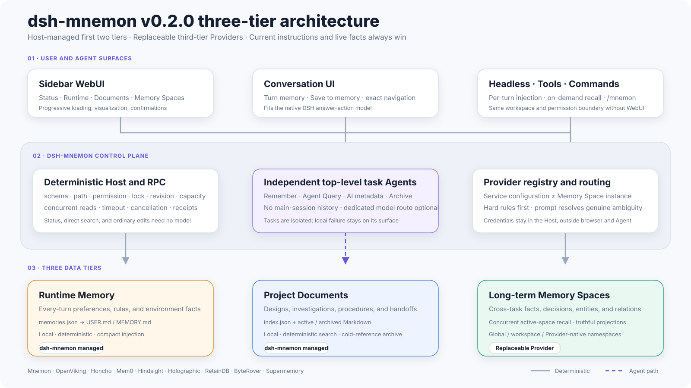

# Architecture

[简体中文](../zh-CN/architecture.md) | **English** | [Documentation Center](./README.md)

## Positioning

`dsh-mnemon` is an integration and supervision layer between DSH and replaceable long-term-memory providers, not a new database engine:

- DSH provides the root Agent, lifecycle events, subagent providers, tools, commands, settings, and Web extension points;
- the plugin provides the control plane for three knowledge layers, routing policies, transactional barriers, and UI;
- Mnemon Native uses the local `mnemon` CLI for named Stores, SQLite, four graph types, relationships, and soft deletion and remains the official prioritized implementation; eight third-party adapters provide Host-controlled HTTP, local-file, or CLI data planes.

## Component Diagram

[](../assets/diagrams/en/project-architecture.svg)

Solid lines show deterministic data or control paths; purple dashed lines show independent task-Agent paths. Runtime Memory and Documents use managed files directly. Memory Spaces first pass through `MemoryProviderAdapter`, then enter the selected provider data plane. The third tier represents Mnemon Native and all eight external implementations rather than describing the whole system as Native-only local data. Click the image to open the original 1600×900 SVG.

Cross-agent interoperability therefore applies only to the third tier: Mnemon Native shares by aligning a local root and Store, while external engines share through their own provider scope. None automatically shares DSH conversation context, Runtime projections, or Documents.

### Third-tier provider contract

`MemoryProviderAdapter` keeps catalog, lifecycle, and user operations in dsh-mnemon's control plane while delegating provider discovery plus `status / search / graph projection / browse / remember / related / link / forget` to data-plane adapters. Discovery is authoritative: a successful provider save atomically replaces that provider's local namespace mappings and maps upstream titles/descriptions; a failed discovery leaves the prior configuration untouched. Capability declarations are a shared hard boundary for UI, agents, and Host: unsupported actions are hidden and rejected. The complete current matrix is maintained in [Long-term memory providers](./memory-providers.md).

Cross-provider search runs concurrently, with one failure reduced to a Memory-Space-scoped hint. Each adapter declares whether its score is normalized relevance; the registered pure quality policy expands candidates, filters them before serialization, and emits structured counts. Heterogeneous raw scores are never compared directly; retained results use reciprocal-rank fusion over each provider's returned order. New adapters and quality policies reuse these contracts without changing the upper-layer Memory Space semantics.

Creation-time provider placement is separate from recall routing. The Host first narrows candidates by configured state, allowlist, data boundary, and required capabilities. One candidate resolves deterministically; multiple candidates send only a redacted capability brief, the Memory Space purpose, and the user's strategy to a tool-free `spawn` worker. The Host validates the structured selection against the eligible set before instantiating the provider, then persists rules, reason, confidence, and worker audit metadata. Endpoints, API keys, and identity headers remain Host-only.

## Host Composition Root

`src/index.ts::apply()` assembles the plugin in this order:

```text
settings.register("mnemon")
  -> resolveConfig
  -> createRunner
  -> MnemonService
  -> RuntimeMemoryController
  -> DocumentManager
  -> StorageScopeInspector
  -> MnemonSubagentCoordinator
  -> MnemonLifecycle
  -> tools / commands / prompt sections
  -> register RPC when a Web connection exists
```

The Host declares dependencies on `tools`, `settings`, `commands`, `agents`, and `subagents`. `workspaceRegistry` is discovered optionally through the Host service registry and is used only for authorized Web inspection. The Web client additionally depends on slots, connection, and DSH locale services.

## Web and Headless Boundaries

The core Host composition is profile-neutral. Both Web and Headless mount settings, Runtime context, Documents, Memory Space tools, lifecycle hooks, and supervised workers. Agent operations always derive `workspace` storage from the session cwd.

Web additionally provides `workspaceRegistry`, client slots, and `connection`. Those services enable cross-workspace inspection, RPC, Sidebar / Buildin, settings UI, Turn memory, and Save to memory. Headless provides none of those browser services; its one-shot runner submits an ordinary user message, waits for Agent idle, flushes the session, prints the final answer, and exits. Plugin disposal cancels a pending delayed review, so Headless relies on explicit or model-guided writes completed inside the task rather than post-idle maintenance.

## Dual Paths for the Root Agent and Workers

The same `mnemon_*` tools route calls according to whether the caller is a subagent, preventing recursive delegation:

```text
root Agent calls mnemon_recall
  -> coordinator starts a bounded recall worker
  -> worker calls mnemon_memory_bodies and mnemon_recall
  -> tool sees origin=subagent
  -> call reaches MnemonService directly
  -> structured evidence returns to root Agent
```

Long-term semantic writes, relationships, deletion, and Memory Space creation or updates use the same supervision pattern, while the deterministic service first checks the target provider's capabilities. Mnemon Native remains the complete reference implementation; external adapters expose only their exact, async, graph, browse, related, and deletion semantics. Ordinary Runtime Memory and Document mutations remain deterministic.

Memory Space removal is a separate dangerous action. Mnemon Native invokes `store remove` after confirmation and removes registration only after success. Every third-party provider uses **Disconnect** semantics: it removes local connection metadata and never deletes provider memory.

## Independent Task Agents and Internal Workers

AI metadata, Agent Query, memory distillation, and document archiving initiated by the Web workbench first create a new top-level task Agent. It borrows no conversation history, binds its cwd explicitly to the selected workbench workspace, composes the default DSH preset, and is disposed after completion. Its model route follows the DSH new-session default unless `taskAgentModel` pins a complete Provider + Model. The same `taskAgentModel` route also applies to every Mnemon subagent delegation issued by the coordinator (idle checkpoint review, recall, write, answer, provider placement, migration, compaction, document archive, and metadata maintenance), so a fixed route covers both the top-level task Agent and all of its internal workers.

The top-level task Agent is the user-visible execution unit. The `spawn` / `fork` providers below are bounded internal workers. When semantic judgment is needed, the task Agent may still dispatch a worker, which inherits its parent task Agent's model route. UI copy therefore says **independent task Agent**, while diagnostics and architecture retain worker / subagent terminology.

### `spawn` worker

`spawn` uses a new isolated context. For each task type, the plugin supplies:

- a fixed persona;
- a minimal tool allowlist;
- a schema-validated, randomly named result tool scoped to that one run and included in the same allowlist;
- `maxDepth: 1`;
- a cancellable signal and bounded token budget.

It is used for recall, long-term semantic writes, evidence-bound answers, hot-memory maintenance, and Document archiving.

### `fork` worker

Scored background review requires a provider named `fork` with `inheritsParentContext=true`. It inherits only a completed parent checkpoint and determines whether to maintain hot memory or at most one Project Document. It is not a continuation of the user's task, and it does not inject review reasoning into the main conversation.

The current review allowlist excludes `mnemon_remember`, `mnemon_forget`, and Memory Space maintenance tools, so background review cannot modify long-term Memory Spaces directly.

## Control Plane and Data Plane

```text
LLM-owned judgment                  Host-owned guarantees
------------------                  ---------------------
what is worth keeping               input validation
which Memory Space fits             path boundary
whether two items are duplicates    process timeout/cancel
how to summarize a Document         file lock + atomic rename
whether a reusable artifact exists  UTF-8 capacity accounting
                                     revision conflict rejection
                                     read/write RPC authority
```

Persona constraints must be distinguished from hard Host guarantees. For example, the MEMORY archival worker is instructed to cover every committed hot-memory item, but the Host can strictly validate only the structured action, revision, and byte budget; the Host does validate USER compaction source coverage item by item.

## Web RPC Boundary

The WebUI does not start system processes or open SQLite directly:

```text
browser component
  -> typed client wrapper
  -> DSH RPC authority check
  -> Host validation
  -> controller / service / bounded worker
  -> local CLI or managed files
```

Read channels and the activation-only Memory Space control require `trusted-host`; broader memory write, settings, and backup channels require `loopback` by default. The activation handler accepts only an exact body ID and Boolean state. Provider credential values travel only through the private management-authorized service catalog; the ordinary trusted-host catalog is redacted. Browser components derive local-write capability from the connection boundary and disable broader controls before transport. A local `remoteAccess=trusted-host` setting followed by a Host restart promotes all three privileged channels together for deployments protected by reliable authentication; DSH `trustedHosts` alone is not user authentication. When `writeEnabled=false`, every mutation handler rejects the request at the Host boundary.

## Internationalization

`src/client/locales.ts` defines `MnemonKey` from the Chinese key set, and the English dictionary must satisfy the same set of keys; `src/client/index.ts` registers both dictionaries with the DSH locale. The main Web pages and settings card switch immediately with the DSH global language and reuse the global light or dark theme.

Command output, tool-card titles, persisted compatibility-default Memory Space names, and some backend errors are still monolingual. This is a known gap on the Roadmap.

## Key Modules

| Module | Responsibility |
|---|---|
| `src/index.ts` | Host composition and registration |
| `src/config.ts` | Configuration schema, defaults, and resolution |
| `src/process.ts` | Bounded process execution without a shell |
| `src/runner.ts` | CLI discovery, arguments, serialization, and JSON parsing |
| `src/service.ts` | Application facade for long-term memory |
| `src/memory-bodies.ts` | Memory Space catalog metadata |
| `src/providers/*` | Third-tier provider contract, catalog, native routing, and external adapters |
| `src/runtime-memory.ts` | Hot-memory source of truth and projections |
| `src/documents.ts` | Documents control plane |
| `src/subagent.ts` | Worker orchestration and capacity transactions |
| `src/lifecycle.ts` | Per-root-Agent lifecycle |
| `src/review-activity.ts` | Deterministic review scoring |
| `src/tools.ts` | Model tools and root/worker routing |
| `src/rpc.ts` | Web read/write channels |
| `src/storage-scope.ts` | Read-only inventory of the three storage scopes |
| `src/client/*` | Web workspace, settings, and locale |
